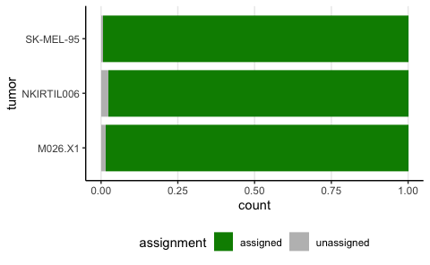
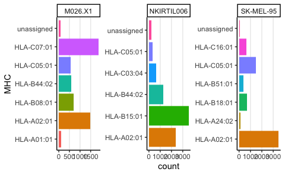
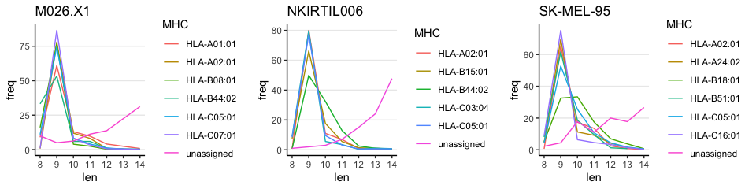

MHC deconv
================
Kaspar Bresser
29/07/2021

``` r
library(tidyverse)
library(lemon)
library(ggpubr)
```

MHCdecon was run on all peptides detected from each melanoma line.
<https://services.healthtech.dtu.dk/services/MHCMotifDecon-1.0/>

Load in the output tables

``` r
dat <- list(read_tsv("Data/MHCdeconOutput/M026/output.xls"),
            read_tsv("Data/MHCdeconOutput/mel95/output.xls"),
            read_tsv("Data/MHCdeconOutput/NKITIL/output.xls")
)
```

Combine tables

``` r
dat.table <- tibble(tumor = c("M026.X1", "SK-MEL-95", "NKIRTIL006"), data = dat)

dat.table
```

    ## # A tibble: 3 × 2
    ##   tumor      data                  
    ##   <chr>      <list>                
    ## 1 M026.X1    <spc_tbl_ [5,395 × 6]>
    ## 2 SK-MEL-95  <spc_tbl_ [6,917 × 6]>
    ## 3 NKIRTIL006 <spc_tbl_ [8,384 × 6]>

Assign rank scores.

``` r
dat.table %>% 
  unnest(col = data) %>% 
  mutate(assignment = case_when(RANK_SCORE > 20 ~ "unassigned",
                         TRUE ~ "assigned")) %>% 
  mutate(MHC = case_when(RANK_SCORE > 20 ~ "unassigned",
                         TRUE ~ MHC)) -> plot.dat 
#  count(tumor, MHC) -> plot.dat 

write_tsv(plot.dat, "Output/Fig_S1DEF.tsv")
```

Plot the fraction of peptides that were assigned or not-assigned

``` r
ggplot(plot.dat, aes(x = tumor, fill = assignment))+
  geom_bar( position = "fill", width = .85)+
  scale_fill_manual(values = c( "green4", "grey"))+
  coord_flip()+
  theme_classic()+
  theme(panel.grid.major.x = element_line(), legend.position = "bottom")
```



``` r
ggsave("Figs/deconv_assigned_unassigned.pdf", width = 3.5, height = 4, scale = .8)
```

Plot the amount of peptides assigned to each allele

``` r
ggplot(plot.dat, aes(x = MHC, fill = MHC))+
  geom_bar( position = "dodge")+
  facet_wrap(~tumor, scales = "free")+
  coord_flip()+
  theme_classic()+
  theme(panel.grid.major.x = element_line(), legend.position = "none")
```



``` r
ggsave("Figs/deconv_alleles.pdf", width = 7.5, height = 3, scale = .8)
```

``` r
plot.dat %>% 
  mutate(len = nchar(SEQUENCE)) %>% 
  group_by(MHC, tumor, len) %>% 
  summarise(n = n()) %>% 
  mutate(freq = (n / sum(n))*100) %>% 
  nest(data = -tumor) %>% 
  deframe() -> plot.lines


plot.list <- map2(plot.lines, names(plot.lines),

~ggplot(.x, aes(x = len, y = freq, color = MHC))+
    geom_line()+
    scale_x_continuous(breaks = 8:14)+
    theme_classic()+
    theme(panel.grid.major.y = element_line(), legend.position = "right")+
    ggtitle(.y)

)

ggarrange(plotlist = plot.list, nrow = 1)
```



``` r
ggsave("Figs/deconv_alleles_lengths.pdf", width = 12, height = 3, scale = .8)
```

``` r
dat.table %>% 
  unnest(col = data) %>% 
  mutate(MHC = case_when(RANK_SCORE > 20 ~ "unassigned",
                         TRUE ~ MHC)) %>% 
  group_by(tumor, MHC) %>% 
  summarise(n = n()) %>% 
  mutate(freq = (n / sum(n))*100)
```

    ## # A tibble: 20 × 4
    ## # Groups:   tumor [3]
    ##    tumor      MHC            n   freq
    ##    <chr>      <chr>      <int>  <dbl>
    ##  1 M026.X1    HLA-A01:01   123  2.28 
    ##  2 M026.X1    HLA-A02:01  1489 27.6  
    ##  3 M026.X1    HLA-B08:01   685 12.7  
    ##  4 M026.X1    HLA-B44:02   587 10.9  
    ##  5 M026.X1    HLA-C05:01   566 10.5  
    ##  6 M026.X1    HLA-C07:01  1865 34.6  
    ##  7 M026.X1    unassigned    80  1.48 
    ##  8 NKIRTIL006 HLA-A02:01  2381 28.4  
    ##  9 NKIRTIL006 HLA-B15:01  3513 41.9  
    ## 10 NKIRTIL006 HLA-B44:02  1286 15.3  
    ## 11 NKIRTIL006 HLA-C03:04   660  7.87 
    ## 12 NKIRTIL006 HLA-C05:01   345  4.11 
    ## 13 NKIRTIL006 unassigned   199  2.37 
    ## 14 SK-MEL-95  HLA-A02:01  3481 50.3  
    ## 15 SK-MEL-95  HLA-A24:02   142  2.05 
    ## 16 SK-MEL-95  HLA-B18:01   719 10.4  
    ## 17 SK-MEL-95  HLA-B51:01   397  5.74 
    ## 18 SK-MEL-95  HLA-C05:01  1476 21.3  
    ## 19 SK-MEL-95  HLA-C16:01   657  9.50 
    ## 20 SK-MEL-95  unassigned    45  0.651

``` r
dat.table %>% 
  unnest(col = data) %>% 
  mutate(MHC = case_when(RANK_SCORE > 20 ~ "unassigned",
                         TRUE ~ "assigned")) %>% 
  mutate(len = case_when(nchar(SEQUENCE) > 11 ~ "dropped",
                         nchar(SEQUENCE) < 9 ~ "dropped",
                         TRUE ~ "kept")) %>% 
  group_by(tumor, MHC, len) %>% 
  summarise(n = n()) %>% 
  mutate(freq = (n / sum(n))*100) %>% 
  filter(MHC == "unassigned")
```

    ## # A tibble: 6 × 5
    ## # Groups:   tumor, MHC [3]
    ##   tumor      MHC        len         n  freq
    ##   <chr>      <chr>      <chr>   <int> <dbl>
    ## 1 M026.X1    unassigned dropped    62  77.5
    ## 2 M026.X1    unassigned kept       18  22.5
    ## 3 NKIRTIL006 unassigned dropped   175  87.9
    ## 4 NKIRTIL006 unassigned kept       24  12.1
    ## 5 SK-MEL-95  unassigned dropped    30  66.7
    ## 6 SK-MEL-95  unassigned kept       15  33.3
