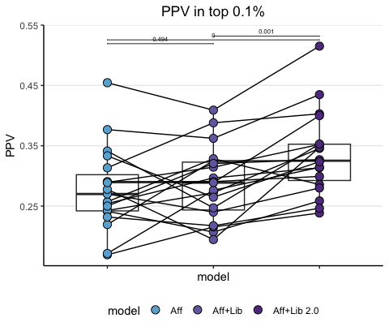
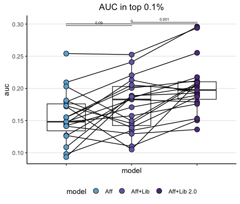

XGB results top 0.1% nuORFs
================
Kaspar Bresser
28/03/2024

- [Import and tidy data](#import-and-tidy-data)
- [Positive predictive value](#positive-predictive-value)
- [Area under the curve](#area-under-the-curve)

Used the analysis below to compare the performance of the XGB models.

``` r
library(bayestestR)
library(tidyverse)
library(pROC)
library(rstatix)
library(ggpubr)
```

## Import and tidy data

Import the results table.

``` r
XGB.results <- read_tsv("./Output/all_predictions.tsv")
```

Convert the ligand column to a binary so it can be used for cumsum
calculation, pivot to longer data by putting the models in a grouped
format.

``` r
XGB.results %>% 
  mutate(rank = -rank) %>% 
  mutate(detected = case_when(ligand == TRUE ~ 1,
                              TRUE ~ 0)) %>% 
  pivot_longer(cols = !c("detected","ligand", "allele", "sequence", "swissprot.id"), 
               names_to =  "model", 
               values_to =  "score") -> XGB.results

XGB.results
```

    ## # A tibble: 7,575,408 × 7
    ##    ligand sequence   swissprot.id allele detected model          score
    ##    <lgl>  <chr>      <chr>        <chr>     <dbl> <chr>          <dbl>
    ##  1 TRUE   GTPKLIWQQR Q15019       A3101         1 aff_lib_small  0.976
    ##  2 TRUE   GTPKLIWQQR Q15019       A3101         1 aff_lib_large  0.919
    ##  3 TRUE   GTPKLIWQQR Q15019       A3101         1 aff_only       0.812
    ##  4 TRUE   GTPKLIWQQR Q15019       A3101         1 rank          -0.447
    ##  5 TRUE   VVRSNVALVR P27930       A3101         1 aff_lib_small  0.542
    ##  6 TRUE   VVRSNVALVR P27930       A3101         1 aff_lib_large  0.540
    ##  7 TRUE   VVRSNVALVR P27930       A3101         1 aff_only       0.720
    ##  8 TRUE   VVRSNVALVR P27930       A3101         1 rank          -0.669
    ##  9 TRUE   AFLGPRPWPR Q86UV5       A3101         1 aff_lib_small  0.934
    ## 10 TRUE   AFLGPRPWPR Q86UV5       A3101         1 aff_lib_large  0.937
    ## # ℹ 7,575,398 more rows

For these analysis we’ll focus on the top 0.1% scoring peptides for each
model. Let’s subset on those. Note that I arrange on both both model
scores and a random number for tie breaking.

Next we’ll calculate the cumulative sums by grouping by allele and
model.

Note that `cumsum()` takes an ordered dataframe.

``` r
XGB.results %>% 
  group_by(allele, model) %>% 
  mutate(random = sample(1:n())) %>% 
  arrange(desc(score), random, .by_group = T) %>% 
    mutate(peptides = 1:n()/n(), 
         detected_ligands = cumsum(detected)/sum(detected)) %>% 
  slice_head(prop = .001) -> XGB.results
 
XGB.results
```

    ## # A tibble: 7,568 × 10
    ## # Groups:   allele, model [76]
    ##    ligand sequence     swissprot.id allele detected model  score random peptides
    ##    <lgl>  <chr>        <chr>        <chr>     <dbl> <chr>  <dbl>  <int>    <dbl>
    ##  1 TRUE   SVWSTLSGK    P53990       A0301         1 aff_l… 0.998 101561  8.47e-6
    ##  2 TRUE   RVFEVYHTTVLK P35222       A0301         1 aff_l… 0.998 106611  1.69e-5
    ##  3 TRUE   RLWTSVAVLK   Q9NUP9       A0301         1 aff_l… 0.998  82892  2.54e-5
    ##  4 TRUE   SLSSWSLMK    P09001       A0301         1 aff_l… 0.997   4878  3.39e-5
    ##  5 FALSE  KIVNLGSSK    Q7RTV0       A0301         0 aff_l… 0.997   3890  4.23e-5
    ##  6 FALSE  KLWNPRNFK    Q53GS9       A0301         0 aff_l… 0.997  77908  5.08e-5
    ##  7 TRUE   SVASISLTK    Q969Q0       A0301         1 aff_l… 0.997  44332  5.93e-5
    ##  8 TRUE   RLSVPPLCK    Q9NYL2       A0301         1 aff_l… 0.997   5049  6.77e-5
    ##  9 FALSE  KVCANHVITK   P49792       A0301         0 aff_l… 0.997  18979  7.62e-5
    ## 10 FALSE  RTFLRAVTK    O43159       A0301         0 aff_l… 0.997  10356  8.47e-5
    ## # ℹ 7,558 more rows
    ## # ℹ 1 more variable: detected_ligands <dbl>

Lastly, set the ordering in which we’d like the models to appear in
plots, by converting the models variable to a factor

``` r
unique(XGB.results$model)
```

    ## [1] "aff_lib_large" "aff_lib_small" "aff_only"      "rank"

``` r
model.order <- c("aff_only", "aff_lib_small","aff_lib_large")

allele.order <- as.character(unique(XGB.results$allele))


colors <- c("#6BAED6", "#756CB1", "#5F3D8C")

XGB.results %>% 
  filter(model %in% model.order) %>% 
  mutate(model = as_factor(model),
         model = fct_relevel(model, model.order),
         allele = as_factor(allele),
         allele = fct_relevel(allele, allele.order)) -> XGB.results

XGB.results
```

    ## # A tibble: 5,676 × 10
    ## # Groups:   allele, model [57]
    ##    ligand sequence     swissprot.id allele detected model  score random peptides
    ##    <lgl>  <chr>        <chr>        <fct>     <dbl> <fct>  <dbl>  <int>    <dbl>
    ##  1 TRUE   SVWSTLSGK    P53990       A0301         1 aff_l… 0.998 101561  8.47e-6
    ##  2 TRUE   RVFEVYHTTVLK P35222       A0301         1 aff_l… 0.998 106611  1.69e-5
    ##  3 TRUE   RLWTSVAVLK   Q9NUP9       A0301         1 aff_l… 0.998  82892  2.54e-5
    ##  4 TRUE   SLSSWSLMK    P09001       A0301         1 aff_l… 0.997   4878  3.39e-5
    ##  5 FALSE  KIVNLGSSK    Q7RTV0       A0301         0 aff_l… 0.997   3890  4.23e-5
    ##  6 FALSE  KLWNPRNFK    Q53GS9       A0301         0 aff_l… 0.997  77908  5.08e-5
    ##  7 TRUE   SVASISLTK    Q969Q0       A0301         1 aff_l… 0.997  44332  5.93e-5
    ##  8 TRUE   RLSVPPLCK    Q9NYL2       A0301         1 aff_l… 0.997   5049  6.77e-5
    ##  9 FALSE  KVCANHVITK   P49792       A0301         0 aff_l… 0.997  18979  7.62e-5
    ## 10 FALSE  RTFLRAVTK    O43159       A0301         0 aff_l… 0.997  10356  8.47e-5
    ## # ℹ 5,666 more rows
    ## # ℹ 1 more variable: detected_ligands <dbl>

## Positive predictive value

Lets first plot the positive predictive value (PPV), i.e. the number of
true positives within a certain threshold. Calculate the PPV as the
number of true positives divided by the total number of peptides within
the selected pool.

``` r
XGB.results %>%  
  group_by(allele, model) %>% 
  mutate(model = fct_drop(model)) %>% 
  summarise(PPV = sum(detected)/n()) %>% 
  ungroup() %>% 
  rstatix::t_test(PPV ~ model, paired = T) %>% 
  add_xy_position(x = "model",  fun = "max",step.increase = .04,) %>% 
  mutate(p.adj = round(p.adj, 3))-> stats
```

``` r
XGB.results %>%  
  group_by(allele, model) %>% 
  summarise(PPV = sum(detected)/n()) %>% 
   ggplot( aes(x = model, y = PPV, group = allele)) +
    geom_boxplot(aes(group = model), width = 0.585)+
    geom_line()+
    geom_point(aes(fill = model), shape = 21, size = 3.25 )+
    scale_fill_manual(values = colors, labels = c("Aff", "Aff+Lib", "Aff+Lib 2.0"))+
    stat_pvalue_manual(stats, label = "p.adj", 
                     tip.length = 0.00, hide.ns = F, label.size = 2 )+
    ggtitle("PPV in top 0.1%")+
    theme_classic()+
    theme(plot.title = element_text(hjust = 0.5), 
          panel.grid.major.y = element_line(), axis.text.x=element_blank(), legend.position = "bottom",)
```



``` r
ggsave("Figs/XGB_PPV_strip.pdf", width = 1.7, height = 3.2, scale = 1.5)
```

## Area under the curve

Or calculate the AUC of these curves as a summary metric and plot that.
Used the `area_under_curve()` function from the
[bayestestR](https://easystats.github.io/bayestestR/index.html) package.

``` r
XGB.results %>% 
  group_by(allele, model) %>% 
  summarise(auc = area_under_curve(peptides, detected_ligands)*1000) %>% 
  mutate(model = fct_drop(model)) %>%
  ungroup() %>% 
  rstatix::t_test( auc ~ model, paired = T) %>% 
  add_xy_position(x = "model", step.increase = 0.04) %>% 
  mutate(p.adj = round(p.adj, 4)) -> stats

stats
```

    ## # A tibble: 3 × 14
    ##   .y.   group1     group2    n1    n2 statistic    df       p p.adj p.adj.signif
    ##   <chr> <chr>      <chr>  <int> <int>     <dbl> <dbl>   <dbl> <dbl> <chr>       
    ## 1 auc   aff_only   aff_l…    19    19     -1.79    18 9   e-2 0.09  ns          
    ## 2 auc   aff_only   aff_l…    19    19     -6.60    18 3.38e-6 0     ****        
    ## 3 auc   aff_lib_s… aff_l…    19    19     -4.18    18 5.67e-4 0.001 **          
    ## # ℹ 4 more variables: y.position <dbl>, groups <named list>, xmin <dbl>,
    ## #   xmax <dbl>

``` r
XGB.results %>% 
  group_by(allele, model) %>% 
  summarise(auc = area_under_curve(peptides, detected_ligands)*1000) %>% 
    ggplot( aes(x = model, y = auc, group = allele)) +
    geom_boxplot(aes(group = model), width = 0.585)+
    geom_line()+
    geom_point(aes(fill = model), shape = 21, size = 3.25 )+
    scale_fill_manual(values = colors, labels = c("Aff", "Aff+Lib", "Aff+Lib 2.0"))+
    stat_pvalue_manual(stats, label = "p.adj", 
                     tip.length = 0.00, hide.ns = F, label.size = 2 )+
    ggtitle("AUC in top 0.1%")+
    theme_classic()+
    theme(plot.title = element_text(hjust = 0.5), 
          panel.grid.major.y = element_line(), axis.text.x=element_blank(), legend.position = "bottom",)
```



``` r
ggsave("Figs/XGB_AUC_strip.pdf", width = 1.7, height = 3.2, scale = 1.5)
```
