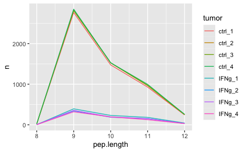

Generate peptide database Ovarian
================
Kaspar Bresser
28/03/2024

- [Import ligands](#import-ligands)
- [Select decoys](#select-decoys)
- [Run netMHCpan](#run-netmhcpan)
  - [Cleanup and combine per tumor](#cleanup-and-combine-per-tumor)
  - [Finalize files](#finalize-files)
- [Final combine data](#final-combine-data)

``` r
library(babelgene)
library(tidyverse)
library(furrr)
```

## Import ligands

``` r
MS.data <- read_tsv("Data/132937_2_supp_37774_p0vb9k.txt")

#MS.data <- read_tsv("132937_2_supp_37797_p0vb9l.txt")
```

``` r
MS.data %>% 
  select(Sequence, `Leading razor protein`, contains("UWB")) %>% 
  pivot_longer(cols = contains("UWB")) %>%
  separate(name, into = c("x", "y", "treatment", "sample")) %>% 
  drop_na() %>% 
  distinct(Sequence, sample, .keep_all = T) %>% 
  transmute(sequence = Sequence, swissprot.id = `Leading razor protein`, tumor = paste(treatment, sample, sep = "_")) %>% 
  mutate(swissprot.id = str_remove(swissprot.id, "-\\d")) -> MS.data

MS.data %>% 
  count(tumor)
```

    ## # A tibble: 8 × 2
    ##   tumor      n
    ##   <chr>  <int>
    ## 1 IFNg_1   906
    ## 2 IFNg_2   766
    ## 3 IFNg_3   778
    ## 4 IFNg_4   694
    ## 5 ctrl_1  5601
    ## 6 ctrl_2  5758
    ## 7 ctrl_3  5779
    ## 8 ctrl_4  5857

Tidy up, and add peptide lengths.

``` r
MS.data %>% 
  mutate(pep.length = str_length(sequence))  -> MS.data

MS.data
```

    ## # A tibble: 26,139 × 4
    ##    sequence   swissprot.id tumor  pep.length
    ##    <chr>      <chr>        <chr>       <int>
    ##  1 AAAAAAAAAR Q504T8       ctrl_2         10
    ##  2 AAAAAAAAAR Q504T8       IFNg_1         10
    ##  3 AAAAAAAAAR Q504T8       IFNg_3         10
    ##  4 AAAAAAAAAR Q504T8       IFNg_4         10
    ##  5 AAAAAAAAK  P50914       ctrl_2          9
    ##  6 AAAAAAAAK  P50914       ctrl_3          9
    ##  7 AAAAAAAAK  P50914       ctrl_4          9
    ##  8 AAAAAAAAR  P58107       ctrl_1          9
    ##  9 AAAAAAAAR  P58107       ctrl_2          9
    ## 10 AAAAAAAAR  P58107       ctrl_3          9
    ## # ℹ 26,129 more rows

Check the amount of 9mers for each allele.

``` r
pep.lengths <- count(MS.data, tumor, pep.length)

pep.lengths %>% 
  filter(pep.length %in% 8:12) %>% 
ggplot( aes(x = pep.length, y = n, color = tumor))+
  geom_line()
```



Subsample the peptide pools to get a more workable number, 1000 should
suffice

``` r
"../2-random_forest_analyses/Data/Protein_per_Uniprot_entry_library_v3.csv.zip" %>% 
  read_tsv() %>% 
  pull(Entry) -> IDs.in.library

MS.data %>% 
  count(tumor, pep.length)
```

    ## # A tibble: 89 × 3
    ##    tumor  pep.length     n
    ##    <chr>       <int> <int>
    ##  1 IFNg_1          8     4
    ##  2 IFNg_1          9   393
    ##  3 IFNg_1         10   231
    ##  4 IFNg_1         11   183
    ##  5 IFNg_1         12    43
    ##  6 IFNg_1         13    30
    ##  7 IFNg_1         14    10
    ##  8 IFNg_1         15     6
    ##  9 IFNg_1         16     5
    ## 10 IFNg_1         17     1
    ## # ℹ 79 more rows

``` r
MS.data %>% 
  filter(pep.length %in% 9:11) %>% 
  filter(swissprot.id %in% IDs.in.library) %>% 
  distinct(tumor, sequence, .keep_all = T) %>% 
  group_by(tumor) %>% 
  slice_sample(n = 500) %>% 
  mutate(ligand = TRUE) %>% 
  ungroup() -> filtered.peptides

filtered.peptides %>% 
  count(tumor, pep.length)
```

    ## # A tibble: 24 × 3
    ##    tumor  pep.length     n
    ##    <chr>       <int> <int>
    ##  1 IFNg_1          9   247
    ##  2 IFNg_1         10   145
    ##  3 IFNg_1         11   108
    ##  4 IFNg_2          9   253
    ##  5 IFNg_2         10   139
    ##  6 IFNg_2         11   108
    ##  7 IFNg_3          9   253
    ##  8 IFNg_3         10   133
    ##  9 IFNg_3         11   114
    ## 10 IFNg_4          9   257
    ## # ℹ 14 more rows

``` r
write_tsv(filtered.peptides, "Output/Ovarian_subsample.tsv")
```

``` r
write_tsv(filtered.peptides, "Output/Ovarian_subsample.tsv")
```

## Select decoys

Import UniProt sequences, use the rna expression table to make an
ensembl/UniProt matching table.

Define a function that, for each allele: (1) Checks which sequences were
detected for that allele, (2) samples an excess of proteins from the
uniprot table weighted by their length, (3) then for each sample
extracts a 9mer, (4) Remove detected peptides, filter for uniqueness and
down sample to 350,000.

``` r
uniprot <- read_csv("Data/UniProt_reviewed_input.tsv") %>% rename(swissprot.id = "sequence_id")


get_peptide <- function(tum, pep.len){
  MS.data %>% 
    mutate(sequence = str_to_upper(sequence)) %>% 
    filter(tumor == tum) %>% 
    filter(nchar(sequence) == pep.len) %>% 
    pull(sequence) %>% 
    toupper() -> s
  
    amount.needed <- nrow(filter(filtered.peptides, tumor == tum & nchar(sequence) == pep.len))*1000
  
  uniprot %>% 
    mutate(len = nchar(sequence)) %>% 
    slice_sample(n = amount.needed*2, weight_by = len, replace = T) %>% 
    rowwise() %>% 
    mutate(number = sample(1:(nchar(sequence)-pep.len), 1),
         sequence = str_sub(sequence, number, number+(pep.len-1))) %>% 
    ungroup() %>% 
    filter(!(sequence %in% s)) %>% 
    transmute(sequence = sequence, swissprot.id = swissprot.id, tumor = tum, ligand = FALSE) %>% 
    filter(swissprot.id %in% IDs.in.library) %>% 
    distinct(sequence, .keep_all = T) %>% 
    slice_sample(n = amount.needed)
}

tumors <- unique(filtered.peptides$tumor)

decoys <- map2_dfr(rep(tumors, 3), rep(c(9,10,11), each = 8), get_peptide)

filtered.peptides %>% 
  select(! pep.length) %>% 
  bind_rows(decoys) -> test.set


test.set %>% 
  count(tumor, ligand, nchar(sequence))
```

Write out the table and peptide files

## Run netMHCpan

Get the file names

``` r
files <- paste0("Output/peptides/", list.files("Output/peptides/", pattern = "ovarian_Pe"))

files
```

``` r
HLA.alleles <- list(  `ctrl_1` =    c('A0301','A6801','B0702', 'C0332','C0702'),
                      `ctrl_2` =    c('A0301','A6801','B0702', 'C0332','C0702'),
                      `ctrl_3` =    c('A0301','A6801','B0702', 'C0332','C0702'),
                      `ctrl_4` =    c('A0301','A6801','B0702', 'C0332','C0702'),
                      `IFNg_1` =    c('A0301','A6801','B0702', 'C0332','C0702'),
                      `IFNg_2` =    c('A0301','A6801','B0702', 'C0332','C0702'),
                      `IFNg_3` =    c('A0301','A6801','B0702', 'C0332','C0702'),
                      `IFNg_4` =    c('A0301','A6801','B0702', 'C0332','C0702'))
```

Run system command for netMHCpan, for each allele. Define function to
get the arguments/flags for netMHCpan

``` r
args_netMHC <- function(allele, file.name, peptide.len){
  c(
    paste0("-a HLA-", sub("(.{3})(.*)", "\\1:\\2", allele)),
    paste0("-f ", file.name),
    "-p",
    "-rth 0.0",
    "-rlt 0.0",
    paste0("-l ", peptide.len),
    "-t -100"
  )
}
```

wrapper function to predict for each length

``` r
netMHC_wrapper <- function(tum, len){
  
  file.name <- paste0("Output/peptides/ovarian_Peptides_", tum, "_", len, "AA.tsv")
  all.alleles <- HLA.alleles[[tum]]
  
  future_map(all.alleles, ~system2(command = "netMHCpan", 
                      args = args_netMHC(., file.name, len), 
                      stdout  = paste0("./Output/netMHCpan_predictions/netMHCpan_prediction_",tum, "_", .,
                                      "_", len , "AA_yay.txt")))
}
```

Run netMHCpan, parallel for the alleles

``` r
plan(multisession, workers = 5)


map2(rep(tumors, 3), rep(9:11, each = 8), ~netMHC_wrapper(.x, .y))


#map2(rep(tumors, 1), rep(11, each = 7), ~netMHC_wrapper(.x, .y))
```

### Cleanup and combine per tumor

Define function to read in predictions for each peptide length, cleanup
the netMHC output, and combine them in a single tsv file

``` r
combine_and_clean <- function(tum){

  file.list <- list.files("./Output/netMHCpan_predictions/", pattern = tum, full.names = T)
#  file.list <- paste0("./Output/netMHCpan_predictions/", file.list)
  
  file.list %>% 
    map(read_lines) %>% 
    map(~.[grepl("   1 HLA", .)]) %>% 
    unlist() %>% 
    c(" Pos         MHC        Peptide      Core Of Gp Gl Ip Il        Icore        Identity  Score_EL %Rank_EL", .) %>% 
    write_lines(paste0("./Output/netMHCpan_predictions_clean/", tum,".tsv"))
  
  gc()
}
```

Apply the function for each allele

``` r
map(tumors, combine_and_clean)
```

### Finalize files

Write a function that reads in the allele predictions per tumor line,
only imports the columns needed, joins them together, and selects the
highest affinity rank.

``` r
write_tumor_files <- function(fil){
 tum <- str_split_i(fil, "\\/|\\.", 3)
  fil %>% 
    read_table() %>% 
    distinct(Peptide, MHC, .keep_all = T) %>% 
    transmute(allele = str_remove_all(MHC, "HLA-|\\*|\\:"), sequence = Peptide, rank = `%Rank_EL`) %>% 
    group_by(sequence) %>% 
    slice_min(rank, n=1) %>% 
    write_tsv(paste0("./Output/netMHCpan_predictions_clean/HLA_affinities_",tum,".tsv"))
}
```

Define HLA typings per tumor line and run the function.

``` r
list.files("Output/netMHCpan_predictions_clean", full.names = T)
map(list.files("Output/netMHCpan_predictions_clean", full.names = T), write_tumor_files)
```

## Final combine data

``` r
test.table <- read_tsv("Output/ovarian_Test_Table.tsv")
```

``` r
files <- list.files("Output/netMHCpan_predictions_clean", pattern = "HLA", full.names = T)

files %>% 
  map(read_tsv) %>% 
  set_names(str_extract(files, ".{5}\\d{1}")) %>% 
  map2(names(.), ~mutate(.x, tumor = .y)) %>% 
  reduce(bind_rows) %>% 
  mutate(tumor = as.character(tumor)) %>% 
  select(-allele) -> netMHCranks
```

``` r
test.table %>% 
  mutate(tumor = as.character(tumor)) %>% 
  left_join(netMHCranks, by = c("sequence", "tumor")) %>% 
  distinct(sequence, tumor, .keep_all = T) -> test.table

test.table

write_tsv(test.table, "Output/ovarian_Test_Table_all.tsv")
```
