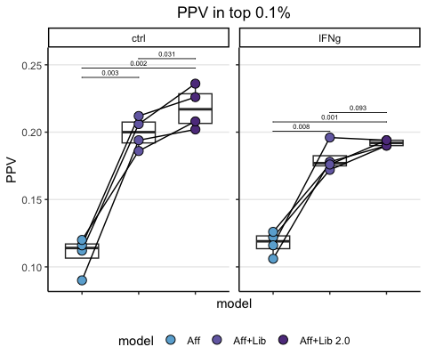

XGB results top 0.1% Ovarian
================
Kaspar Bresser
28/03/2024

- [Import and tidy data](#import-and-tidy-data)
- [Positive predictive value](#positive-predictive-value)
- [Area under the curve](#area-under-the-curve)

Used the analysis below to compare the performance of the XGB models.

``` r
library(bayestestR)
library(tidyverse)
library(rstatix)
library(ggpubr)
library(pROC)
```

## Import and tidy data

Import the results table.

``` r
XGB.results <- read_tsv("./Output/all_predictions_ovarian.tsv")
```

Convert the ligand column to a binary so it can be used for cumsum
calculation, pivot to longer data by putting the models in a grouped
format.

``` r
XGB.results %>% 
  mutate(rank = -rank) %>% 
  mutate(detected = case_when(ligand == TRUE ~ 1,
                              TRUE ~ 0)) %>% 
  pivot_longer(cols = !c("detected","ligand", "tumor", "sequence", "swissprot.id"), 
               names_to =  "model", 
               values_to =  "score") -> XGB.results

XGB.results
```

    ## # A tibble: 16,015,580 × 7
    ##    ligand sequence    swissprot.id tumor  detected model          score
    ##    <lgl>  <chr>       <chr>        <chr>     <dbl> <chr>          <dbl>
    ##  1 TRUE   RLYLNVLNR   Q10713       IFNg_1        1 aff_lib        0.987
    ##  2 TRUE   RLYLNVLNR   Q10713       IFNg_1        1 aff_lib_small  0.995
    ##  3 TRUE   RLYLNVLNR   Q10713       IFNg_1        1 aff_only       0.964
    ##  4 TRUE   RLYLNVLNR   Q10713       IFNg_1        1 rank          -0.043
    ##  5 TRUE   SPDNPSSAL   Q8N1L9       IFNg_1        1 aff_lib        0.982
    ##  6 TRUE   SPDNPSSAL   Q8N1L9       IFNg_1        1 aff_lib_small  0.940
    ##  7 TRUE   SPDNPSSAL   Q8N1L9       IFNg_1        1 aff_only       0.981
    ##  8 TRUE   SPDNPSSAL   Q8N1L9       IFNg_1        1 rank          -0.014
    ##  9 TRUE   SVAEDTSDHRR Q6AI08       IFNg_1        1 aff_lib        0.820
    ## 10 TRUE   SVAEDTSDHRR Q6AI08       IFNg_1        1 aff_lib_small  0.791
    ## # ℹ 16,015,570 more rows

For these analysis we’ll focus on the top 0.1% scoring peptides for each
model. Let’s subset on those. Note that I arrange on both both model
scores and a random number for tie breaking.

Next we’ll calculate the cumulative sums by grouping by allele and
model.

Note that `cumsum()` takes an ordered dataframe.

``` r
XGB.results %>% 
  group_by(tumor, model) %>% 
  mutate(random = sample(1:n())) %>% 
  arrange(desc(score), random, .by_group = T) %>% 
    mutate(peptides = 1:n()/n(), 
         detected_ligands = cumsum(detected)/sum(detected)) %>% 
  slice_head(prop = .001) -> XGB.results
 
XGB.results
```

    ## # A tibble: 16,000 × 10
    ## # Groups:   tumor, model [32]
    ##    ligand sequence    swissprot.id tumor  detected model   score random peptides
    ##    <lgl>  <chr>       <chr>        <chr>     <dbl> <chr>   <dbl>  <int>    <dbl>
    ##  1 TRUE   KIMSSPLSK   Q9UNX3       IFNg_1        1 aff_lib 1.00  319746  2.00e-6
    ##  2 TRUE   SPSPSGSVL   P56181       IFNg_1        1 aff_lib 1.00  412731  4.00e-6
    ##  3 FALSE  RPRPPRQLAPL O14979       IFNg_1        0 aff_lib 1.00  375410  5.99e-6
    ##  4 FALSE  SASQPAVEL   Q14677       IFNg_1        0 aff_lib 0.999 321511  7.99e-6
    ##  5 FALSE  FSYQVASTL   Q96DE5       IFNg_1        0 aff_lib 0.999 281762  9.99e-6
    ##  6 TRUE   KLFPKGVFTK  P30041       IFNg_1        1 aff_lib 0.999 171563  1.20e-5
    ##  7 FALSE  FSSEVTAAL   P13639       IFNg_1        0 aff_lib 0.999 230338  1.40e-5
    ##  8 FALSE  HASDRIIAL   P29401       IFNg_1        0 aff_lib 0.999  39573  1.60e-5
    ##  9 TRUE   RLYSVSYLLK  P21333       IFNg_1        1 aff_lib 0.999 457765  1.80e-5
    ## 10 FALSE  YAIKKKDEL   P46782       IFNg_1        0 aff_lib 0.999 128524  2.00e-5
    ## # ℹ 15,990 more rows
    ## # ℹ 1 more variable: detected_ligands <dbl>

Lastly, set the ordering in which we’d like the models to appear in
plots, by converting the models variable to a factor

``` r
unique(XGB.results$model)
```

    ## [1] "aff_lib"       "aff_lib_small" "aff_only"      "rank"

``` r
model.order <- c("aff_only", "aff_lib_small","aff_lib")

tumor.order <- as.character(unique(XGB.results$tumor))

colors <- c("#6BAED6", "#756CB1", "#5F3D8C")

XGB.results %>% 
  filter(model %in% model.order) %>% 
  mutate(model = as_factor(model),
         model = fct_relevel(model, model.order),
         tumor = as_factor(tumor),
         tumor = fct_relevel(tumor, tumor.order)) %>% 
  separate(tumor, into = c("treatment", "tumor")) -> XGB.results

XGB.results
```

    ## # A tibble: 12,000 × 11
    ## # Groups:   model [3]
    ##    ligand sequence    swissprot.id treatment tumor detected model   score random
    ##    <lgl>  <chr>       <chr>        <chr>     <chr>    <dbl> <fct>   <dbl>  <int>
    ##  1 TRUE   KIMSSPLSK   Q9UNX3       IFNg      1            1 aff_lib 1.00  319746
    ##  2 TRUE   SPSPSGSVL   P56181       IFNg      1            1 aff_lib 1.00  412731
    ##  3 FALSE  RPRPPRQLAPL O14979       IFNg      1            0 aff_lib 1.00  375410
    ##  4 FALSE  SASQPAVEL   Q14677       IFNg      1            0 aff_lib 0.999 321511
    ##  5 FALSE  FSYQVASTL   Q96DE5       IFNg      1            0 aff_lib 0.999 281762
    ##  6 TRUE   KLFPKGVFTK  P30041       IFNg      1            1 aff_lib 0.999 171563
    ##  7 FALSE  FSSEVTAAL   P13639       IFNg      1            0 aff_lib 0.999 230338
    ##  8 FALSE  HASDRIIAL   P29401       IFNg      1            0 aff_lib 0.999  39573
    ##  9 TRUE   RLYSVSYLLK  P21333       IFNg      1            1 aff_lib 0.999 457765
    ## 10 FALSE  YAIKKKDEL   P46782       IFNg      1            0 aff_lib 0.999 128524
    ## # ℹ 11,990 more rows
    ## # ℹ 2 more variables: peptides <dbl>, detected_ligands <dbl>

## Positive predictive value

Lets first plot the positive predictive value (PPV), i.e. the number of
true positives within a certain threshold. Calculate the PPV as the
number of true positives divided by the total number of peptides within
the selected pool.

``` r
XGB.results %>%  
  group_by(tumor, treatment, model) %>% 
  mutate(model = fct_drop(model)) %>% 
  summarise(PPV = sum(detected)/n()) %>% 
  ungroup() %>% 
  group_by(treatment) %>% 
  rstatix::t_test(PPV ~ model, paired = T) %>% 
  add_xy_position(x = "model",  fun = "max", step.increase = 0.04) %>% 
  mutate(p.adj = round(p.adj, 3))-> stats
```

``` r
library(lemon)

XGB.results %>%  
  group_by(tumor, treatment, model) %>% 
  summarise(PPV = sum(detected)/n()) %>% 
   ggplot( aes(x = model, y = PPV, group = tumor)) +
    geom_boxplot(aes(group = model), width = 0.585)+
    geom_line()+
    geom_point(aes(fill = model), shape = 21, size = 3.25 )+
    facet_rep_wrap(~treatment)+
    scale_fill_manual(values = colors, labels = c("Aff", "Aff+Lib", "Aff+Lib 2.0"))+
    stat_pvalue_manual(stats, label = "p.adj", 
                     tip.length = 0.00, hide.ns = F, label.size = 2 )+
    ggtitle("PPV in top 0.1%")+
    theme_classic()+
    theme(plot.title = element_text(hjust = 0.5), 
          panel.grid.major.y = element_line(), axis.text.x=element_blank(), legend.position = "bottom",)
```



``` r
ggsave("Figs/XGB_PPV_strip.pdf", width = 3.2, height = 3.2, scale = 1.2)
```

## Area under the curve

Or calculate the AUC of these curves as a summary metric and plot that.
Used the `area_under_curve()` function from the
[bayestestR](https://easystats.github.io/bayestestR/index.html) package.

``` r
XGB.results %>% 
  group_by(tumor, treatment, model) %>% 
  summarise(auc = area_under_curve(peptides, detected_ligands)*1000) %>% 
  mutate(model = fct_drop(model)) %>%
  group_by(treatment) %>% 
  rstatix::t_test( auc ~ model, paired = T) %>% 
  add_xy_position(x = "model", step.increase = 0.04) %>% 
  mutate(p.adj = round(p.adj, 4)) -> stats

stats
```

    ## # A tibble: 6 × 15
    ##   treatment .y.   group1       group2    n1    n2 statistic    df       p  p.adj
    ##   <chr>     <chr> <chr>        <chr>  <int> <int>     <dbl> <dbl>   <dbl>  <dbl>
    ## 1 IFNg      auc   aff_only     aff_l…     4     4    -10.0      3 2   e-3 0.004 
    ## 2 IFNg      auc   aff_only     aff_l…     4     4    -16.8      3 4.59e-4 0.001 
    ## 3 IFNg      auc   aff_lib_sma… aff_l…     4     4     -2.64     3 7.8 e-2 0.078 
    ## 4 ctrl      auc   aff_only     aff_l…     4     4    -12.8      3 1   e-3 0.002 
    ## 5 ctrl      auc   aff_only     aff_l…     4     4    -21.6      3 2.17e-4 0.0007
    ## 6 ctrl      auc   aff_lib_sma… aff_l…     4     4     -2.24     3 1.1 e-1 0.11  
    ## # ℹ 5 more variables: p.adj.signif <chr>, y.position <dbl>,
    ## #   groups <named list>, xmin <dbl>, xmax <dbl>

``` r
XGB.results %>% 
  group_by(tumor, treatment, model) %>% 
  summarise(auc = area_under_curve(peptides, detected_ligands)*1000) %>% 
    ggplot( aes(x = model, y = auc, group = tumor)) +
    geom_boxplot(aes(group = model), width = 0.585)+
    geom_line()+
    geom_point(aes(fill = model), shape = 21, size = 3.25 )+
   facet_rep_wrap(~treatment)+
    scale_fill_manual(values = colors, labels = c("Aff", "Aff+Lib", "Aff+Lib 2.0"))+
    stat_pvalue_manual(stats, label = "p.adj", 
                     tip.length = 0.00, hide.ns = F, label.size = 2 )+
    ggtitle("AUC in top 0.1%")+
    theme_classic()+
    theme(plot.title = element_text(hjust = 0.5), 
          panel.grid.major.y = element_line(), axis.text.x=element_blank(), legend.position = "bottom",)
```


``` r
ggsave("Figs/XGB_AUC_strip.pdf", width = 3.2, height = 3.2, scale = 1.2)
```
