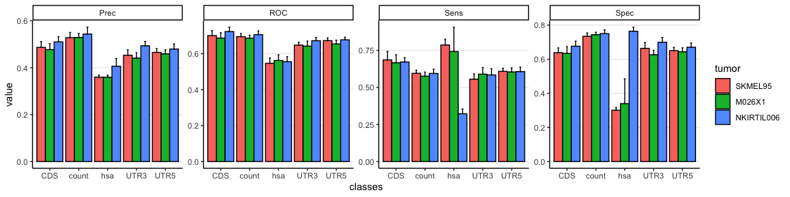
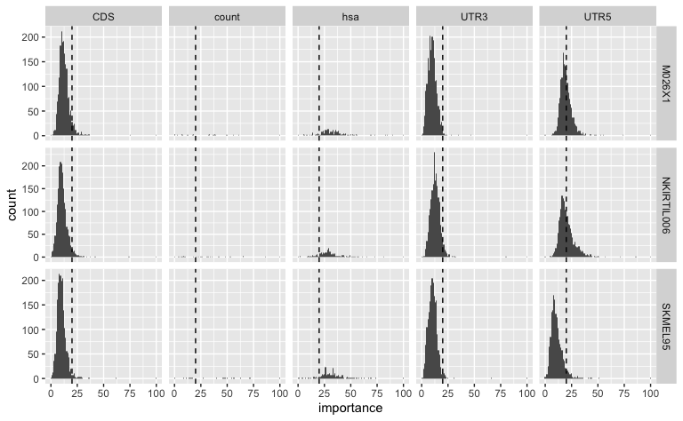
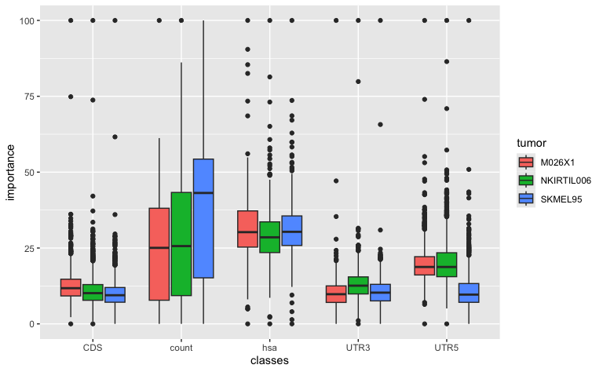
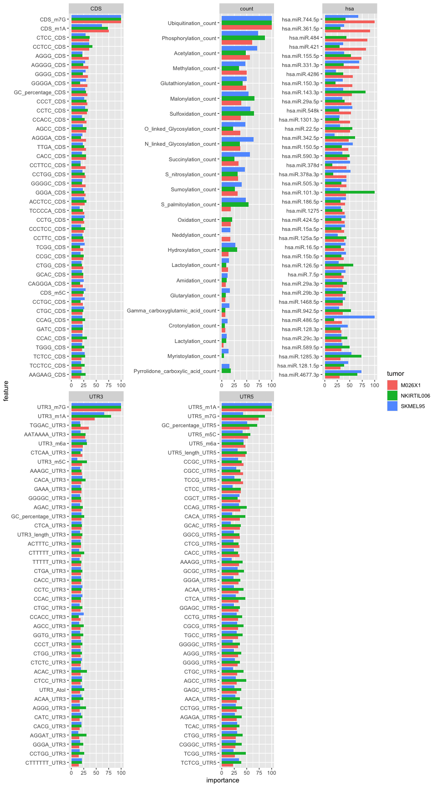
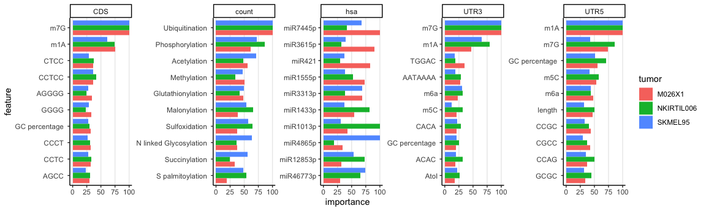
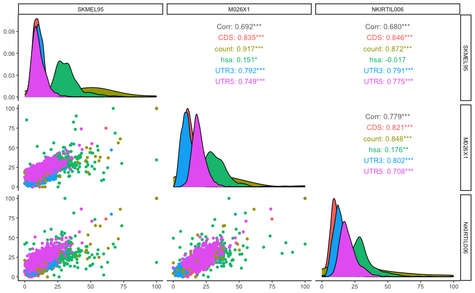
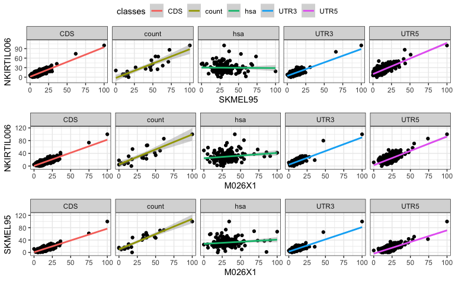
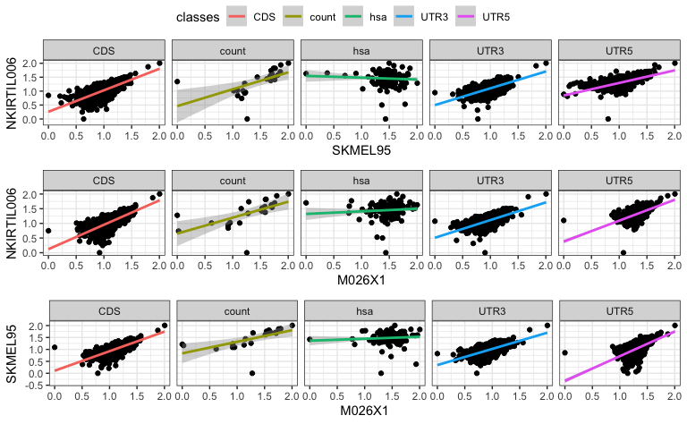
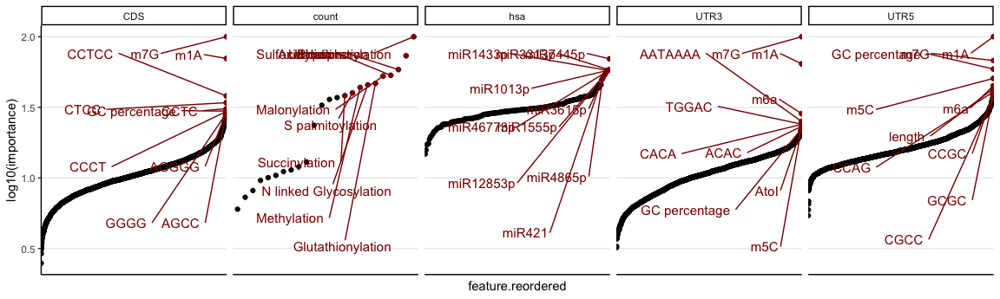

Investigate importance of features
================
Kaspar Bresser
11/02/2024

- [Import and tidy data](#import-and-tidy-data)
- [check metrics](#check-metrics)
- [Check importance](#check-importance)
- [Homogenicity with barplots](#homogenicity-with-barplots)
- [Correlations between lines](#correlations-between-lines)
- [Average importance plots](#average-importance-plots)

Used the analysis below to investigate the importance of the different
variables as determined by random forest models.

``` r
library(tidyverse)
library(tidytext)
library(caret)
library(pheatmap)
library(RColorBrewer)
library(ggrepel)
```

# Import and tidy data

Import the results table. This table stores the different RandomForest
models, plus information of the tumor and the feature class to which the
model was fitted.

``` r
rf.results <- read_rds("Output/RF_per_tumor_new.rds")


rf.results <- mutate(rf.results, tumor = fct_collapse(tumor, M026X1 = c("M026X1","M026.X1"), SKMEL95 =c("SK-MEL-95","SKMEL95")))
```

# check metrics

Extract the results of each model,

``` r
rf.results %>% 
  transmute(metrics = map(rf.models, "results"), tumor = tumor, classes = classes) %>% 
  unnest(metrics) %>% 
  pivot_longer(2:9, names_to = "metric", values_to = "value") %>%
  mutate(which = case_when(str_detect(metric, "SD") ~ "SD",
                           TRUE ~ "value"),
         metric = str_remove(metric, "SD")) %>% 
  pivot_wider(names_from = which, values_from = "value") -> to.plot

write_tsv(to.plot, "Output/Fig_S2a.tsv")

to.plot <- read_tsv( "Output/Fig_S2a.tsv")

to.plot
```

    ## # A tibble: 60 × 6
    ##     mtry tumor      classes metric value     SD
    ##    <dbl> <chr>      <chr>   <chr>  <dbl>  <dbl>
    ##  1    66 SKMEL95    CDS     ROC    0.701 0.0277
    ##  2    66 SKMEL95    CDS     Sens   0.686 0.0569
    ##  3    66 SKMEL95    CDS     Spec   0.638 0.0281
    ##  4    66 SKMEL95    CDS     Prec   0.487 0.0251
    ##  5    66 M026X1     CDS     ROC    0.687 0.0297
    ##  6    66 M026X1     CDS     Sens   0.666 0.0537
    ##  7    66 M026X1     CDS     Spec   0.634 0.0394
    ##  8    66 M026X1     CDS     Prec   0.477 0.0252
    ##  9    66 NKIRTIL006 CDS     ROC    0.723 0.0245
    ## 10    66 NKIRTIL006 CDS     Sens   0.672 0.0289
    ## # ℹ 50 more rows

``` r
tumor.order <- c("SKMEL95", "M026X1", "NKIRTIL006")

to.plot %>% 
  mutate(tumor = factor(tumor, levels = tumor.order)) %>% 
ggplot( aes(x=classes, y=value, fill=tumor)) + 
  geom_bar(stat="identity", color="black", position=position_dodge()) +
  geom_errorbar(aes(ymin=value, ymax=value+SD), width=.2,
                 position=position_dodge(.9))+
  facet_wrap(~metric, scales = "free_y", nrow = 1)+
  theme_classic()+
  theme(panel.grid.major.y = element_line())
```



``` r
ggsave("Figs/importance_model_metrics.pdf", width = 100, height = 20, units = "mm", scale = 4)
```

# Check importance

Extract the importance information from the models, and unnest into long
format.

``` r
rf.results %>% 
  mutate(importance = map(rf.models, varImp, scale = T),
         importance = map(importance, "importance"),
         importance = map(importance, as_tibble, rownames = "feature")) %>% 
  select(tumor, classes, importance) %>% 
  unnest(importance ) %>% 
  select(-no) %>% 
  rename(importance = yes) -> importance.table

rm(rf.results)
gc()
```

    ##           used  (Mb) gc trigger   (Mb) limit (Mb)   max used   (Mb)
    ## Ncells 2659328 142.1    4772078  254.9         NA    4772078  254.9
    ## Vcells 4625529  35.3 1085202077 8279.5      40960 1025127494 7821.2

``` r
write_tsv(importance.table, "Output/rf_importance.tsv")

importance.table <- read_tsv( "Output/rf_importance.tsv")

importance.table
```

    ## # A tibble: 17,346 × 4
    ##    tumor   classes feature         importance
    ##    <chr>   <chr>   <chr>                <dbl>
    ##  1 SKMEL95 CDS     CDS_length_CDS       16.2 
    ##  2 SKMEL95 CDS     AAAA_CDS             15.2 
    ##  3 SKMEL95 CDS     AAAAA_CDS            11.7 
    ##  4 SKMEL95 CDS     AAAAAA_CDS           12.7 
    ##  5 SKMEL95 CDS     AAAAAAA_CDS           8.98
    ##  6 SKMEL95 CDS     AAAAAAAA_CDS          8.75
    ##  7 SKMEL95 CDS     AAAAAAAAA_CDS         7.09
    ##  8 SKMEL95 CDS     AAAAAAC_CDS           8.43
    ##  9 SKMEL95 CDS     AAAAAACAAAG_CDS       4.74
    ## 10 SKMEL95 CDS     AAAAAAG_CDS          11.2 
    ## # ℹ 17,336 more rows

``` r
ggplot(importance.table, aes(x = importance))+
  geom_histogram(binwidth = 1)+
  facet_grid(tumor~classes,  scales = "free_y")+
  geom_vline(xintercept = 20, linetype = "dashed")
```



``` r
ggplot(importance.table, aes(x = classes, y = importance, fill = tumor))+
  geom_boxplot()
```



# Homogenicity with barplots

Want to focus on a few top features to plot, lets select the top 40 most
important features across the tumor lines. Used the sum of the 3 lines
to get the features that had a high score in at least two of the lines.

``` r
importance.table %>% 
  group_by(classes, feature) %>% 
  summarise(score = sum(importance)) %>% 
  slice_max(score, n = 40) -> top.important

write_tsv(top.important, "Output/top_important_features.tsv")

importance.table %>% 
  group_by(classes, feature) %>% 
  summarise(score = sum(importance)) %>% 
  slice_max(score, n = 10) -> top10.important
```

Plot as barcharts.

``` r
importance.table %>% 
  semi_join(top.important) %>% 
  group_by(tumor) %>% 
  mutate(feature = reorder(feature, importance)) %>% 
  ggplot(aes(feature, importance, fill = tumor))+
    geom_bar(stat = "identity", position = "dodge")+
    facet_wrap(~classes, scales = "free", nrow = 2)+
    coord_flip()
```



``` r
importance.table %>% 
  semi_join(top10.important) %>% 
  group_by(tumor) %>% 
  mutate(feature = str_remove_all(feature, "UTR5|UTR3|CDS|count|hsa|\\."),
         feature = str_replace_all(feature, "_", " ")) %>% 
  mutate(feature = reorder_within(feature, importance, classes)) %>% 
  ggplot(aes(feature, importance, fill = tumor))+
    geom_bar(stat = "identity", position = "dodge")+
    facet_wrap(~classes, scales = "free", nrow = 1)+
    coord_flip()+
    scale_x_reordered()+
    theme_classic()+
    theme(panel.grid.major.x = element_line())
```



``` r
ggsave(("Figs/importance_importance.pdf"), width = 12, height = 3)
```

# Correlations between lines

Use GGally’s ggpairs function to check correlations between the tumor
lines.

``` r
library(GGally)
library(ggpubr)

importance.table %>% 
  pivot_wider(names_from = tumor, values_from = importance) %>% 
  ggpairs(columns = 3:5, aes(color = classes))+
  theme_classic()
```



``` r
ggsave(("Figs/importance_ggpairs.pdf"), width = 6, height = 6)
```

Visualization isn’t great, let’s plot the different comparisons for each
class as individual scatterplots.

``` r
comps <- list(c("SKMEL95", "NKIRTIL006"), c("M026X1", "NKIRTIL006"), c("M026X1", "SKMEL95"))


importance.table %>% 
  pivot_wider(names_from = tumor, values_from = importance) -> to.plot

plots <- map(comps, ~ggplot(to.plot, aes_string(x = .[[1]], y = .[[2]]))+
                      geom_point()+
                      geom_smooth(aes(color = classes), method = "lm")+
                      facet_wrap(~classes, nrow = 1)+
                      theme_bw())
```

    ## Warning: `aes_string()` was deprecated in ggplot2 3.0.0.
    ## ℹ Please use tidy evaluation idioms with `aes()`.
    ## ℹ See also `vignette("ggplot2-in-packages")` for more information.
    ## This warning is displayed once every 8 hours.
    ## Call `lifecycle::last_lifecycle_warnings()` to see where this warning was
    ## generated.

``` r
ggarrange(plotlist = plots, ncol = 1, nrow = 3, common.legend = T)
```



``` r
ggsave(("Figs/importance_scatter.pdf"), width = 10, height = 6)

write_tsv(to.plot, "./Output/Fig2C.tsv")
```

Same, but log10 transformed

``` r
importance.table %>% 
  mutate(importance = log10(importance+1)) %>% 
  pivot_wider(names_from = tumor, values_from = importance, values_fill = 0)  -> to.plot-> to.plot

plots <- map(comps, ~ggplot(to.plot, aes_string(x = .[[1]], y = .[[2]]))+
                      geom_point()+
                      geom_smooth(aes(color = classes), method = "lm")+
                      facet_wrap(~classes, nrow = 1)+
                      theme_bw())

ggarrange(plotlist = plots, ncol = 1, nrow = 3, common.legend = T)
```



``` r
ggsave(("Figs/importance_scatter_log10.pdf"), width = 10, height = 6)

ggsave(("Figs/importance_scatter_log10_mm.pdf"), width = 70, height = 60, units = "mm", scale = 3)
```

# Average importance plots

Calculate mean importance across tumor lines, simplify feature names,
and reorder. Log10 transform the importance metric.

``` r
importance.table %>% 
  group_by(classes, feature) %>% 
  summarise(importance = mean(importance)) %>% 
  mutate(feature = str_remove_all(feature, "UTR5|UTR3|CDS|count|hsa|\\."),
         feature = str_replace_all(feature, "_", " ")) %>% 
  mutate(feature.reordered = reorder_within(feature, importance, classes)) -> to.plot


ggplot(to.plot, aes(x = feature.reordered, y = log10(importance), label = feature))+
    geom_point()+
    facet_wrap(~classes, scales = "free_x", nrow = 1)+
    theme_classic()+
    geom_point(data = slice_max(to.plot, importance, n = 10 ), color = "darkred")+
    geom_text_repel(data = slice_max(to.plot, importance, n = 10 ), 
                    box.padding = 1.4, max.overlaps = 25, color = "darkred", size = 4)+
    theme(axis.text.x=element_blank(),
          axis.ticks.x=element_blank(), panel.grid.major.y = element_line())
```



``` r
ggsave(("Figs/importance_dotplots.pdf"), width = 122, height = 30, units = "mm", scale = 4)


write_tsv(to.plot, "./Output/Fig2B.tsv")
```
