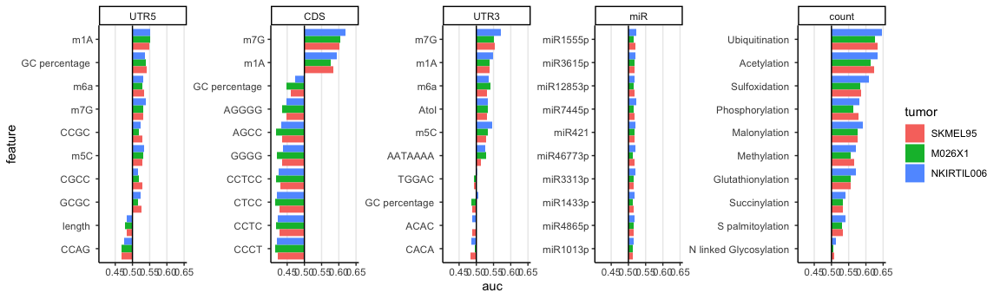

Visualizing the importance of features
================
Kaspar Bresser
18/02/2024

- [Import data and tidy](#import-data-and-tidy)
- [T test](#t-test)
- [HLA ligand enrichment](#hla-ligand-enrichment)
- [Plot AUC graphs](#plot-auc-graphs)

In these I analysis I’ll try to visualize features that were identified
to be important by the individually fitted randomforest models.

``` r
library(tidyverse)
library(rstatix)
library(tidytext)
```

## Import data and tidy

Import the peptides used to train the models, down-sample decoy peptides
to the same amount as the MS-detected peptides (3389) for each tumor.

``` r
train.peptides <- read_tsv("Output/test_train_sets/HLA_train_set_complete.tsv")
tumor.order <- c("SKMEL95", "M026X1", "NKIRTIL006")

train.peptides %>% 
  group_by(tumor, ligand) %>% 
  nest() %>% 
  ungroup() %>% 
  mutate(sample.size =  rep(c(13556, 3389), 3)) %>% 
  mutate(data = map2(data, sample.size, sample_n)) %>% 
  select(-sample.size) %>% 
  unnest(data) -> train.peptides

train.peptides
```

    ## # A tibble: 50,835 × 8
    ##    ligand tumor  Peptide     swissprot_id     rna    ribo allele      rank
    ##    <lgl>  <chr>  <chr>       <chr>          <dbl>   <dbl> <chr>      <dbl>
    ##  1 FALSE  M026X1 QVKGDKVESY  Q5VVY1         0.111    0    HLA-A0101  1.02 
    ##  2 FALSE  M026X1 RWHPYTNTA   Q96G21       109.     172.   HLA-C0701  3.01 
    ##  3 FALSE  M026X1 YNHNNINQW   P51808        32.1     78.9  HLA-B4402  1.01 
    ##  4 FALSE  M026X1 CFKVMFLQR   O75182         5.49   108.   HLA-C0701 30.6  
    ##  5 FALSE  M026X1 DALDREAAL   Q9C093         3.05     7.17 HLA-B0801  0.097
    ##  6 FALSE  M026X1 IQPFAFKGLAN Q7Z2Q7         0.251    0    HLA-B4402 72.5  
    ##  7 FALSE  M026X1 TAPFVIHDIE  Q03181         9.24    35.6  HLA-C0501 56.2  
    ##  8 FALSE  M026X1 APTLFTMLD   Q01201         3.01    54.0  HLA-B4402 60    
    ##  9 FALSE  M026X1 TVEENRPVGT  O60245        68.2   3339.   HLA-B4402 13.8  
    ## 10 FALSE  M026X1 FSQRSQLARH  Q6ZNA1         2.81    12    HLA-A0101  4.59 
    ## # ℹ 50,825 more rows

Import the important features and the entire feature table.

The `imp.features` table contains the top features, based on summed
importance score over the three lines.

Features table contains a lot of `NA`’s, replace these with 0’s, and
select only the important features.

``` r
imp.features <- read_tsv("Output/top_important_features.tsv")

features <- read_tsv("Data/Protein_per_Uniprot_entry_library_v3.csv.zip")

features %>% 
  select(one_of("Entry", imp.features$feature)) %>% 
  mutate(across(everything(), replace_na, 0 )) -> features
```

    ## Warning: There was 1 warning in `mutate()`.
    ## ℹ In argument: `across(everything(), replace_na, 0)`.
    ## Caused by warning:
    ## ! The `...` argument of `across()` is deprecated as of dplyr 1.1.0.
    ## Supply arguments directly to `.fns` through an anonymous function instead.
    ## 
    ##   # Previously
    ##   across(a:b, mean, na.rm = TRUE)
    ## 
    ##   # Now
    ##   across(a:b, \(x) mean(x, na.rm = TRUE))

select the top 10 features for each class.

``` r
imp.features %>%
  group_by(classes) %>% 
  slice_max(order_by = score, n = 10) %>% 
  pull(feature) -> focus.features 

focus.features
```

    ##  [1] "CDS_m7G"                      "CDS_m1A"                     
    ##  [3] "CCTCC_CDS"                    "CTCC_CDS"                    
    ##  [5] "CCTC_CDS"                     "GC_percentage_CDS"           
    ##  [7] "CCCT_CDS"                     "AGGGG_CDS"                   
    ##  [9] "GGGG_CDS"                     "AGCC_CDS"                    
    ## [11] "UTR3_m7G"                     "UTR3_m1A"                    
    ## [13] "UTR3_m6a"                     "AATAAAA_UTR3"                
    ## [15] "TGGAC_UTR3"                   "CACA_UTR3"                   
    ## [17] "ACAC_UTR3"                    "GC_percentage_UTR3"          
    ## [19] "UTR3_m5C"                     "UTR3_AtoI"                   
    ## [21] "UTR5_m1A"                     "UTR5_m7G"                    
    ## [23] "GC_percentage_UTR5"           "UTR5_m5C"                    
    ## [25] "UTR5_m6a"                     "UTR5_length_UTR5"            
    ## [27] "CCAG_UTR5"                    "CCGC_UTR5"                   
    ## [29] "GCGC_UTR5"                    "CGCC_UTR5"                   
    ## [31] "Ubiquitination_count"         "Phosphorylation_count"       
    ## [33] "Acetylation_count"            "Sulfoxidation_count"         
    ## [35] "Malonylation_count"           "Glutathionylation_count"     
    ## [37] "N_linked_Glycosylation_count" "Methylation_count"           
    ## [39] "S_palmitoylation_count"       "Succinylation_count"         
    ## [41] "hsa.miR.744.5p"               "hsa.miR.331.3p"              
    ## [43] "hsa.miR.143.3p"               "hsa.miR.101.3p"              
    ## [45] "hsa.miR.4677.3p"              "hsa.miR.155.5p"              
    ## [47] "hsa.miR.361.5p"               "hsa.miR.1285.3p"             
    ## [49] "hsa.miR.486.5p"               "hsa.miR.421"

subset the feature table, join with the peptide table, switch to long,
and add feature types

``` r
features %>%
  select(one_of("Entry", focus.features)) %>%  
  inner_join(train.peptides, by =  c("Entry" = "swissprot_id")) %>% 
  pivot_longer(cols = one_of(focus.features), names_to = "feature", values_to = "value") %>%
  mutate(feature = factor(feature, levels = focus.features)) %>% 
  mutate(feature.type = case_when(str_detect(feature, "UTR5") ~ "UTR5",
                                  str_detect(feature, "UTR3") ~ "UTR3",
                                  str_detect(feature, "count") ~ "count",
                                  str_detect(feature, "CDS") ~ "CDS",
                                  str_detect(feature, "hsa") ~ "miR",
                                  TRUE ~ "misc")) -> plot.data

plot.data
```

    ## # A tibble: 2,540,100 × 11
    ##    Entry      ligand tumor      Peptide     rna  ribo allele  rank feature value
    ##    <chr>      <lgl>  <chr>      <chr>     <dbl> <dbl> <chr>  <dbl> <fct>   <dbl>
    ##  1 A0A087WVF3 FALSE  NKIRTIL006 PAKPEQGSS     0     0 HLA-C…    43 CDS_m7G   0  
    ##  2 A0A087WVF3 FALSE  NKIRTIL006 PAKPEQGSS     0     0 HLA-C…    43 CDS_m1A   0  
    ##  3 A0A087WVF3 FALSE  NKIRTIL006 PAKPEQGSS     0     0 HLA-C…    43 CCTCC_…   8  
    ##  4 A0A087WVF3 FALSE  NKIRTIL006 PAKPEQGSS     0     0 HLA-C…    43 CTCC_C…  13  
    ##  5 A0A087WVF3 FALSE  NKIRTIL006 PAKPEQGSS     0     0 HLA-C…    43 CCTC_C…  16  
    ##  6 A0A087WVF3 FALSE  NKIRTIL006 PAKPEQGSS     0     0 HLA-C…    43 GC_per…  58.6
    ##  7 A0A087WVF3 FALSE  NKIRTIL006 PAKPEQGSS     0     0 HLA-C…    43 CCCT_C…  12  
    ##  8 A0A087WVF3 FALSE  NKIRTIL006 PAKPEQGSS     0     0 HLA-C…    43 AGGGG_…   4  
    ##  9 A0A087WVF3 FALSE  NKIRTIL006 PAKPEQGSS     0     0 HLA-C…    43 GGGG_C…   8  
    ## 10 A0A087WVF3 FALSE  NKIRTIL006 PAKPEQGSS     0     0 HLA-C…    43 AGCC_C…   8  
    ## # ℹ 2,540,090 more rows
    ## # ℹ 1 more variable: feature.type <chr>

## T test

To specifically select a couple features that are significantly
associated with HLA sampling, we can do a simple t test.

Plot the T statistics as barplots, either all together or facetted.

``` r
feat.classes <- (c("UTR5","CDS" ,"UTR3","miR",  "count"))

plot.data %>% 
  group_by(feature) %>% 
  t_test(value~ligand) %>% 
  adjust_pvalue(method = "bonferroni") -> stats

stats
```

    ## # A tibble: 50 × 10
    ##    feature  .y.   group1 group2    n1    n2 statistic     df         p     p.adj
    ##    <fct>    <chr> <chr>  <chr>  <int> <int>     <dbl>  <dbl>     <dbl>     <dbl>
    ##  1 CDS_m7G  value FALSE  TRUE   40668 10134     -33.5 12402. 8.21e-236 4.11e-234
    ##  2 CDS_m1A  value FALSE  TRUE   40668 10134     -20.4 12689. 8.99e- 91 4.49e- 89
    ##  3 CCTCC_C… value FALSE  TRUE   40668 10134      34.1 44087. 1.5 e-251 7.5 e-250
    ##  4 CTCC_CDS value FALSE  TRUE   40668 10134      33.9 44376. 4.59e-249 2.29e-247
    ##  5 CCTC_CDS value FALSE  TRUE   40668 10134      33.5 43916. 3.07e-243 1.53e-241
    ##  6 GC_perc… value FALSE  TRUE   40668 10134      16.9 16627. 8.11e- 64 4.06e- 62
    ##  7 CCCT_CDS value FALSE  TRUE   40668 10134      33.6 34465. 3.19e-244 1.60e-242
    ##  8 AGGGG_C… value FALSE  TRUE   40668 10134      27.9 24541. 4.58e-169 2.29e-167
    ##  9 GGGG_CDS value FALSE  TRUE   40668 10134      32.6 26810. 2.52e-228 1.26e-226
    ## 10 AGCC_CDS value FALSE  TRUE   40668 10134      31.7 36781. 6.56e-218 3.28e-216
    ## # ℹ 40 more rows

``` r
stats %>% 
  mutate(feature.type = case_when(str_detect(feature, "UTR5") ~ "UTR5",
                                  str_detect(feature, "UTR3") ~ "UTR3",
                                  str_detect(feature, "count") ~ "count",
                                  str_detect(feature, "CDS") ~ "CDS",
                                  str_detect(feature, "hsa") ~ "miR",
                                  TRUE ~ "misc"),
         feature.type = factor(feature.type, levels = feat.classes),
           feature = str_remove_all(feature, "UTR5|UTR3|CDS|count|hsa|\\."),
           feature = str_replace_all(feature, "_", " "),
           feature = reorder_within(feature, -statistic, feature.type)) %>% 
  ggplot(aes(x = feature, y = -statistic, fill = p.adj < 0.05))+
    geom_bar(stat = "identity")+
    coord_flip()+
    scale_x_reordered()+
    theme_minimal()+
    facet_wrap(~feature.type, scales = "free_y", nrow = 1)
```


``` r
ggsave("Figs/importance_Tstat_facet.pdf", width = 16, height = 2.8)

stats %>% 
  mutate(feature.type = case_when(str_detect(feature, "UTR5") ~ "UTR5",
                                  str_detect(feature, "UTR3") ~ "UTR3",
                                  str_detect(feature, "count") ~ "count",
                                  str_detect(feature, "CDS") ~ "CDS",
                                  str_detect(feature, "hsa") ~ "miR",
                                  TRUE ~ "misc"),
           feature = str_remove_all(feature, "UTR5|UTR3|CDS|count|hsa|\\."),
           feature = str_replace_all(feature, "_", " "),
           feature = reorder_within(feature, -statistic, feature.type)) %>% 
  write_tsv("Output/Fig_S2B.tsv")
```

``` r
stats %>% 
  ggplot(aes(x = reorder(feature, -statistic), y = -statistic, fill = p.adj < 0.05))+
    geom_bar(stat = "identity")+
    coord_flip()+
    theme_minimal()
```


``` r
ggsave("Figs/importance_Tstat_all.pdf", width = 6, height = 7)
```

Next we can plot the top and bottom 10 features by t-statistic.

``` r
stats %>% 
  filter(dense_rank(statistic) <= 10 | dense_rank(desc(statistic)) <= 10) %>% 
  pull(feature) %>% 
  fct_drop() -> feats

plot.data %>% 
  mutate(tumor = factor(tumor, levels = tumor.order)) %>% 
  filter(feature %in% feats) %>% 
  ggplot(aes(tumor, log10(value+1), fill = ligand))+
  geom_boxplot()+
  facet_wrap(~feature, nrow = 2, scales = "free")+
  theme_classic()
```


``` r
ggsave(("Figs/importance_boxplots.pdf"), width = 12, height = 4, scale = 1.5)

plot.data %>% 
  filter(feature %in% feats) %>% 
    write_tsv("Output/Fig2D.tsv")
```

## HLA ligand enrichment

Was looking for other ways to visualize whether the values of a feature
would allow one to enrich for MS detected peptides. One way to do this
could be to count the amount of HLA ligands present in the top 50%
peptides after sorting for each feature. As a control, I can calculate
the same metric after randomly permuting that feature. I can
subsequently plot the difference between the actual and control setting.

Achieved this with the bit of code below; Adding a column where each
feature is permuted, and a column of random values which I can use later
on for tie breaking. Then nest to get separate tibbles for each feature
and tumor. Then arrange these tibbles by feature value and tie-breaker,
slice off 50% of the columns, calculate the amount of HLA ligands, and
pull those values. Do the sample for the permuted control column.

bootstrapped this analysis. I added some lines to subset 30% of the data
during each loop.

``` r
df.list <- list()
for(i in 1:50){
  plot.data %>% 
    select(ligand, feature, value, tumor, feature.type) %>% 
    group_by(feature, tumor, feature.type) %>%
    mutate(random = sample(value, n()),
           for.arrange = 1:n()) %>% 
    nest() %>%          
    mutate(PPV = map(data, ~sample_frac(., size = .3)),
           control = PPV,
           PPV = map(PPV, ~arrange(., desc(value))),
           PPV = map(PPV, ~slice_head(.,prop =  .5)),
           PPV = map(PPV, ~summarise(., PPV = sum(ligand))),
           PPV = map_dbl(PPV, pull, PPV),
           control = map(control, ~arrange(., desc(random))),
           control = map(control, ~slice_head(.,prop =  .5)),
           control = map(control, ~summarise(., PPV = sum(ligand))),
           control = map_dbl(control, pull, PPV)) %>%
    mutate(difference = PPV-control,
           perc.difference = ((PPV-control)/control)*100) %>% 
    rename_with(~paste0(., i), contains("difference")) %>% 
    select(!c(data, PPV, control)) -> PPV.data
  
  df.list[[i]] <- PPV.data
}

PPV.data <- reduce(df.list, inner_join, by = c("feature", "tumor", "feature.type"))
```

Plot that data as bar plot, and each individual run as points.

``` r
PPV.data %>% 
  pivot_longer(cols = starts_with("perc."), names_to = "replicate", values_to = "difference") %>% 
  group_by(feature.type) %>% 
  group_split() -> to.plot

PPV.data %>% 
  pivot_longer(cols = starts_with("perc."), names_to = "replicate", values_to = "difference") %>% 
  select(feature, tumor, feature.type, replicate, difference) %>% 
  write_tsv( "Fig2EF.tsv")

map(to.plot, ~ggplot(., aes(x = tumor, y = difference, fill = tumor))+
                geom_bar(position = "dodge", stat = "summary", fun = "median")+
                geom_point(position = position_jitterdodge() )+
                facet_wrap(~feature, nrow = 1))
```

    ## [[1]]


    ## 
    ## [[2]]


    ## 
    ## [[3]]


    ## 
    ## [[4]]


    ## 
    ## [[5]]


Or plot as barplot, adding the the confidence interval.

``` r
PPV.data %>% 
  mutate(tumor = factor(tumor, levels = tumor.order)) %>% 
  pivot_longer(cols = starts_with("perc."), names_to = "replicate", values_to = "diff") %>% 
  group_by(feature, feature.type, tumor) %>% 
  summarise(difference = mean(diff), stdev = sd(diff), n=n()) %>% 
  mutate(se = stdev/sqrt(n)) %>%
  mutate(ic = se * qt((1-0.05)/2 + .5, n-1)) %>% 
  group_by(feature, feature.type) %>% 
  mutate(group.mean = mean(difference)) %>% 
  mutate(feature.label = str_replace_all(feature, "_", " "),
         feature.label = str_remove(feature.label, feature.type),
         feature.type = factor(feature.type, levels = feat.classes),
         feature = reorder_within(feature, group.mean, feature.type)) -> to.plot

ggplot(to.plot, aes(x = reorder(feature, group.mean), y = difference, fill = tumor,  
                    ymin=difference-ic, ymax=difference+ic))+
  geom_bar( stat="identity", color = "black", position = "dodge") +
  geom_errorbar(  position=position_dodge(width=0.9), width = .3)+
  geom_hline(yintercept = 0)+
  facet_wrap(~feature.type, scales = "free", nrow =1)+
  coord_flip()+
  scale_x_reordered()+
  theme_classic()+
  theme(panel.grid.major.x = element_line())
```


``` r
ggsave("Figs/importance_enrichment_final.pdf", width = 150, height = 35, units = "mm", scale = 2.5)
```

``` r
to.plot %>% 
  group_by(feature, feature.type) %>% 
  summarise(mean.difference = mean(difference)) %>% 
  ggplot(aes(reorder(feature.type, abs(mean.difference)), abs(mean.difference), color = feature.type))+
  geom_boxplot(outlier.shape = NA, size = 1)+
  geom_jitter(width = .15, color = "black")+
  theme_classic()+
  theme(panel.grid.major.y = element_line())
```


``` r
to.plot %>% 
  group_by(feature, feature.type) %>% 
  summarise(mean.difference = mean(difference)) %>% 
  ggplot(aes(reorder(feature.type, abs(mean.difference)), abs(mean.difference)))+
  geom_boxplot(outlier.shape = NA, size = 0.5)+
  geom_jitter(shape = 21, width = .15, size = 2.0, aes( fill = feature.type))+
  theme_classic()+
  theme(panel.grid.major.y = element_line())
```


``` r
ggsave("Figs/importance_enrichment_classes_box_final.pdf", width = 4, height = 3)
```

## Plot AUC graphs

``` r
plot.data %>% 
  select(feature, value, ligand, tumor, feature.type) %>% 
  group_by(feature, tumor) %>% 
  arrange(desc(value)) %>% 
  mutate(peptides = 1:n()/n(), ligands_found = cumsum(ligand)/sum(ligand)) -> cumsum.dat
```

``` r
library(bayestestR)
cumsum.dat %>% 
  group_by(feature, tumor, feature.type) %>% 
   summarise(auc = area_under_curve(peptides, ligands_found)) -> auc.dat
```

``` r
t_shift <- scales::trans_new("shift",
                             transform = function(x) {x-.5},
                             inverse = function(x) {x+.5})

feat.classes <- (c("UTR5","CDS" ,"UTR3","miR",  "count"))


auc.dat %>% 
  mutate(tumor = factor(tumor, levels = tumor.order),
         feature.type = factor(feature.type, levels = feat.classes)) %>% 
  group_by(tumor) %>% 
  mutate(feature = str_remove_all(feature, "UTR5|UTR3|CDS|count|hsa|\\."),
         feature = str_replace_all(feature, "_", " ")) %>% 
  mutate(feature = reorder_within(feature, auc, feature.type)) %>% 
  ggplot(aes(x = feature, y = auc, fill = tumor))+
    geom_bar(stat = "identity", position = "dodge")+
    facet_wrap(~feature.type, scales = "free_y", nrow = 1)+
    coord_flip()+
    scale_y_continuous(trans = t_shift)+
    scale_x_reordered()+
    geom_hline(yintercept = .5)+
    theme_classic()+
    theme(panel.grid.major.x = element_line(), legend.position = "right")
```



``` r
ggsave("./Figs/AUC_plots.pdf", units = "mm", width = 135, height = 35, scale = 2)
```
