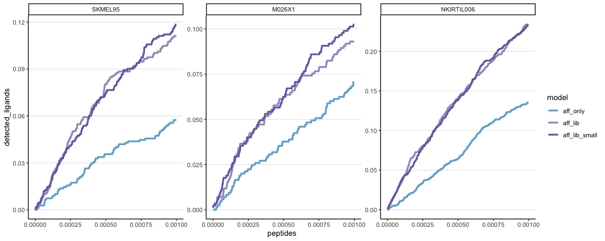

XGB results top 0.1%
================
Kaspar Bresser
28/02/2024

- [Import and tidy data](#import-and-tidy-data)
- [Positive predictive value](#positive-predictive-value)
- [Cumulative sums](#cumulative-sums)
- [Area under the curve](#area-under-the-curve)
- [Sensitivity ect](#sensitivity-ect)

Used the analysis below to compare the performance of the XGB models.

``` r
library(bayestestR)
library(tidyverse)
```

## Import and tidy data

Import the results table.

``` r
XGB.results <- read_tsv("./Output/all_predictions_new.tsv")
```

Convert the ligand column to a binary so it can be used for cumsum
calculation, pivot to longer data by putting the models in a grouped
format.

``` r
XGB.results %>% 
  mutate(detected = case_when(ligand == TRUE ~ 1,
                              TRUE ~ 0)) %>% 
  mutate(rank = -rank) %>% 
  pivot_longer(cols = !c("detected", "ligand", "tumor", "swissprot_id", "Peptide", "allele"), 
               names_to =  "model", 
               values_to =  "score") -> XGB.results

XGB.results
```

    ## # A tibble: 39,926,724 × 8
    ##    ligand Peptide   swissprot_id tumor  allele    detected model           score
    ##    <lgl>  <chr>     <chr>        <chr>  <chr>        <dbl> <chr>           <dbl>
    ##  1 FALSE  ELHSQLDGS Q14CN2       M026X1 HLA-A0201        0 aff_lib       1.97e-3
    ##  2 FALSE  ELHSQLDGS Q14CN2       M026X1 HLA-A0201        0 aff_lib_small 1.89e-3
    ##  3 FALSE  ELHSQLDGS Q14CN2       M026X1 HLA-A0201        0 aff_lib_smal… 1.30e-5
    ##  4 FALSE  ELHSQLDGS Q14CN2       M026X1 HLA-A0201        0 aff_lib_smal… 5.25e-5
    ##  5 FALSE  ELHSQLDGS Q14CN2       M026X1 HLA-A0201        0 aff_lib_smal… 1.11e-5
    ##  6 FALSE  ELHSQLDGS Q14CN2       M026X1 HLA-A0201        0 aff_only      7.85e-3
    ##  7 FALSE  ELHSQLDGS Q14CN2       M026X1 HLA-A0201        0 aff_ribo      9.66e-5
    ##  8 FALSE  ELHSQLDGS Q14CN2       M026X1 HLA-A0201        0 aff_rna_ribo  8.34e-6
    ##  9 FALSE  ELHSQLDGS Q14CN2       M026X1 HLA-A0201        0 aff_rna       8.94e-6
    ## 10 FALSE  ELHSQLDGS Q14CN2       M026X1 HLA-A0201        0 rna           0      
    ## # ℹ 39,926,714 more rows

For these analysis we’ll focus on the top 0.1% scoring peptides for each
model. Let’s subset on those. Note that I arrange on both both model
scores and a random number for tie breaking.

Next we’ll calculate the cumulative sums by grouping by tumor and model.

Note that `cumsum()` takes an ordered dataframe.

``` r
XGB.results %>% 
  group_by(tumor, model) %>% 
  mutate(random = sample(1:n())) %>% 
  arrange(desc(score), random, .by_group = T) %>% 
    mutate(peptides = 1:n()/n(), 
         detected_ligands = cumsum(detected)/sum(detected)) %>% 
  slice_head(prop = .001) -> XGB.results
```

Lastly, set the ordering in which we’d like the models to appear in
plots, by converting the models variable to a factor

``` r
unique(XGB.results$model)
```

    ##  [1] "aff_lib"                "aff_lib_small"          "aff_lib_small_ribo"    
    ##  [4] "aff_lib_small_rna"      "aff_lib_small_rna_ribo" "aff_only"              
    ##  [7] "aff_ribo"               "aff_rna"                "aff_rna_ribo"          
    ## [10] "rank"                   "ribo"                   "rna"

``` r
unique(XGB.results$tumor)
```

    ## [1] "M026X1"     "NKIRTIL006" "SKMEL95"

``` r
model.order <- c("aff_only", "aff_lib", "aff_lib_small", "aff_lib_small_rna", "aff_rna","aff_ribo","aff_rna_ribo",
                 "aff_lib_small_ribo", "aff_lib_small_rna_ribo")


tumor.order <- c("SKMEL95", "M026X1","NKIRTIL006")

XGB.results %>% 
  mutate(model = as_factor(model),
         model = fct_relevel(model, model.order),
         tumor = factor(tumor, levels = tumor.order)) %>% 
  filter(model %in% model.order) -> XGB.results

XGB.results
```

    ## # A tibble: 29,934 × 11
    ## # Groups:   tumor, model [27]
    ##    ligand Peptide swissprot_id tumor allele detected model score random peptides
    ##    <lgl>  <chr>   <chr>        <fct> <chr>     <dbl> <fct> <dbl>  <int>    <dbl>
    ##  1 TRUE   LADAIN… P08670       M026… HLA-C…        1 aff_… 1.00   17096  1.17e-6
    ##  2 FALSE  HAFEII… P46782       M026… HLA-C…        0 aff_… 1.00  564693  2.34e-6
    ##  3 TRUE   KIYEGQ… P46777       M026… HLA-A…        1 aff_… 1.00  144208  3.51e-6
    ##  4 FALSE  AENGKS… P61769       M026… HLA-B…        0 aff_… 1.00  406613  4.67e-6
    ##  5 FALSE  AEEAKL… P56211       M026… HLA-B…        0 aff_… 1.00  846943  5.84e-6
    ##  6 FALSE  YQDLLN… P08670       M026… HLA-C…        0 aff_… 1.00  305788  7.01e-6
    ##  7 FALSE  YVDDGL… P14618       M026… HLA-C…        0 aff_… 1.00  271965  8.18e-6
    ##  8 FALSE  EENEEK… Q96NE9       M026… HLA-B…        0 aff_… 0.999 457024  9.35e-6
    ##  9 TRUE   VGDPST… O15042       M026… HLA-C…        1 aff_… 0.999 179187  1.05e-5
    ## 10 FALSE  ARNPPG… Q16629       M026… HLA-C…        0 aff_… 0.999 664806  1.17e-5
    ## # ℹ 29,924 more rows
    ## # ℹ 1 more variable: detected_ligands <dbl>

## Positive predictive value

Lets first plot the positive predictive value (PPV), i.e. the number of
true positives within a certain threshold. Calculate the PPV as the
number of true positives divided by the total number of peptides within
the selected pool.

Plot improvement gained with library:

``` r
core.models <- c("aff_only", "aff_lib", "aff_lib_small")
#colors <- c("#27aae1", "#6675b8", "#834e9f", "#2bb673", "#2e7a3c", "cyan3", "cyan4")
colors <- c("#6BAED6", "#9E9AC8", "#756BB1")

XGB.results %>%  
  filter(model %in% core.models) %>% 
  group_by(tumor, model) %>% 
  summarise(PPV = sum(detected)/n()) %>% 
ggplot( aes(x = tumor, y = PPV, fill = model)) +
  geom_bar(stat = "identity", width=0.75, position=position_dodge(width=0.85), color = "black")+
  ggtitle("PPV in top 0.1%")+
  scale_fill_manual(values = colors, labels = c("A", "A+SF", "A+SF(trim)"))+
  ggtitle("PPV in top 0.1%")+
  theme_classic()+
  theme(plot.title = element_text(hjust = 0.5), panel.grid.major.y = element_line())
```


``` r
ggsave("Figs/XGB_PPV_bar_core.pdf", width = 3, height = 2, scale = 2)
```

``` r
rna.models <- c("aff_only",  "aff_lib_small", "aff_rna","aff_ribo","aff_rna_ribo")

colors <- c("#6BAED6",  "#756BB1", "#74C476", "#31A354" ,"#006D2C")

XGB.results %>%  
  filter(model %in% rna.models) %>% 
  group_by(tumor, model) %>% 
  summarise(PPV = sum(detected)/n()) %>% 
ggplot( aes(x = tumor, y = PPV, fill = model)) +
  geom_bar(stat = "identity", width=0.75, position=position_dodge(width=0.85), color = "black")+
  ggtitle("PPV in top 0.1%")+
  scale_fill_manual(values = colors, labels = c("A", "A+SF", "A+RNA", "A+RP", "A+RNA+RP"))+
  ggtitle("PPV in top 0.1%")+
  theme_classic()+
  theme(plot.title = element_text(hjust = 0.5), panel.grid.major.y = element_line())
```


``` r
ggsave("Figs/XGB_PPV_bar_RNA.pdf", width = 3, height = 2, scale = 2)
```

``` r
sf.models <- c("aff_only",  "aff_lib_small", "aff_lib_small_rna","aff_lib_small_ribo","aff_lib_small_rna_ribo")

colors <- c("#6BAED6",  "#756BB1", "#2171B5", "#08519C" ,"#08306B")

XGB.results %>%  
  filter(model %in% sf.models) %>% 
  group_by(tumor, model) %>% 
  summarise(PPV = sum(detected)/n()) %>% 
ggplot( aes(x = tumor, y = PPV, fill = model)) +
  geom_bar(stat = "identity", width=0.75, position=position_dodge(width=0.85), color = "black")+
  ggtitle("PPV in top 0.1%")+
  scale_fill_manual(values = colors, labels = c("A", "A+SF", "A+SF+RNA", "A+SF+RP", "A+SF+RNA+RP"))+
  ggtitle("PPV in top 0.1%")+
  theme_classic()+
  theme(plot.title = element_text(hjust = 0.5), panel.grid.major.y = element_line())
```


``` r
ggsave("Figs/XGB_PPV_bar_SF.pdf", width = 3, height = 2, scale = 2)
```

``` r
sf.models <- c("aff_only",  "aff_rna", "aff_lib_small_rna", "aff_ribo","aff_lib_small_ribo", "aff_rna_ribo","aff_lib_small_rna_ribo")

colors <- c("#6BAED6",  "#74C476", "#2171B5","#31A354", "#08519C", "#006D2C","#08306B")

XGB.results %>%  
  filter(model %in% sf.models) %>% 
  mutate(model = factor(model, levels = sf.models)) %>% 
  group_by(tumor, model) %>% 
  summarise(PPV = sum(detected)/n()) %>% 
ggplot( aes(x = tumor, y = PPV, fill = model)) +
  geom_bar(stat = "identity", width=0.75, position=position_dodge(width=0.85), color = "black")+
  ggtitle("PPV in top 0.1%")+
  scale_fill_manual(values = colors)+
  ggtitle("PPV in top 0.1%")+
  theme_classic()+
  theme(plot.title = element_text(hjust = 0.5), panel.grid.major.y = element_line())
```


``` r
ggsave("Figs/XGB_PPV_bar_SF_compared.pdf", width = 3, height = 2, scale = 2)
```

Can also plot the PPV on a continuous scale across the top 0.1%.

``` r
colors <- c("#6BAED6", "#9E9AC8", "#756BB1")

XGB.results %>% 
  filter(model %in% core.models) %>% 
  group_by(tumor,model) %>% 
  mutate(PPV = cumsum(detected)/1:n()) %>% 
  ggplot(aes(x = peptides, y = PPV, color = model))+
  geom_line(linewidth = 1.2)+
  scale_color_manual(values = colors)+
  facet_wrap(~tumor, scales = "free")+
  theme_classic()+
  theme(panel.grid.major.y = element_line())
```


``` r
ggsave(("Figs/XGB_PPV_line_core.pdf"), width = 6, height = 2, scale = 2)
```

``` r
colors <- c("#6BAED6",  "#756BB1", "#74C476", "#31A354" ,"#006D2C")

XGB.results %>% 
  filter(model %in% rna.models) %>% 
  group_by(tumor,model) %>% 
  mutate(PPV = cumsum(detected)/1:n()) %>% 
ggplot(aes(x = peptides, y = PPV, color = model))+
  geom_line(linewidth = 1.2)+
  scale_color_manual(values = colors)+
  facet_wrap(~tumor, scales = "free")+
  theme_classic()+
  theme(panel.grid.major.y = element_line())
```


``` r
ggsave(("Figs/XGB_PPV_line_rna.pdf"), width = 6, height = 2, scale = 2)
```

``` r
sf.models <- c("aff_only",  "aff_lib_small", "aff_lib_small_rna","aff_lib_small_ribo","aff_lib_small_rna_ribo")

colors <- c("#6BAED6",  "#756BB1", "#2171B5", "#08519C" ,"#08306B")

XGB.results %>% 
  filter(model %in% sf.models) %>% 
    group_by(tumor,model) %>% 
  mutate(PPV = cumsum(detected)/1:n()) %>% 
ggplot(aes(x = peptides, y = PPV, color = model))+
  geom_line(linewidth = 1.2)+
  scale_color_manual(values = colors)+
  facet_wrap(~tumor, scales = "free")+
  theme_classic()+
  theme(panel.grid.major.y = element_line())
```


``` r
ggsave(("Figs/XGB_PPV_line_SF.pdf"), width = 6, height = 2, scale = 2)
```

## Cumulative sums

Core models:

``` r
colors <- c("#6BAED6", "#9E9AC8", "#756BB1")


XGB.results %>% 
  filter(model %in% core.models) %>% 
  ggplot(aes(x = peptides, y = detected_ligands, color = model))+
  geom_line(size = 1.2)+  
  scale_color_manual(values = colors)+
  facet_wrap(~tumor, scales = "free")+
  theme_classic()+
  theme(panel.grid.major.y = element_line())
```

    ## Warning: Using `size` aesthetic for lines was deprecated in ggplot2 3.4.0.
    ## ℹ Please use `linewidth` instead.
    ## This warning is displayed once every 8 hours.
    ## Call `lifecycle::last_lifecycle_warnings()` to see where this warning was
    ## generated.



``` r
ggsave(("Figs/XGB_cumsum_core.pdf"), width = 6, height = 2, scale = 2)
```

``` r
colors <- c("#6BAED6",  "#756BB1", "#74C476", "#31A354" ,"#006D2C")


XGB.results %>% 
  filter(model %in% rna.models) %>% 
  ggplot(aes(x = peptides, y = detected_ligands, color = model))+
  geom_line(size = 1.2)+  
  scale_color_manual(values = colors)+
  facet_wrap(~tumor, scales = "free")+
  theme_classic()+
  theme(panel.grid.major.y = element_line())
```


``` r
ggsave(("Figs/XGB_cumsum_rna.pdf"), width = 6, height = 2, scale = 2)
```

``` r
colors <- c("#6BAED6", "#9E9AC8", "#756BB1")
colors <- c("#6BAED6",  "#756BB1", "#74C476", "#31A354" ,"#006D2C")
colors <- c("#6BAED6",  "#756BB1", "#2171B5", "#08519C" ,"#08306B")


XGB.results %>% 
  filter(model %in% sf.models) %>% 
  ggplot(aes(x = peptides, y = detected_ligands, color = model))+
  geom_line(size = 1.2)+  
  scale_color_manual(values = colors)+
  facet_wrap(~tumor, scales = "free")+
  theme_classic()+
  theme(panel.grid.major.y = element_line())
```


``` r
ggsave(("Figs/XGB_cumsum_SF.pdf"), width = 6, height = 2, scale = 2)
```

## Area under the curve

Or calculate the AUC of these curves as a summary metric and plot that.
Used the `area_under_curve()` function from the
[bayestestR](https://easystats.github.io/bayestestR/index.html) package.
First check maximum AUC to normalize between 0 and 1.

Core models:

``` r
colors <- c("#6BAED6", "#9E9AC8", "#756BB1")


XGB.results %>% 
  filter(model %in% core.models) %>% 
  group_by(tumor, model) %>% 
  summarise(auc = area_under_curve(peptides, detected_ligands)) %>% 
  ggplot( aes(x = tumor, y = auc, fill = model)) +
  geom_bar(stat = "identity", width=0.75, position=position_dodge(width=0.85), color = "black")+  
  scale_fill_manual(values = colors, labels = c("Aff", "Aff+Lib", "Aff+Lib(trim)", "Aff+RNA"))+
  ggtitle("AUC in top 0.1%")+
  theme_classic()+
  theme(plot.title = element_text(hjust = 0.5), panel.grid.major.y = element_line())
```


``` r
ggsave(("Figs/XGB_AUC_core.pdf"), width = 3, height = 2, scale = 2)
```

``` r
colors <- c("#6BAED6",  "#756BB1", "#74C476", "#31A354" ,"#006D2C")

XGB.results %>% 
  filter(model %in% rna.models) %>% 
  group_by(tumor, model) %>% 
  summarise(auc = area_under_curve(peptides, detected_ligands)) %>% 
  ggplot( aes(x = tumor, y = auc, fill = model)) +
  geom_bar(stat = "identity", width=0.75, position=position_dodge(width=0.85), color = "black")+  
  scale_fill_manual(values = colors)+
  ggtitle("AUC in top 0.1%")+
  theme_classic()+
  theme(plot.title = element_text(hjust = 0.5), panel.grid.major.y = element_line())
```


``` r
ggsave(("Figs/XGB_AUC_rna.pdf"), width = 3, height = 2, scale = 2)
```

``` r
colors <- c("#6BAED6",  "#756BB1", "#2171B5", "#08519C" ,"#08306B")

XGB.results %>% 
  filter(model %in% sf.models) %>% 
  group_by(tumor, model) %>% 
  summarise(auc = area_under_curve(peptides, detected_ligands)) %>% 
  ggplot( aes(x = tumor, y = auc, fill = model)) +
  geom_bar(stat = "identity", width=0.75, position=position_dodge(width=0.85), color = "black")+  
  scale_fill_manual(values = colors)+
  ggtitle("AUC in top 0.1%")+
  theme_classic()+
  theme(plot.title = element_text(hjust = 0.5), panel.grid.major.y = element_line())
```


``` r
ggsave(("Figs/XGB_AUC_sf.pdf"), width = 3, height = 2, scale = 2)
```

``` r
sf.models <- c("aff_only",  "aff_rna", "aff_lib_small_rna", "aff_ribo","aff_lib_small_ribo", "aff_rna_ribo","aff_lib_small_rna_ribo")

colors <- c("#6BAED6",  "#74C476", "#2171B5","#31A354", "#08519C", "#006D2C","#08306B")

XGB.results %>% 
  filter(model %in% sf.models) %>% 
    mutate(model = factor(model, levels = sf.models)) %>% 
  group_by(tumor, model) %>% 
  summarise(auc = area_under_curve(peptides, detected_ligands)*1000) %>% 
  ggplot( aes(x = tumor, y = auc, fill = model)) +
  geom_bar(stat = "identity", width=0.75, position=position_dodge(width=0.85), color = "black")+  
  scale_fill_manual(values = colors)+
  ggtitle("AUC in top 0.1%")+
  theme_classic()+
  theme(plot.title = element_text(hjust = 0.5), panel.grid.major.y = element_line())
```


``` r
ggsave(("Figs/XGB_AUC_sf_compared.pdf"), width = 3, height = 2, scale = 2)
```

## Sensitivity ect

Read in the data to get metrics of model performance

``` r
library(pROC)

XGB.results <- read_tsv("./Output/all_predictions_new.tsv")

XGB.results <- mutate(XGB.results, rank = -rank)
```

Define a function to retrieve the performance metrics, and a function to
get the cutoffs at a certain threshold of sensitivity

``` r
get_sens_spec <- function(lig, preds, mods){
 
  map(preds, ~roc(lig, .)) %>% 
     map(~coords(., x = "all", input = "sensitivity", ret = "all") ) -> tmp

    
  tibble(model = mods, dat = tmp) %>% 
    unnest()
    
}

get_cutoffs <- function(lig, preds, mods, thresh){
  map(preds, ~roc(lig, .)) %>%
    map(~coords(., x = thresh, input = "sensitivity", ret = "all") ) %>% 
  map(~select(., !c(threshold))) %>% 
  bind_rows() %>% 
    mutate(model = mods)
}
```

Get the information

``` r
model.results.info <- get_sens_spec(lig = XGB.results$ligand,
                                    preds = map2(list(XGB.results), model.order, ~pull(.x, .y)),
                                    mods =  model.order)
```

    ## Warning: `cols` is now required when using `unnest()`.
    ## ℹ Please use `cols = c(dat)`.

``` r
coordinates <- get_cutoffs(lig = XGB.results$ligand,
                           preds = map2(list(XGB.results), model.order, ~pull(.x, .y)),
                           mods =  model.order,
                           thresh = 0.1)

model.results.info
```

    ## # A tibble: 2,197,609 × 25
    ##    model    threshold specificity sensitivity accuracy     tn    tp    fn     fp
    ##    <chr>        <dbl>       <dbl>       <dbl>    <dbl>  <dbl> <dbl> <dbl>  <dbl>
    ##  1 aff_on… -Inf             0           1     0.000994 0       3306     0 3.32e6
    ##  2 aff_on…    0.00565       0.134       0.999 0.135    4.45e5  3303     3 2.88e6
    ##  3 aff_on…    0.00693       0.155       0.999 0.156    5.14e5  3303     3 2.81e6
    ##  4 aff_on…    0.00819       0.423       0.996 0.424    1.41e6  3292    14 1.92e6
    ##  5 aff_on…    0.0112        0.447       0.995 0.447    1.49e6  3289    17 1.84e6
    ##  6 aff_on…    0.0158        0.508       0.994 0.509    1.69e6  3286    20 1.63e6
    ##  7 aff_on…    0.0278        0.542       0.994 0.543    1.80e6  3286    20 1.52e6
    ##  8 aff_on…    0.0447        0.595       0.992 0.595    1.98e6  3280    26 1.35e6
    ##  9 aff_on…    0.0647        0.619       0.992 0.620    2.06e6  3278    28 1.27e6
    ## 10 aff_on…    0.0950        0.695       0.985 0.696    2.31e6  3256    50 1.01e6
    ## # ℹ 2,197,599 more rows
    ## # ℹ 16 more variables: npv <dbl>, ppv <dbl>, fdr <dbl>, fpr <dbl>, tpr <dbl>,
    ## #   tnr <dbl>, fnr <dbl>, `1-specificity` <dbl>, `1-sensitivity` <dbl>,
    ## #   `1-accuracy` <dbl>, `1-npv` <dbl>, `1-ppv` <dbl>, precision <dbl>,
    ## #   recall <dbl>, youden <dbl>, closest.topleft <dbl>

And plot at 0.1 sensitivity

``` r
colors <- c("#6BAED6",  "#756BB1", "#74C476", "#31A354" ,"#006D2C")

model.results.info %>% 
  filter(model %in% rna.models) %>% 
  mutate(model = factor(model, levels = rna.models)) %>% 
ggplot( aes(x = `1-specificity`, y = sensitivity, color = model))+
  geom_line( linewidth = 1.5)+
  coord_cartesian(ylim = c(0.0, 0.1), xlim = c(0.0, 0.001))+
  geom_segment(aes(x = 0.0, xend = max(coordinates$`1-specificity`), y = .1, yend = .1), color = "black", linetype = "dashed")+
  geom_segment(data = filter(coordinates, model %in% rna.models), aes(x = `1-specificity`, xend = `1-specificity`, y = 0.0, yend = .1, color = model), 
               linewidth = 0.8, linetype = "dashed")+
  scale_color_manual(values = colors)+
  theme_classic()+
  theme(panel.grid.major = element_line())
```

    ## Warning in geom_segment(aes(x = 0, xend = max(coordinates$`1-specificity`), : All aesthetics have length 1, but the data has 347589 rows.
    ## ℹ Did you mean to use `annotate()`?


``` r
ggsave(("Figs/XGB_SensSpec_10.pdf"), width = 2.8, height = 2, scale = 2)
```

    ## Warning in geom_segment(aes(x = 0, xend = max(coordinates$`1-specificity`), : All aesthetics have length 1, but the data has 347589 rows.
    ## ℹ Did you mean to use `annotate()`?

And plot at 0.5 sensitivity

``` r
coordinates <- get_cutoffs(lig = XGB.results$ligand,
                           preds = map2(list(XGB.results), model.order, ~pull(.x, .y)),
                           mods =  model.order,
                           thresh = 0.5)

colors <- c("#6BAED6",  "#756BB1", "#74C476", "#31A354" ,"#006D2C")

model.results.info %>% 
  filter(model %in% rna.models) %>% 
  mutate(model = factor(model, levels = rna.models)) %>% 
ggplot( aes(x = `1-specificity`, y = sensitivity, color = model))+
  geom_line( linewidth = 1.5)+
  coord_cartesian(ylim = c(0.0, 0.5), xlim = c(0.0, 0.015))+
  geom_segment(aes(x = 0.0, xend = max(coordinates$`1-specificity`), y = .5, yend = .5), color = "black", linetype = "dashed")+
  geom_segment(data = filter(coordinates, model %in% rna.models), aes(x = `1-specificity`, xend = `1-specificity`, y = 0.0, yend = .5, color = model), 
               linewidth = 0.8, linetype = "dashed")+
  scale_color_manual(values = colors)+
  theme_classic()+
  theme(panel.grid.major = element_line())
```

    ## Warning in geom_segment(aes(x = 0, xend = max(coordinates$`1-specificity`), : All aesthetics have length 1, but the data has 347589 rows.
    ## ℹ Did you mean to use `annotate()`?


``` r
ggsave(("Figs/XGB_SensSpec_50.pdf"), width = 2.8, height = 2, scale = 2)
```

    ## Warning in geom_segment(aes(x = 0, xend = max(coordinates$`1-specificity`), : All aesthetics have length 1, but the data has 347589 rows.
    ## ℹ Did you mean to use `annotate()`?
