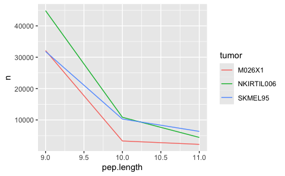

Generate peptide database
================
Kaspar Bresser
22/03/2024

- [Lung data peptide select](#lung-data-peptide-select)
  - [Import ligands](#import-ligands)
  - [Run netMHCpan](#run-netmhcpan)
    - [Cleanup and combine per tumor](#cleanup-and-combine-per-tumor)
    - [Finalize files](#finalize-files)
  - [Final combine data](#final-combine-data)

``` r
library(babelgene)
library(tidyverse)
library(furrr)
```

# Lung data peptide select

## Import ligands

``` r
MS.data <- read_tsv("Output/Melanoma_train_set_complete.tsv")
```

``` r
tumors <- unique(MS.data$tumor)

MS.data %>% 
  transmute(sequence = Peptide, swissprot.id = swissprot_id, tumor = tumor) %>% 
  na.omit() %>% 
  distinct(sequence, tumor, .keep_all = T) -> MS.data

MS.data %>% count(tumor)
```

    ## # A tibble: 3 × 2
    ##   tumor          n
    ##   <chr>      <int>
    ## 1 M026X1     37642
    ## 2 NKIRTIL006 60126
    ## 3 SKMEL95    48477

Tidy up, and add peptide lengths.

``` r
MS.data %>% 
  mutate(pep.length = str_length(sequence))  -> MS.data

MS.data
```

    ## # A tibble: 146,245 × 4
    ##    sequence  swissprot.id tumor  pep.length
    ##    <chr>     <chr>        <chr>       <int>
    ##  1 IVGAYICIF Q8IVW8       M026X1          9
    ##  2 YTVCRDLKE O43913       M026X1          9
    ##  3 MEEPGATPQ A4FU28       M026X1          9
    ##  4 RLASARTLY Q9H0A0       M026X1          9
    ##  5 ISIEAMDFV Q8WZ42       M026X1          9
    ##  6 CEAVNPTRF Q9UK80       M026X1          9
    ##  7 PGKKGQAGP P39059       M026X1          9
    ##  8 CSVEVRQED Q8NHY3       M026X1          9
    ##  9 LIDKNLESK Q9HCM2       M026X1          9
    ## 10 SFLFLEPME Q9UGM5       M026X1          9
    ## # ℹ 146,235 more rows

Check the amount of 9mers for each allele.

``` r
pep.lengths <- count(MS.data, tumor, pep.length)

pep.lengths %>% 
  filter(pep.length %in% 8:12) %>% 
ggplot( aes(x = pep.length, y = n, color = tumor))+
  geom_line()
```



Write out the table and peptide files

## Run netMHCpan

Get the file names

``` r
files <- list.files("Output/Melanoma/peptides", pattern = "Melanoma_Pep", full.names = T)

files
```

``` r
HLA.alleles <- list(M026X1 = c("A0201","A0101", "B0801", "B4402", "C0501","C0701"), 
                    SKMEL95 =c("A0201","A2402", "B1801","B5101","C0501","C1601"),
                    NKIRTIL006 = c("A0201", "B1501", "B4402", "C0501", "C0304" ))
```

Run system command for netMHCpan, for each allele. Define function to
get the arguments/flags for netMHCpan

``` r
args_netMHC <- function(allele, file.name, peptide.len){
  c(
    paste0("-a HLA-", sub("(.{3})(.*)", "\\1:\\2", allele)),
    paste0("-f ", file.name),
    "-p",
    "-rth 0.0",
    "-rlt 0.0",
    paste0("-l ", peptide.len),
    "-t -100",
    "-inpfmt 0"
  )
}
```

wrapper function to predict for each length

``` r
netMHC_wrapper <- function(tum, len){
  
  file.name <- paste0("Output/Melanoma/peptides/Melanoma_Peptides_", tum, "_", len, "AA.tsv")
  all.alleles <- HLA.alleles[[tum]]
  
  future_map(all.alleles, ~system2(command = "netMHCpanExp", 
                      args = args_netMHC(., file.name, len), 
                      stdout  = paste0("./Output/Melanoma/netMHCpanExp_predictions/netMHCpan_prediction_",tum, "_", .,
                                      "_", len , "AA_yay.txt")))
}
```

Run netMHCpan, parallel for the alleles

``` r
plan(multisession, workers = 6)


map2(rep(tumors, 3), rep(9:11, each = 3), ~netMHC_wrapper(.x, .y))
```

### Cleanup and combine per tumor

Define function to read in predictions for each peptide length, cleanup
the netMHC output, and combine them in a single tsv file

``` r
combine_and_clean <- function(tum){

  file.list <- list.files("./Output/Melanoma/netMHCpanExp_predictions/", pattern = tum, full.names = T)

  file.list %>% 
    map(read_lines) %>% 
    map(~.[grepl("   1 HLA", .)]) %>% 
    unlist() %>% 
    c(" Pos         MHC        Peptide      Core Of Gp Gl Ip Il        Icore        Identity  Score_EL %Rank_EL Exp", .) %>% 
    write_lines(paste0("./Output/Melanoma/netMHCpanExp_predictions_clean/", tum,".tsv"))
  
  gc()
}
```

Apply the function for each allele

``` r
map(tumors, combine_and_clean)
```

### Finalize files

Write a function that reads in the allele predictions per tumor line,
only imports the columns needed, joins them together, and selects the
highest affinity rank.

``` r
write_tumor_files <- function(fil){
 tum <- str_split_i(fil, "\\/|\\.", 4)
  fil %>% 
    read_table() %>% 
    distinct(Peptide, MHC, .keep_all = T) %>% 
    transmute(allele = str_remove_all(MHC, "HLA-|\\*|\\:"), sequence = Peptide, rank = `%Rank_EL`) %>% 
    group_by(sequence) %>% 
    slice_min(rank, n=1) %>% 
    write_tsv(paste0("./Output/Melanoma/netMHCpanExp_predictions_clean/HLA_affinities_",tum,".tsv"))
}
```

Define HLA typings per tumor line and run the function.

``` r
list.files("Output/Melanoma/netMHCpanExp_predictions_clean", full.names = T)
map(list.files("Output/Melanoma/netMHCpanExp_predictions_clean", full.names = T), write_tumor_files)
```

## Final combine data

``` r
train.table <- read_tsv("Output/Melanoma_train_set_complete.tsv")
```

``` r
files <- list.files("Output/Melanoma/netMHCpanExp_predictions_clean", pattern = "HLA", full.names = T)

files %>% 
  map(read_tsv) %>% 
  set_names(str_split_i(files, "\\_|\\.", 5)) %>% 
  map2(names(.), ~mutate(.x, tumor = .y)) %>% 
  reduce(bind_rows) %>% 
  mutate(tumor = as.character(tumor)) %>% 
  select(-allele) %>% 
  rename(rankExp = rank) -> netMHCranksExp
```

``` r
train.table %>% 
  left_join(netMHCranksExp, by = c("Peptide" = "sequence", "tumor" = "tumor")) %>% 
  na.omit() -> train.table

train.table %>% 
  count(tumor, ligand)
```

``` r
write_tsv(train.table, "Output/Melanoma_Train_Table_all.tsv")
```
