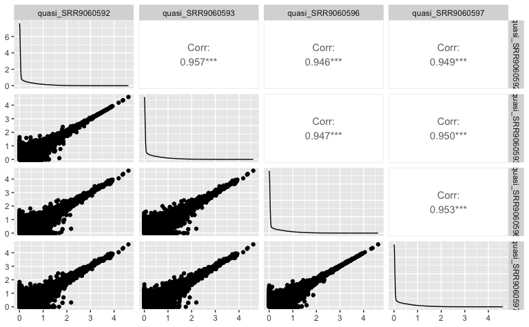
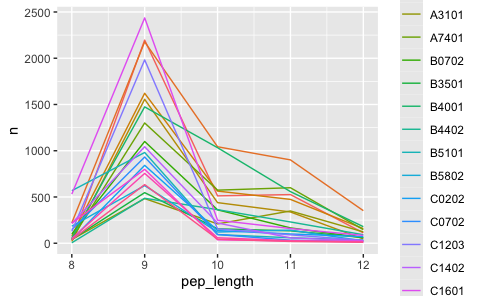

Generate peptide database
================
Kaspar Bresser
25/03/2024

- [Get RNA expression](#get-rna-expression)
- [Import ligands](#import-ligands)
- [Select decoys](#select-decoys)
- [Run netMHCpan](#run-netmhcpan)

prepping the mono-allelic dataset for further processing. Extracting dta
from several alleles, adding decoys, and performing netMHCpan
predictions.

``` r
library(babelgene)
library(seqinr)
library(tidyverse)
library(GGally)
library(readxl)
library(furrr)
```

## Get RNA expression

We’ll first want to check which genes are expressed by the cell line
that was used in the manuscript. Analyzed 4 RNAseq samples that were
deposited by the authors. Start with reading in the tables.

``` r
folders <- list.files(("Data/RNAseq"), pattern = "^quasi_")

salmon.results <- tibble(salmon = map(paste0("Data/RNAseq/", folders, "/quant.sf"), read_tsv),
                         sample = folders)

salmon.results
```

    ## # A tibble: 4 × 2
    ##   salmon                  sample          
    ##   <list>                  <chr>           
    ## 1 <spc_tbl_ [95,309 × 5]> quasi_SRR9060592
    ## 2 <spc_tbl_ [95,309 × 5]> quasi_SRR9060593
    ## 3 <spc_tbl_ [95,309 × 5]> quasi_SRR9060596
    ## 4 <spc_tbl_ [95,309 × 5]> quasi_SRR9060597

Check correlation between the samples using `GGally::ggpairs`.

``` r
salmon.results %>% 
  unnest(salmon) %>% 
  mutate(TPM = log10(TPM+1)) %>% 
  pivot_wider(id_cols = Name, names_from = sample, values_from = TPM) %>% 
  ggpairs(columns = 2:5)
```



Consistency between samples looks good. Calculate mean values.

``` r
salmon.results %>% 
  unnest(salmon) %>%
  group_by(Name) %>% 
  summarise(TPM = mean(TPM)) %>% 
  transmute(ensembl_id = str_remove_all(Name, "\\.\\d+"), TPM = TPM) -> rna.expression

rna.expression
```

    ## # A tibble: 95,309 × 2
    ##    ensembl_id                                                                TPM
    ##    <chr>                                                                   <dbl>
    ##  1 ENST00000000233|ENSG00000004059|OTTHUMG00000023246|OTTHUMT0000005956… 123.   
    ##  2 ENST00000000412|ENSG00000003056|OTTHUMG00000168276|OTTHUMT0000039913…  71.8  
    ##  3 ENST00000000442|ENSG00000173153|OTTHUMG00000150641|OTTHUMT0000031930…   0.793
    ##  4 ENST00000001008|ENSG00000004478|OTTHUMG00000090429|OTTHUMT0000020686…  84.7  
    ##  5 ENST00000001146|ENSG00000003137|OTTHUMG00000129756|OTTHUMT0000025196…   0    
    ##  6 ENST00000002125|ENSG00000003509|OTTHUMG00000128468|OTTHUMT0000025026…  17.1  
    ##  7 ENST00000002165|ENSG00000001036|OTTHUMG00000015728|OTTHUMT0000004252…  38.1  
    ##  8 ENST00000002501|ENSG00000003249|OTTHUMG00000138984|OTTHUMT0000027287…   0    
    ##  9 ENST00000002596|ENSG00000002587|OTTHUMG00000090547|OTTHUMT0000020707…   0.244
    ## 10 ENST00000002829|ENSG00000001617|OTTHUMG00000156806|OTTHUMT0000034592…   0    
    ## # ℹ 95,299 more rows

Check the amount of expressed genes

``` r
table(rna.expression$TPM > 0)
```

    ## 
    ## FALSE  TRUE 
    ## 32308 63001

Read conversion table, which contains Ensemble transcript and gene IDs,
and swissprot IDs.

``` r
conversion.table <- na.omit(read_tsv("Data/HLA_peptidomics/conversion.txt"))

conversion.table
```

    ## # A tibble: 46,100 × 3
    ##    `Ensembl Gene ID` `Ensembl Transcript ID` `UniProt/SwissProt Accession`
    ##    <chr>             <chr>                   <chr>                        
    ##  1 ENSG00000261530   ENST00000566356         P35070                       
    ##  2 ENSG00000260334   ENST00000561776         P01350                       
    ##  3 ENSG00000261125   ENST00000562865         P54257                       
    ##  4 ENSG00000261125   ENST00000568643         P54257                       
    ##  5 ENSG00000261125   ENST00000568276         P54257                       
    ##  6 ENSG00000261125   ENST00000568474         P54257                       
    ##  7 ENSG00000261577   ENST00000565220         P14923                       
    ##  8 ENSG00000261577   ENST00000562805         P14923                       
    ##  9 ENSG00000261577   ENST00000565780         P14923                       
    ## 10 ENSG00000261258   ENST00000568842         Q96AY3                       
    ## # ℹ 46,090 more rows

Extract the transcript ID from the ensembl_id column, join with the
conversion table,

``` r
rna.expression %>% 
  transmute(`Ensembl Transcript ID` = str_extract(ensembl_id, "ENST\\d+"), TPM = TPM) %>% 
  left_join(conversion.table) %>% 
  mutate(ensembl_id = `Ensembl Gene ID`, swissprot_id = `UniProt/SwissProt Accession`) %>% 
  group_by(ensembl_id) %>% 
  summarise(TPM = sum(TPM), swissprot_id = unique(swissprot_id)) -> rna.expression
```

    ## Warning: Returning more (or less) than 1 row per `summarise()` group was deprecated in
    ## dplyr 1.1.0.
    ## ℹ Please use `reframe()` instead.
    ## ℹ When switching from `summarise()` to `reframe()`, remember that `reframe()`
    ##   always returns an ungrouped data frame and adjust accordingly.
    ## Call `lifecycle::last_lifecycle_warnings()` to see where this warning was
    ## generated.

``` r
write_tsv(rna.expression, "Broad_Data/RNAseq/averaged_TPM_values_salmon.tsv")
```

## Import ligands

``` r
excel_sheets("Data/HLA_peptidomics/41587_2019_322_MOESM3_ESM.xlsx")
```

    ##  [1] "Sheet1" "A0101"  "A0201"  "A0202"  "A0203"  "A0204"  "A0205"  "A0206" 
    ##  [9] "A0207"  "A0211"  "A0301"  "A1101"  "A1102"  "A2301"  "A2402"  "A2407" 
    ## [17] "A2501"  "A2601"  "A2902"  "A3001"  "A3002"  "A3101"  "A3201"  "A3301" 
    ## [25] "A3303"  "A3401"  "A3402"  "A3601"  "A6601"  "A6801"  "A6802"  "A7401" 
    ## [33] "B0702"  "B0704"  "B0801"  "B1301"  "B1302"  "B1402"  "B1501"  "B1502" 
    ## [41] "B1503"  "B1510"  "B1517"  "B1801"  "B2705"  "B3501"  "B3503"  "B3507" 
    ## [49] "B3701"  "B3801"  "B3802"  "B4001"  "B4002"  "B4006"  "B4201"  "B4402" 
    ## [57] "B4403"  "B4501"  "B4601"  "B4901"  "B5001"  "B5101"  "B5201"  "B5301" 
    ## [65] "B5401"  "B5501"  "B5502"  "B5601"  "B5701"  "B5703"  "B5801"  "B5802" 
    ## [73] "C0102"  "C0202"  "C0302"  "C0303"  "C0304"  "C0401"  "C0403"  "C0501" 
    ## [81] "C0602"  "C0701"  "C0702"  "C0704"  "C0801"  "C0802"  "C1202"  "C1203" 
    ## [89] "C1402"  "C1403"  "C1502"  "C1601"  "C1701"  "G0101"  "G0103"  "G0104"

``` r
alleles <- c("A2402", "A0201",  "A1101", "A3101", "A2301", "A7401",
             "B3501", "B5101", "B4001", "B0702", "B5802", "B4402", 
             "C0702", "C1203", "C1402", "C1701","C1601", "C0202",
             "G0103", "G0101")
excel.file <- "Data/HLA_peptidomics/41587_2019_322_MOESM3_ESM.xlsx"

tibble(data = map(alleles, ~read_excel(excel.file, sheet = . )), allele = alleles) %>% 
  mutate(data = map(data, ~select(., sequence, hg19.kgXref.geneSymbol))) -> broad.HLA.data
  
broad.HLA.data
```

    ## # A tibble: 20 × 2
    ##    data                 allele
    ##    <list>               <chr> 
    ##  1 <tibble [2,428 × 2]> A2402 
    ##  2 <tibble [3,485 × 2]> A0201 
    ##  3 <tibble [5,550 × 2]> A1101 
    ##  4 <tibble [1,506 × 2]> A3101 
    ##  5 <tibble [3,260 × 2]> A2301 
    ##  6 <tibble [2,944 × 2]> A7401 
    ##  7 <tibble [1,113 × 2]> B3501 
    ##  8 <tibble [1,875 × 2]> B5101 
    ##  9 <tibble [3,429 × 2]> B4001 
    ## 10 <tibble [1,903 × 2]> B0702 
    ## 11 <tibble [1,225 × 2]> B5802 
    ## 12 <tibble [1,229 × 2]> B4402 
    ## 13 <tibble [1,282 × 2]> C0702 
    ## 14 <tibble [2,501 × 2]> C1203 
    ## 15 <tibble [1,658 × 2]> C1402 
    ## 16 <tibble [1,198 × 2]> C1701 
    ## 17 <tibble [3,845 × 2]> C1601 
    ## 18 <tibble [1,408 × 2]> C0202 
    ## 19 <tibble [804 × 2]>   G0103 
    ## 20 <tibble [956 × 2]>   G0101

Tidy up, and add peptide lengths.

``` r
broad.HLA.data %>% 
  unnest(data) %>% 
  mutate(pep_length = str_length(sequence)) %>% 
  dplyr::rename(gene.symbol = "hg19.kgXref.geneSymbol") -> broad.HLA.data

broad.HLA.data
```

    ## # A tibble: 43,599 × 4
    ##    sequence     gene.symbol allele pep_length
    ##    <chr>        <chr>       <chr>       <int>
    ##  1 AFFEGPPFKFKF WDR1        A2402          12
    ##  2 AFFGDVVLRF   CCDC134     A2402          10
    ##  3 AFHPTAQLL    AMBRA1      A2402           9
    ##  4 AFIEKHWTF    CSRP2BP     A2402           9
    ##  5 AFIQKSNLI    ZNF146      A2402           9
    ##  6 AFLDKQNQVKF  ITGA4       A2402          11
    ##  7 AFLEINRQLLF  EID2B       A2402          11
    ##  8 AFLKVSSVF    RANGAP1     A2402           9
    ##  9 AFLYNDQLIW   CCZ1        A2402          10
    ## 10 AFMVNGQKF    PRC1        A2402           9
    ## # ℹ 43,589 more rows

Check the amount of 9,10,11mers for each allele.

``` r
pep.lengths <- count(broad.HLA.data, allele, pep_length)

pep.lengths %>% 
  filter(pep_length %in% 8:12) %>% 
ggplot( aes(x = pep_length, y = n, color = allele))+
  geom_line()
```



Broad data uses gene symbols, expand the conversion table to include
those.

``` r
babelgene::orthologs(genes = na.omit(broad.HLA.data)$gene.symbol, species = "mouse", top = T) %>% 
  transmute(gene.symbol = human_symbol, ensemble_id =  human_ensembl) %>% 
  full_join(conversion.table, by = c("ensemble_id" = "Ensembl Gene ID")) %>% 
  as_tibble() -> conversion.table
```

    ## Warning in full_join(., conversion.table, by = c(ensemble_id = "Ensembl Gene ID")): Detected an unexpected many-to-many relationship between `x` and `y`.
    ## ℹ Row 3 of `x` matches multiple rows in `y`.
    ## ℹ Row 36628 of `y` matches multiple rows in `x`.
    ## ℹ If a many-to-many relationship is expected, set `relationship =
    ##   "many-to-many"` to silence this warning.

``` r
conversion.table
```

    ## # A tibble: 46,369 × 4
    ##    gene.symbol ensemble_id     `Ensembl Transcript ID` UniProt/SwissProt Acces…¹
    ##    <chr>       <chr>           <chr>                   <chr>                    
    ##  1 A1BG        ENSG00000121410 ENST00000263100         P04217                   
    ##  2 A2M         ENSG00000175899 ENST00000318602         P01023                   
    ##  3 AAAS        ENSG00000094914 ENST00000209873         Q9NRG9                   
    ##  4 AAAS        ENSG00000094914 ENST00000394384         Q9NRG9                   
    ##  5 AACS        ENSG00000081760 ENST00000316519         Q86V21                   
    ##  6 AACS        ENSG00000081760 ENST00000316543         Q86V21                   
    ##  7 AACS        ENSG00000081760 ENST00000261686         Q86V21                   
    ##  8 AAGAB       ENSG00000103591 ENST00000261880         Q6PD74                   
    ##  9 AAK1        ENSG00000115977 ENST00000409085         Q2M2I8                   
    ## 10 AAK1        ENSG00000115977 ENST00000406297         Q2M2I8                   
    ## # ℹ 46,359 more rows
    ## # ℹ abbreviated name: ¹​`UniProt/SwissProt Accession`

Select the peptides

``` r
broad.HLA.data %>% 
  filter(pep_length %in% 9:11) %>% 
  mutate(sequence = str_to_upper(sequence)) %>% 
  inner_join(conversion.table, na_matches = "never") %>% 
  group_by(allele) %>% 
  distinct(sequence, .keep_all = T) %>% 
  transmute(sequence = sequence, swissprot_id = `UniProt/SwissProt Accession`, allele = allele, ensembl_id = ensemble_id) -> filtered.peptides
```

    ## Warning in inner_join(., conversion.table, na_matches = "never"): Detected an unexpected many-to-many relationship between `x` and `y`.
    ## ℹ Row 2 of `x` matches multiple rows in `y`.
    ## ℹ Row 17553 of `y` matches multiple rows in `x`.
    ## ℹ If a many-to-many relationship is expected, set `relationship =
    ##   "many-to-many"` to silence this warning.

``` r
filtered.peptides
```

    ## # A tibble: 30,838 × 4
    ## # Groups:   allele [20]
    ##    sequence    swissprot_id allele ensembl_id     
    ##    <chr>       <chr>        <chr>  <chr>          
    ##  1 AFFGDVVLRF  Q9H6E4       A2402  ENSG00000100147
    ##  2 AFHPTAQLL   Q9C0C7       A2402  ENSG00000110497
    ##  3 AFIQKSNLI   Q15072       A2402  ENSG00000167635
    ##  4 AFLDKQNQVKF P13612       A2402  ENSG00000115232
    ##  5 AFLEINRQLLF Q96D98       A2402  ENSG00000176401
    ##  6 AFLKVSSVF   P46060       A2402  ENSG00000100401
    ##  7 AFLYNDQLIW  P86791       A2402  ENSG00000122674
    ##  8 AFMVNGQKF   O43663       A2402  ENSG00000198901
    ##  9 ALPAAFHTW   A8K8P3       A2402  ENSG00000198089
    ## 10 ALPEIFTEL   P41091       A2402  ENSG00000130741
    ## # ℹ 30,828 more rows

``` r
write_tsv(filtered.peptides, "Output/Broad_peptides.tsv")
```

Subsample the peptide pools to get a more workable number, 500 is
slightly under the smallest allele-set.

``` r
"../2-random_forest_analyses/Data/Protein_per_Uniprot_entry_library_v3.csv.zip" %>% 
  read_tsv() %>% 
  pull(Entry) -> IDs.in.library

filtered.peptides %>% 
  filter(swissprot_id %in% IDs.in.library) %>% 
  group_by(allele) %>% 
  slice_sample(n = 500) %>% 
  mutate(ligand = TRUE) %>% 
  ungroup() -> filtered.peptides

filtered.peptides
```

    ## # A tibble: 10,000 × 5
    ##    sequence    swissprot_id allele ensembl_id      ligand
    ##    <chr>       <chr>        <chr>  <chr>           <lgl> 
    ##  1 ALWGEDAEL   Q68DX3       A0201  ENSG00000170324 TRUE  
    ##  2 SLDAAAGMLYL P16591       A0201  ENSG00000151422 TRUE  
    ##  3 LLAEIGAVTL  Q9BSV6       A0201  ENSG00000170892 TRUE  
    ##  4 RVMELFFTV   Q9C0E2       A0201  ENSG00000132953 TRUE  
    ##  5 SLVEQLTMV   O75448       A0201  ENSG00000008838 TRUE  
    ##  6 TLLPGEGPFL  Q14353       A0201  ENSG00000130005 TRUE  
    ##  7 GMDRYLIYV   P05107       A0201  ENSG00000160255 TRUE  
    ##  8 TLATDILMGV  O43143       A0201  ENSG00000109606 TRUE  
    ##  9 ALTEYTLYL   Q14139       A0201  ENSG00000110344 TRUE  
    ## 10 SLFSHSLISI  Q15386       A0201  ENSG00000009335 TRUE  
    ## # ℹ 9,990 more rows

``` r
write_tsv(filtered.peptides, "Output/Broad_peptides_subsample.tsv")
```

## Select decoys

Import UniProt sequences, use the rna expression table to make an
ensembl/UniProt matching table.

Define a function that, for each allele: (1) Checks which sequences were
detected for that allele, (2) samples an excess of proteins from the
uniprot table weighted by their length, (3) then for each sample
extracts a 9mer, (4) Remove detected peptides, filter for uniqueness and
down sample to 350,000.

``` r
uniprot <- read_csv("Data/UniProt_reviewed_input.tsv") %>% rename(swissprot_id = "sequence_id")


rna.expression %>% 
  filter(swissprot_id %in% IDs.in.library) %>% 
  right_join(uniprot) %>% 
  replace_na(list(TPM = 0.0)) -> rna.expression

rna.expression %>% 
  rename(rna = TPM) %>% 
  select(rna, swissprot_id) %>% 
  right_join(filtered.peptides) %>% 
  replace_na(list(rna = 0.0)) %>% 
  distinct(sequence, allele, .keep_all = T) %>% 
  na.omit() -> filtered.peptides
```

``` r
fitered.peptides %>% count(allele, nchar(sequence)) %>% group_by(`nchar(sequence)`) %>% summarise(max(n))

uniprot <- read_csv("Data/HLA_peptidomics/UniProt_reviewed_input.tsv")


get_peptide <- function(a, pep.len){
  broad.HLA.data %>% 
    mutate(sequence = str_to_upper(sequence)) %>% 
    filter(allele == a) %>% 
    filter(nchar(sequence) == pep.len) %>% 
    pull(sequence) %>% 
    toupper() -> s
  
    amount.needed <- nrow(filter(filtered.peptides, allele == a & nchar(sequence) == pep.len))*1000
  
  rna.expression %>% 
    mutate(len = nchar(sequence)) %>% 
    slice_sample(n = amount.needed*2, weight_by = len, replace = T) %>% 
    rowwise() %>% 
    mutate(number = sample(1:(nchar(sequence)-pep.len), 1),
         sequence = str_sub(sequence, number, number+(pep.len-1))) %>% 
    ungroup() %>% 
    filter(!(sequence %in% s)) %>% 
    transmute(sequence = sequence, swissprot_id = swissprot_id, allele = a, rna = TPM, ligand = FALSE) %>% 
    filter(swissprot_id %in% IDs.in.library) %>% 
    distinct(sequence, .keep_all = T) %>% 
    slice_sample(n = amount.needed)
}

decoys <- map2_dfr(rep(alleles, 3), rep(c(9,10,11), each = 20), get_peptide)

filtered.peptides %>% 
  select(!ensembl_id) %>% 
  bind_rows(decoys) -> test.set


test.set %>% 
  count(allele, ligand, nchar(sequence))
```

Write out the table and peptide files

## Run netMHCpan

Run system command for netMHCpan, for each allele.

Define function to read in predictions for each peptide length, cleanup
the netMHC output, and combine them in a single tsv file

``` r
combine_and_clean <- function(allele){

  file.list <- list.files("./Output/netMHCpan_predictions/", pattern = allele)
  file.list <- paste0("./Output/netMHCpan_predictions/", file.list)
  
  file.list %>% 
    map(read_lines) %>% 
    map(~.[grepl("   1 HLA", .)]) %>% 
    unlist() %>% 
    c(" Pos         MHC        Peptide      Core Of Gp Gl Ip Il        Icore        Identity  Score_EL %Rank_EL", .) %>% 
    write_lines(paste0("./Output/netMHCpan_predictions_clean/", allele,".tsv"))
  
  gc()
}
```

Apply the function for each allele

``` r
map(alleles, combine_and_clean)
```
