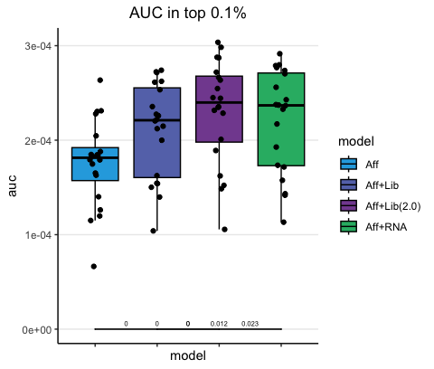

XGB results top 0.1% Broad data
================
Kaspar Bresser
26/03/2024

- [Import and tidy data](#import-and-tidy-data)
- [Area under the curve](#area-under-the-curve)

Used the analysis below to compare the performance of the XGB models.

``` r
library(bayestestR)
library(tidyverse)
library(rstatix)
library(ggpubr)
library(pROC)
```

## Import and tidy data

Import the results table.

``` r
XGB.results <- read_tsv("./Output/all_predictions_mono_allelic.tsv")
```

Convert the ligand column to a binary so it can be used for cumsum
calculation, pivot to longer data by putting the models in a grouped
format.

``` r
XGB.results %>% 
  mutate(detected = case_when(ligand == TRUE ~ 1,
                              TRUE ~ 0)) %>% 
  pivot_longer(cols = !c("detected", "ligand", "allele", "sequence", "swissprot_id"), 
               names_to =  "model", 
               values_to =  "score") -> XGB.results

XGB.results
```

    ## # A tibble: 70,068,376 × 7
    ##    ligand sequence   swissprot_id allele detected model          score
    ##    <lgl>  <chr>      <chr>        <chr>     <dbl> <chr>          <dbl>
    ##  1 TRUE   MEQFPHLAFW P20645       B4402         1 aff_lib        0.995
    ##  2 TRUE   MEQFPHLAFW P20645       B4402         1 aff_lib_small  0.992
    ##  3 TRUE   MEQFPHLAFW P20645       B4402         1 aff_lib_large  0.973
    ##  4 TRUE   MEQFPHLAFW P20645       B4402         1 aff_only       0.955
    ##  5 TRUE   MEQFPHLAFW P20645       B4402         1 aff_rna        0.978
    ##  6 TRUE   MEQFPHLAFW P20645       B4402         1 rank           0.063
    ##  7 TRUE   MEQFPHLAFW P20645       B4402         1 rna           71.8  
    ##  8 TRUE   REHDIAIKFF P30260       B4402         1 aff_lib        0.984
    ##  9 TRUE   REHDIAIKFF P30260       B4402         1 aff_lib_small  0.981
    ## 10 TRUE   REHDIAIKFF P30260       B4402         1 aff_lib_large  0.990
    ## # ℹ 70,068,366 more rows

For these analysis we’ll focus on the top 0.1% scoring peptides for each
model. Let’s subset on those. Note that I arrange on both both model
scores and a random number for tie breaking.

Next we’ll calculate the cumulative sums by grouping by allele and
model.

Note that `cumsum()` takes an ordered dataframe.

``` r
XGB.results %>% 
  group_by(allele, model) %>% 
  mutate(random = sample(1:n())) %>% 
  arrange(desc(score), random, .by_group = T) %>% 
    mutate(peptides = 1:n()/n(), 
         detected_ligands = cumsum(detected)/sum(detected)) %>% 
  slice_head(prop = .001) -> XGB.results
 
XGB.results
```

    ## # A tibble: 70,000 × 10
    ## # Groups:   allele, model [140]
    ##    ligand sequence  swissprot_id allele detected model   score random   peptides
    ##    <lgl>  <chr>     <chr>        <chr>     <dbl> <chr>   <dbl>  <int>      <dbl>
    ##  1 TRUE   KIYEGQVEV P46777       A0201         1 aff_lib 1.00  162282 0.00000200
    ##  2 TRUE   QLDDLKVEL P42766       A0201         1 aff_lib 1.00  267836 0.00000400
    ##  3 FALSE  AVFPHLTVV P61165       A0201         0 aff_lib 1.00  307949 0.00000599
    ##  4 TRUE   TLMEEVLLL Q9H4A6       A0201         1 aff_lib 0.999  45054 0.00000799
    ##  5 FALSE  TLSQAIVKV O15042       A0201         0 aff_lib 0.999 483439 0.00000999
    ##  6 TRUE   ILMEHIHKL P84098       A0201         1 aff_lib 0.999 111107 0.0000120 
    ##  7 TRUE   ILIDWLVQV P14635       A0201         1 aff_lib 0.999 155070 0.0000140 
    ##  8 FALSE  ALDPFIPIL P51398       A0201         0 aff_lib 0.999 258972 0.0000160 
    ##  9 TRUE   HLYDIHVTV A8MXV4       A0201         1 aff_lib 0.999 335224 0.0000180 
    ## 10 TRUE   SLADIAQKL O43242       A0201         1 aff_lib 0.999 381305 0.0000200 
    ## # ℹ 69,990 more rows
    ## # ℹ 1 more variable: detected_ligands <dbl>

Lastly, set the ordering in which we’d like the models to appear in
plots, by converting the models variable to a factor

``` r
unique(XGB.results$model)
```

    ## [1] "aff_lib"       "aff_lib_large" "aff_lib_small" "aff_only"     
    ## [5] "aff_rna"       "rank"          "rna"

``` r
model.order <- c("aff_only", "aff_lib","aff_lib_small", "aff_lib_large", "aff_rna", "rank", "rna")

allele.order <- unique(XGB.results$allele)

colors <- c("#27aae1", "#6675b8", "#834e9f", "#2bb673", "#2e7a3c", "grey")

XGB.results %>% 
  filter(model %in% model.order) %>% 
  mutate(model = as_factor(model),
         model = fct_relevel(model, model.order),
         allele = as_factor(allele),
         allele = fct_relevel(allele, allele.order)) -> XGB.results

XGB.results
```

    ## # A tibble: 70,000 × 10
    ## # Groups:   allele, model [140]
    ##    ligand sequence  swissprot_id allele detected model   score random   peptides
    ##    <lgl>  <chr>     <chr>        <fct>     <dbl> <fct>   <dbl>  <int>      <dbl>
    ##  1 TRUE   KIYEGQVEV P46777       A0201         1 aff_lib 1.00  162282 0.00000200
    ##  2 TRUE   QLDDLKVEL P42766       A0201         1 aff_lib 1.00  267836 0.00000400
    ##  3 FALSE  AVFPHLTVV P61165       A0201         0 aff_lib 1.00  307949 0.00000599
    ##  4 TRUE   TLMEEVLLL Q9H4A6       A0201         1 aff_lib 0.999  45054 0.00000799
    ##  5 FALSE  TLSQAIVKV O15042       A0201         0 aff_lib 0.999 483439 0.00000999
    ##  6 TRUE   ILMEHIHKL P84098       A0201         1 aff_lib 0.999 111107 0.0000120 
    ##  7 TRUE   ILIDWLVQV P14635       A0201         1 aff_lib 0.999 155070 0.0000140 
    ##  8 FALSE  ALDPFIPIL P51398       A0201         0 aff_lib 0.999 258972 0.0000160 
    ##  9 TRUE   HLYDIHVTV A8MXV4       A0201         1 aff_lib 0.999 335224 0.0000180 
    ## 10 TRUE   SLADIAQKL O43242       A0201         1 aff_lib 0.999 381305 0.0000200 
    ## # ℹ 69,990 more rows
    ## # ℹ 1 more variable: detected_ligands <dbl>

## Area under the curve

Or calculate the AUC of these curves as a summary metric and plot that.
Used the `area_under_curve()` function from the
[bayestestR](https://easystats.github.io/bayestestR/index.html) package.

``` r
mods <-  c("aff_only", "aff_lib_small", "aff_lib_large", "aff_rna")


XGB.results %>% 
  filter(model %in% mods) %>% 
  group_by(allele, model) %>% 
  summarise(auc = area_under_curve(peptides, detected_ligands)) %>% 
  ggplot( aes(x = allele, y = auc, fill = model)) +
  geom_bar(stat = "identity", width=0.75, position=position_dodge(width=0.85), color = "black")+
    scale_fill_manual(values = colors, labels = c("Aff", "Aff+Lib", "Aff+Lib(2.0)", "Aff+RNA"))+
  ggtitle("AUC in top 0.1%")+
  theme_classic()+
    theme(plot.title = element_text(hjust = 0.5), 
          panel.grid.major.y = element_line(),
          axis.text.x = element_text(angle = 90, vjust = 0.5, hjust=1))
```


``` r
ggsave(("Figs/XGB_Ext_AUC_bar_core.pdf"), width = 4, height = 2, scale = 2)
```

``` r
XGB.results %>% 
  filter(model %in% mods) %>% 
  group_by(allele, model) %>% 
  summarise(auc = area_under_curve(peptides, detected_ligands)) %>% 
  mutate(model = fct_drop(model)) %>%
  ungroup() %>% 
  rstatix::t_test( auc ~ model, paired = T) %>% 
  add_xy_position(x = "model") %>% 
  mutate(p.adj = round(p.adj, 4)) -> stats
```

``` r
XGB.results %>% 
  filter(model %in% mods) %>% 
  group_by(allele, model) %>% 
  summarise(auc = area_under_curve(peptides, detected_ligands)) %>% 
    ggplot( aes(x = model, y = auc)) +
    geom_boxplot(aes(fill = model), color = "black", outlier.shape = NA)+
    geom_jitter(width = 0.1)+
    scale_fill_manual(values = colors, labels = c("Aff", "Aff+Lib", "Aff+Lib(2.0)", "Aff+RNA"))+
    stat_pvalue_manual(stats, label = "p.adj", 
                     tip.length = 0.00, hide.ns = F, label.size = 2 )+
    ggtitle("AUC in top 0.1%")+
    theme_classic()+
    theme(plot.title = element_text(hjust = 0.5), panel.grid.major.y = element_line(), axis.text.x = element_blank())
```



``` r
ggsave(("Figs/XGB_Ext_AUC_box_core.pdf"), width = 2, height = 2.5, scale = 2)
```
