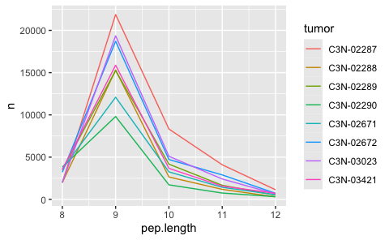

Generate peptide database
================
Kaspar Bresser
28/03/2024

- [Import ligands](#import-ligands)
- [Select decoys](#select-decoys)
- [Run netMHCpan](#run-netmhcpan)
  - [Cleanup and combine per tumor](#cleanup-and-combine-per-tumor)
  - [Finalize files](#finalize-files)
- [Run netMHCpanExp](#run-netmhcpanexp)
  - [Cleanup and combine per tumor](#cleanup-and-combine-per-tumor-1)
  - [Finalize files](#finalize-files-1)
- [Final combine data](#final-combine-data)

``` r
library(babelgene)
library(tidyverse)
library(furrr)
```

## Import ligands

``` r
MS.data <- read_tsv("Data/HLA_MS_data.tsv")
```

``` r
tumors <- c("C3N-02287",
            "C3N-02288",
            "C3N-02289",
           "C3N-02290",
           "C3N-02671",
           "C3N-02672",
           "C3N-03023",
           "C3N-03421")

MS.data %>% 
  select(PEP.GroupingKey, PG.Genes, contains(tumors)) %>% 
  pivot_longer(-c(PEP.GroupingKey, PG.Genes)) %>% 
  mutate(tumor = str_split_i(name, "_", 1)) %>% 
  na.omit() %>% 
  distinct(PEP.GroupingKey, tumor, .keep_all = T) -> MS.data

MS.data %>% count(tumor)
```

    ## # A tibble: 8 × 2
    ##   tumor         n
    ##   <chr>     <int>
    ## 1 C3N-02287 38639
    ## 2 C3N-02288 22015
    ## 3 C3N-02289 25749
    ## 4 C3N-02290 16891
    ## 5 C3N-02671 21617
    ## 6 C3N-02672 31162
    ## 7 C3N-03023 30217
    ## 8 C3N-03421 26677

Tidy up, and add peptide lengths.

``` r
MS.data %>% 
  transmute(sequence = PEP.GroupingKey, tumor = tumor, gene.symbol = PG.Genes) %>% 
  mutate(pep.length = str_length(sequence))  -> MS.data

MS.data
```

    ## # A tibble: 212,967 × 4
    ##    sequence    tumor     gene.symbol pep.length
    ##    <chr>       <chr>     <chr>            <int>
    ##  1 KVLEPSETLVV C3N-02287 SON                 11
    ##  2 KVLEPSETLVV C3N-02288 SON                 11
    ##  3 KVLEPSETLVV C3N-02290 SON                 11
    ##  4 KVLEPSETLVV C3N-02671 SON                 11
    ##  5 KVLEPSETLVV C3N-02672 SON                 11
    ##  6 KVLEPSETLVV C3N-03023 SON                 11
    ##  7 KVLEPSETLVV C3N-03421 SON                 11
    ##  8 SPEPSKIML   C3N-03023 SON                  9
    ##  9 SPEPSKIML   C3N-03421 SON                  9
    ## 10 FPESSAIEAL  C3N-03023 SON                 10
    ## # ℹ 212,957 more rows

Check the amount of 9mers for each allele.

``` r
pep.lengths <- count(MS.data, tumor, pep.length)

pep.lengths %>% 
  filter(pep.length %in% 8:12) %>% 
ggplot( aes(x = pep.length, y = n, color = tumor))+
  geom_line()
```



``` r
babelgene::orthologs(genes = MS.data$gene.symbol, species = "mouse", top = T) %>% 
  transmute(gene.symbol = human_symbol, ensemble_id =  human_ensembl) %>% 
  full_join(read_tsv("Data/conversion.txt"), by = c("ensemble_id" = "Ensembl Gene ID")) %>% 
  as_tibble() %>% 
  na.omit() %>% 
  distinct(gene.symbol, `UniProt/SwissProt Accession`, .keep_all = T) %>% 
  transmute(gene.symbol = gene.symbol, swissprot.id = `UniProt/SwissProt Accession`) -> conversion.table
```

    ## Warning in full_join(., read_tsv("Data/conversion.txt"), by = c(ensemble_id = "Ensembl Gene ID")): Detected an unexpected many-to-many relationship between `x` and `y`.
    ## ℹ Row 1 of `x` matches multiple rows in `y`.
    ## ℹ Row 82718 of `y` matches multiple rows in `x`.
    ## ℹ If a many-to-many relationship is expected, set `relationship =
    ##   "many-to-many"` to silence this warning.

Subsample the peptide pools to get a more workable number, 500 is
slightly under the smallest allele-set.

``` r
"../2-random_forest_analyses/Data/Protein_per_Uniprot_entry_library_v3.csv.zip" %>% 
  read_tsv() %>% 
  pull(Entry) -> IDs.in.library

MS.data %>% 
  count(tumor, pep.length)
```

    ## # A tibble: 64 × 3
    ##    tumor     pep.length     n
    ##    <chr>          <int> <int>
    ##  1 C3N-02287          8  1993
    ##  2 C3N-02287          9 21879
    ##  3 C3N-02287         10  8326
    ##  4 C3N-02287         11  4095
    ##  5 C3N-02287         12  1139
    ##  6 C3N-02287         13   556
    ##  7 C3N-02287         14   349
    ##  8 C3N-02287         15   302
    ##  9 C3N-02288          8  1988
    ## 10 C3N-02288          9 15303
    ## # ℹ 54 more rows

``` r
MS.data %>% 
  filter(pep.length %in% 9:11) %>% 
  left_join(conversion.table) %>% 
  filter(swissprot.id %in% IDs.in.library) %>% 
  distinct(tumor, sequence, .keep_all = T) %>% 
  group_by(tumor) %>% 
  slice_sample(n = 500) %>% 
  mutate(ligand = TRUE) %>% 
  ungroup() -> filtered.peptides
```

    ## Warning in left_join(., conversion.table): Detected an unexpected many-to-many relationship between `x` and `y`.
    ## ℹ Row 2799 of `x` matches multiple rows in `y`.
    ## ℹ Row 9734 of `y` matches multiple rows in `x`.
    ## ℹ If a many-to-many relationship is expected, set `relationship =
    ##   "many-to-many"` to silence this warning.

``` r
write_tsv(filtered.peptides, "Output/Lung_peptides_subsample.tsv")
```

## Select decoys

Import UniProt sequences, use the rna expression table to make an
ensembl/UniProt matching table.

Define a function that, for each allele: (1) Checks which sequences were
detected for that allele, (2) samples an excess of proteins from the
uniprot table weighted by their length, (3) then for each sample
extracts a 9mer, (4) Remove detected peptides, filter for uniqueness and
down sample to 350,000.

``` r
uniprot <- read_csv("Data/UniProt_reviewed_input.tsv") %>% rename(swissprot.id = "sequence_id")


get_peptide <- function(tum, pep.len){
  MS.data %>% 
    mutate(sequence = str_to_upper(sequence)) %>% 
    filter(tumor == tum) %>% 
    filter(nchar(sequence) == pep.len) %>% 
    pull(sequence) %>% 
    toupper() -> s
  
    amount.needed <- nrow(filter(filtered.peptides, tumor == tum & nchar(sequence) == pep.len))*1000
  
  uniprot %>% 
    mutate(len = nchar(sequence)) %>% 
    slice_sample(n = amount.needed*2, weight_by = len, replace = T) %>% 
    rowwise() %>% 
    mutate(number = sample(1:(nchar(sequence)-pep.len), 1),
         sequence = str_sub(sequence, number, number+(pep.len-1))) %>% 
    ungroup() %>% 
    filter(!(sequence %in% s)) %>% 
    transmute(sequence = sequence, swissprot.id = swissprot.id, tumor = tum, ligand = FALSE) %>% 
    filter(swissprot.id %in% IDs.in.library) %>% 
    distinct(sequence, .keep_all = T) %>% 
    slice_sample(n = amount.needed)
}

decoys <- map2_dfr(rep(tumors, 3), rep(c(9,10,11), each = 8), get_peptide)

filtered.peptides %>% 
  select(!c(gene.symbol, pep.length)) %>% 
  bind_rows(decoys) -> test.set


test.set %>% 
  count(tumor, ligand, nchar(sequence))
```

Write out the table and peptide files

## Run netMHCpan

Get the file names

``` r
files <- paste0("Output/peptides/", list.files("Output/peptides/", pattern = "Test_Pep"))

files
```

``` r
HLA.alleles <- list(  `C3N-02287` = c('A0201','A0301','B3801','B4405','C0202','C1203'),
                      `C3N-02288` = c('A0201','A0217','B1302','B1501','C0401','C0602'),
                      `C3N-02289` = c('A0301','A2601','B1801','C0701','C1203'),
                      `C3N-02290` = c('A0101','A0201','B5101','B5201','C1202','C1402'),
                      `C3N-02671` = c('A0101','A0201','B0801','B4402','C0501','C0701'),
                      `C3N-02672` = c('A0201','A1101','B3801','B5101','C1203','C1402'),
                      `C3N-03023` = c('A0201','A2301','B3503','B4403','C0401'),
                      `C3N-03421` = c('A0101','A0201','B0801','C0202','C0701'))
```

Run system command for netMHCpan, for each allele. Define function to
get the arguments/flags for netMHCpan

``` r
args_netMHC <- function(allele, file.name, peptide.len){
  c(
    paste0("-a HLA-", sub("(.{3})(.*)", "\\1:\\2", allele)),
    paste0("-f ", file.name),
    "-p",
    "-rth 0.0",
    "-rlt 0.0",
    paste0("-l ", peptide.len),
    "-t -100"
  )
}
```

wrapper function to predict for each length

``` r
netMHC_wrapper <- function(tum, len){
  
  file.name <- paste0("Output/peptides/Lung_Test_Peptides_", tum, "_", len, "AA.tsv")
  all.alleles <- HLA.alleles[[tum]]
  
  future_map(all.alleles, ~system2(command = "netMHCpan", 
                      args = args_netMHC(., file.name, len), 
                      stdout  = paste0("./Output/netMHCpan_predictions/netMHCpan_prediction_",tum, "_", .,
                                      "_", len , "AA_yay.txt")))
}
```

Run netMHCpan, parallel for the alleles

``` r
plan(multisession, workers = 6)


map2(rep(tumors, 3), rep(9:11, each = 8), ~netMHC_wrapper(.x, .y))
```

### Cleanup and combine per tumor

Define function to read in predictions for each peptide length, cleanup
the netMHC output, and combine them in a single tsv file

``` r
combine_and_clean <- function(tum){

  file.list <- list.files("./Output/netMHCpan_predictions/", pattern = tum, full.names = T)
#  file.list <- paste0("./Output/netMHCpan_predictions/", file.list)
  
  file.list %>% 
    map(read_lines) %>% 
    map(~.[grepl("   1 HLA", .)]) %>% 
    unlist() %>% 
    c(" Pos         MHC        Peptide      Core Of Gp Gl Ip Il        Icore        Identity  Score_EL %Rank_EL", .) %>% 
    write_lines(paste0("./Output/netMHCpan_predictions_clean/", tum,".tsv"))
  
  gc()
}
```

Apply the function for each allele

``` r
map(tumors, combine_and_clean)
```

### Finalize files

Write a function that reads in the allele predictions per tumor line,
only imports the columns needed, joins them together, and selects the
highest affinity rank.

``` r
write_tumor_files <- function(fil){
 tum <- str_split_i(fil, "\\/|\\.", 3)
  fil %>% 
    read_table() %>% 
    distinct(Peptide, MHC, .keep_all = T) %>% 
    transmute(allele = str_remove_all(MHC, "HLA-|\\*|\\:"), sequence = Peptide, rank = `%Rank_EL`) %>% 
    group_by(sequence) %>% 
    slice_min(rank, n=1) %>% 
    write_tsv(paste0("./Output/netMHCpan_predictions_clean/HLA_affinities_",tum,".tsv"))
}
```

Define HLA typings per tumor line and run the function.

``` r
list.files("Output/netMHCpan_predictions_clean", full.names = T)
map(list.files("Output/netMHCpan_predictions_clean", full.names = T), write_tumor_files)
```

## Run netMHCpanExp

Get the file names

``` r
files <- paste0("Output/peptides/", list.files("Output/peptides/", pattern = "Test_Pep"))

files
```

``` r
HLA.alleles <- list(  `C3N-02287` = c('A0201','A0301','B3801','B4405','C0202','C1203'),
                      `C3N-02288` = c('A0201','A0217','B1302','B1501','C0401','C0602'),
                      `C3N-02289` = c('A0301','A2601','B1801','C0701','C1203'),
                      `C3N-02290` = c('A0101','A0201','B5101','B5201','C1202','C1402'),
                      `C3N-02671` = c('A0101','A0201','B0801','B4402','C0501','C0701'),
                      `C3N-02672` = c('A0201','A1101','B3801','B5101','C1203','C1402'),
                      `C3N-03023` = c('A0201','A2301','B3503','B4403','C0401'),
                      `C3N-03421` = c('A0101','A0201','B0801','C0202','C0701'))
```

Run system command for netMHCpan, for each allele. Define function to
get the arguments/flags for netMHCpan

``` r
args_netMHC <- function(allele, file.name, peptide.len){
  c(
    paste0("-a HLA-", sub("(.{3})(.*)", "\\1:\\2", allele)),
    paste0("-f ", file.name),
    "-p",
    "-rth 0.0",
    "-rlt 0.0",
    paste0("-l ", peptide.len),
    "-t -100",
    "-inpfmt 0"
  )
}
```

wrapper function to predict for each length

``` r
netMHC_wrapper <- function(tum, len){
  
  file.name <- paste0("Output/peptides/Lung_Test_Peptides_", tum, "_", len, "AA.tsv")
  all.alleles <- HLA.alleles[[tum]]
  
  future_map(all.alleles, ~system2(command = "netMHCpanExp", 
                      args = args_netMHC(., file.name, len), 
                      stdout  = paste0("./Output/netMHCpanExp_predictions/netMHCpan_prediction_",tum, "_", .,
                                      "_", len , "AA_yay.txt")))
}
```

Run netMHCpan, parallel for the alleles

``` r
plan(multisession, workers = 6)


map2(rep(tumors, 3), rep(9:11, each = 8), ~netMHC_wrapper(.x, .y))
```

### Cleanup and combine per tumor

Define function to read in predictions for each peptide length, cleanup
the netMHC output, and combine them in a single tsv file

``` r
combine_and_clean <- function(tum){

  file.list <- list.files("./Output/netMHCpanExp_predictions/", pattern = tum, full.names = T)
#  file.list <- paste0("./Output/netMHCpan_predictions/", file.list)
  
  file.list %>% 
    map(read_lines) %>% 
    map(~.[grepl("   1 HLA", .)]) %>% 
    unlist() %>% 
    c(" Pos         MHC        Peptide      Core Of Gp Gl Ip Il        Icore        Identity  Score_EL %Rank_EL Exp", .) %>% 
    write_lines(paste0("./Output/netMHCpanExp_predictions_clean/", tum,".tsv"))
  
  gc()
}
```

Apply the function for each allele

``` r
map(tumors, combine_and_clean)
```

### Finalize files

Write a function that reads in the allele predictions per tumor line,
only imports the columns needed, joins them together, and selects the
highest affinity rank.

``` r
write_tumor_files <- function(fil){
 tum <- str_split_i(fil, "\\/|\\.", 3)
  fil %>% 
    read_table() %>% 
    distinct(Peptide, MHC, .keep_all = T) %>% 
    transmute(allele = str_remove_all(MHC, "HLA-|\\*|\\:"), sequence = Peptide, rank = `%Rank_EL`) %>% 
    group_by(sequence) %>% 
    slice_min(rank, n=1) %>% 
    write_tsv(paste0("./Output/netMHCpanExp_predictions_clean/HLA_affinities_",tum,".tsv"))
}
```

Define HLA typings per tumor line and run the function.

``` r
list.files("Output/netMHCpanExp_predictions_clean", full.names = T)
map(list.files("Output/netMHCpanExp_predictions_clean", full.names = T), write_tumor_files)
```

## Final combine data

``` r
test.table <- read_tsv("Output/Lung_Test_Table.tsv")
```

``` r
files <- list.files("Output/netMHCpan_predictions_clean", pattern = "HLA", full.names = T)

files %>% 
  map(read_tsv) %>% 
  set_names(str_split_i(files, "\\_|\\.", 5)) %>% 
  map2(names(.), ~mutate(.x, tumor = .y)) %>% 
  reduce(bind_rows) %>% 
  select(-allele) -> netMHCranks
```

``` r
files <- list.files("Output/netMHCpanExp_predictions_clean", pattern = "HLA", full.names = T)

files %>% 
  map(read_tsv) %>% 
  set_names(str_split_i(files, "\\_|\\.", 5)) %>% 
  map2(names(.), ~mutate(.x, tumor = .y)) %>% 
  map( rename, rankExp = rank) %>% 
  reduce(bind_rows) %>% 
  select(-allele) -> netMHCranksExp
```

``` r
test.table %>% 
  left_join(netMHCranks, by = c("sequence", "tumor")) %>% 
  left_join(netMHCranksExp, by = c("sequence", "tumor")) %>% 
  distinct(sequence, tumor, .keep_all = T) -> test.table

test.table

write_tsv(test.table, "Output/Lung_Test_Table_all.tsv")
```
