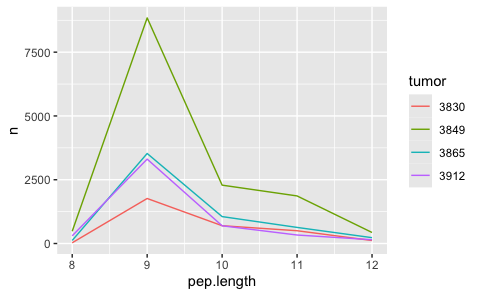

Generate peptide database meningioma
================
Kaspar Bresser
26-03-2024

- [Import ligands](#import-ligands)
- [Select decoys](#select-decoys)
- [Run netMHCpan](#run-netmhcpan)
  - [Cleanup and combine per tumor](#cleanup-and-combine-per-tumor)
  - [Finalize files](#finalize-files)
- [Run netMHCpanExp](#run-netmhcpanexp)
  - [Cleanup and combine per tumor](#cleanup-and-combine-per-tumor-1)
  - [Finalize files](#finalize-files-1)
- [Final combine data](#final-combine-data)

``` r
library(babelgene)
library(tidyverse)
library(furrr)
```

## Import ligands

``` r
MS.data <- read_tsv("Data/meningioma_data.txt")
```

``` r
MS.data %>% 
  select(Sequence, `Leading razor protein`, contains("HLApI_")) %>% 
  pivot_longer(cols = contains("HLApI_")) %>%
  separate(name, into = c("x", "y", "sample")) %>% 
  drop_na() %>% 
  distinct(Sequence, sample, .keep_all = T) %>% 
  transmute(sequence = Sequence, swissprot.id = `Leading razor protein`, tumor = sample) %>% 
  mutate(swissprot.id = str_remove(swissprot.id, "-\\d")) -> MS.data
```

    ## Warning: Expected 3 pieces. Additional pieces discarded in 312452 rows [1, 2, 3, 4, 5,
    ## 6, 7, 8, 9, 10, 11, 12, 13, 14, 15, 16, 17, 18, 19, 20, ...].

``` r
MS.data %>% 
  count(tumor)
```

    ## # A tibble: 4 × 2
    ##   tumor     n
    ##   <chr> <int>
    ## 1 3830   3485
    ## 2 3849  14301
    ## 3 3865   5910
    ## 4 3912   5100

Tidy up, and add peptide lengths.

``` r
MS.data %>% 
  mutate(pep.length = str_length(sequence))  -> MS.data

MS.data
```

    ## # A tibble: 28,796 × 4
    ##    sequence    swissprot.id tumor pep.length
    ##    <chr>       <chr>        <chr>      <int>
    ##  1 AAAAAAAAK   P50914       3865           9
    ##  2 AAAAAAAAY   Q04726       3865           9
    ##  3 AAAAAAAQSVY P07203       3912          11
    ##  4 AAAAAAASL   Q9NVR0       3912           9
    ##  5 AAAAAQSVY   P07203       3865           9
    ##  6 AAAALPGAR   Q9H4Q3       3912           9
    ##  7 AAAALVLKA   Q9Y490       3849           9
    ##  8 AAAAPSPVL   P81877       3912           9
    ##  9 AAAAPSPVM   Q9BWG4       3912           9
    ## 10 AAAAVGPAM   Q9H1I8       3912           9
    ## # ℹ 28,786 more rows

Check the amount of 9mers for each allele.

``` r
pep.lengths <- count(MS.data, tumor, pep.length)

pep.lengths %>% 
  filter(pep.length %in% 8:12) %>% 
ggplot( aes(x = pep.length, y = n, color = tumor))+
  geom_line()
```



Subsample the peptide pools to get a more workable number, 1000 should
suffice

``` r
"../2-random_forest_analyses/Data/Protein_per_Uniprot_entry_library_v3.csv.zip" %>% 
  read_tsv() %>% 
  pull(Entry) -> IDs.in.library

MS.data %>% 
  count(tumor, pep.length)
```

    ## # A tibble: 71 × 3
    ##    tumor pep.length     n
    ##    <chr>      <int> <int>
    ##  1 3830           8    29
    ##  2 3830           9  1765
    ##  3 3830          10   698
    ##  4 3830          11   501
    ##  5 3830          12   117
    ##  6 3830          13    83
    ##  7 3830          14    72
    ##  8 3830          15    62
    ##  9 3830          16    52
    ## 10 3830          17    32
    ## # ℹ 61 more rows

``` r
MS.data %>% 
  filter(pep.length %in% 9:11) %>% 
  filter(swissprot.id %in% IDs.in.library) %>% 
  distinct(tumor, sequence, .keep_all = T) %>% 
  group_by(tumor) %>% 
  slice_sample(n = 1000) %>% 
  mutate(ligand = TRUE) %>% 
  ungroup() -> filtered.peptides
```

``` r
write_tsv(filtered.peptides, "Output/Lung_peptides_subsample.tsv")
```

## Select decoys

Import UniProt sequences, use the rna expression table to make an
ensembl/UniProt matching table.

Define a function that, for each allele: (1) Checks which sequences were
detected for that allele, (2) samples an excess of proteins from the
uniprot table weighted by their length, (3) then for each sample
extracts a 9mer, (4) Remove detected peptides, filter for uniqueness and
down sample to 350,000.

``` r
uniprot <- read_csv("Data/UniProt_reviewed_input.tsv") %>% rename(swissprot.id = "sequence_id")


get_peptide <- function(tum, pep.len){
  MS.data %>% 
    mutate(sequence = str_to_upper(sequence)) %>% 
    filter(tumor == tum) %>% 
    filter(nchar(sequence) == pep.len) %>% 
    pull(sequence) %>% 
    toupper() -> s
  
    amount.needed <- nrow(filter(filtered.peptides, tumor == tum & nchar(sequence) == pep.len))*1000
  
  uniprot %>% 
    mutate(len = nchar(sequence)) %>% 
    slice_sample(n = amount.needed*2, weight_by = len, replace = T) %>% 
    rowwise() %>% 
    mutate(number = sample(1:(nchar(sequence)-pep.len), 1),
         sequence = str_sub(sequence, number, number+(pep.len-1))) %>% 
    ungroup() %>% 
    filter(!(sequence %in% s)) %>% 
    transmute(sequence = sequence, swissprot.id = swissprot.id, tumor = tum, ligand = FALSE) %>% 
    filter(swissprot.id %in% IDs.in.library) %>% 
    distinct(sequence, .keep_all = T) %>% 
    slice_sample(n = amount.needed)
}

tumors <- unique(filtered.peptides$tumor)

decoys <- map2_dfr(rep(tumors, 3), rep(c(9,10,11), each = 4), get_peptide)

filtered.peptides %>% 
  select(! pep.length) %>% 
  bind_rows(decoys) -> test.set


test.set %>% 
  count(tumor, ligand, nchar(sequence))
```

Write out the table and peptide files

## Run netMHCpan

Get the file names

``` r
files <- paste0("Output/peptides/", list.files("Output/peptides/", pattern = "Test_Pep"))

files
```

``` r
HLA.alleles <- list(  `3830` =  c('A0201','A0301','B0702','C0702'),
                      `3849` =  c('A0101','A3101','B3801','B4402','C0501','C1203'),
                      `3912` =  c('A0101','A2906','B0801','B1501','C0304', 'C0701'),
                      `3865` =  c('A0101','A0301','B3501','B5701','C0401','C0602'))
```

Run system command for netMHCpan, for each allele. Define function to
get the arguments/flags for netMHCpan

``` r
args_netMHC <- function(allele, file.name, peptide.len){
  c(
    paste0("-a HLA-", sub("(.{3})(.*)", "\\1:\\2", allele)),
    paste0("-f ", file.name),
    "-p",
    "-rth 0.0",
    "-rlt 0.0",
    paste0("-l ", peptide.len),
    "-t -100"
  )
}
```

wrapper function to predict for each length

``` r
netMHC_wrapper <- function(tum, len){
  
  file.name <- paste0("Output/peptides/Lung_Test_Peptides_", tum, "_", len, "AA.tsv")
  all.alleles <- HLA.alleles[[tum]]
  
  future_map(all.alleles, ~system2(command = "netMHCpan", 
                      args = args_netMHC(., file.name, len), 
                      stdout  = paste0("./Output/netMHCpan_predictions/netMHCpan_prediction_",tum, "_", .,
                                      "_", len , "AA_yay.txt")))
}
```

Run netMHCpan, parallel for the alleles

``` r
plan(multisession, workers = 6)


map2(rep(tumors, 3), rep(9:11, each = 4), ~netMHC_wrapper(.x, .y))
```

### Cleanup and combine per tumor

Define function to read in predictions for each peptide length, cleanup
the netMHC output, and combine them in a single tsv file

``` r
combine_and_clean <- function(tum){

  file.list <- list.files("./Output/netMHCpan_predictions/", pattern = tum, full.names = T)
#  file.list <- paste0("./Output/netMHCpan_predictions/", file.list)
  
  file.list %>% 
    map(read_lines) %>% 
    map(~.[grepl("   1 HLA", .)]) %>% 
    unlist() %>% 
    c(" Pos         MHC        Peptide      Core Of Gp Gl Ip Il        Icore        Identity  Score_EL %Rank_EL", .) %>% 
    write_lines(paste0("./Output/netMHCpan_predictions_clean/", tum,".tsv"))
  
  gc()
}
```

Apply the function for each allele

``` r
map(tumors, combine_and_clean)
```

### Finalize files

Write a function that reads in the allele predictions per tumor line,
only imports the columns needed, joins them together, and selects the
highest affinity rank.

``` r
write_tumor_files <- function(fil){
 tum <- str_split_i(fil, "\\/|\\.", 3)
  fil %>% 
    read_table() %>% 
    distinct(Peptide, MHC, .keep_all = T) %>% 
    transmute(allele = str_remove_all(MHC, "HLA-|\\*|\\:"), sequence = Peptide, rank = `%Rank_EL`) %>% 
    group_by(sequence) %>% 
    slice_min(rank, n=1) %>% 
    write_tsv(paste0("./Output/netMHCpan_predictions_clean/HLA_affinities_",tum,".tsv"))
}
```

Define HLA typings per tumor line and run the function.

``` r
list.files("Output/netMHCpan_predictions_clean", full.names = T)
map(list.files("Output/netMHCpan_predictions_clean", full.names = T), write_tumor_files)
```

## Run netMHCpanExp

Get the file names

``` r
files <- paste0("Output/peptides/", list.files("Output/peptides/", pattern = "Test_Pep"))

files
```

``` r
HLA.alleles 
```

Run system command for netMHCpan, for each allele. Define function to
get the arguments/flags for netMHCpan

``` r
args_netMHC <- function(allele, file.name, peptide.len){
  c(
    paste0("-a HLA-", sub("(.{3})(.*)", "\\1:\\2", allele)),
    paste0("-f ", file.name),
    "-p",
    "-rth 0.0",
    "-rlt 0.0",
    paste0("-l ", peptide.len),
    "-t -100",
    "-inpfmt 0"
  )
}
```

wrapper function to predict for each length

``` r
netMHC_wrapper <- function(tum, len){
  
  file.name <- paste0("Output/peptides/Lung_Test_Peptides_", tum, "_", len, "AA.tsv")
  all.alleles <- HLA.alleles[[tum]]
  
  future_map(all.alleles, ~system2(command = "netMHCpanExp", 
                      args = args_netMHC(., file.name, len), 
                      stdout  = paste0("./Output/netMHCpanExp_predictions/netMHCpan_prediction_",tum, "_", .,
                                      "_", len , "AA_yay.txt")))
}
```

Run netMHCpan, parallel for the alleles

``` r
plan(multisession, workers = 6)


map2(rep(tumors, 3), rep(9:11, each = 4), ~netMHC_wrapper(.x, .y))
```

### Cleanup and combine per tumor

Define function to read in predictions for each peptide length, cleanup
the netMHC output, and combine them in a single tsv file

``` r
combine_and_clean <- function(tum){

  file.list <- list.files("./Output/netMHCpanExp_predictions/", pattern = tum, full.names = T)
#  file.list <- paste0("./Output/netMHCpan_predictions/", file.list)
  
  file.list %>% 
    map(read_lines) %>% 
    map(~.[grepl("   1 HLA", .)]) %>% 
    unlist() %>% 
    c(" Pos         MHC        Peptide      Core Of Gp Gl Ip Il        Icore        Identity  Score_EL %Rank_EL Exp", .) %>% 
    write_lines(paste0("./Output/netMHCpanExp_predictions_clean/", tum,".tsv"))
  
  gc()
}
```

Apply the function for each allele

``` r
map(tumors, combine_and_clean)
```

### Finalize files

Write a function that reads in the allele predictions per tumor line,
only imports the columns needed, joins them together, and selects the
highest affinity rank.

``` r
write_tumor_files <- function(fil){
 tum <- str_split_i(fil, "\\/|\\.", 3)
  fil %>% 
    read_table() %>% 
    distinct(Peptide, MHC, .keep_all = T) %>% 
    transmute(allele = str_remove_all(MHC, "HLA-|\\*|\\:"), sequence = Peptide, rank = `%Rank_EL`) %>% 
    group_by(sequence) %>% 
    slice_min(rank, n=1) %>% 
    write_tsv(paste0("./Output/netMHCpanExp_predictions_clean/HLA_affinities_",tum,".tsv"))
}
```

Define HLA typings per tumor line and run the function.

``` r
list.files("Output/netMHCpanExp_predictions_clean", full.names = T)
map(list.files("Output/netMHCpanExp_predictions_clean", full.names = T), write_tumor_files)
```

## Final combine data

``` r
test.table <- read_tsv("Output/Lung_Test_Table.tsv")
```

``` r
files <- list.files("Output/netMHCpan_predictions_clean", pattern = "HLA", full.names = T)

files %>% 
  map(read_tsv) %>% 
  set_names(str_split_i(files, "\\_|\\.", 5)) %>% 
  map2(names(.), ~mutate(.x, tumor = .y)) %>% 
  reduce(bind_rows) %>% 
  mutate(tumor = as.character(tumor)) %>% 
  select(-allele) -> netMHCranks
```

``` r
files <- list.files("Output/netMHCpanExp_predictions_clean", pattern = "HLA", full.names = T)

files %>% 
  map(read_tsv) %>% 
  set_names(str_split_i(files, "\\_|\\.", 5)) %>% 
  map2(names(.), ~mutate(.x, tumor = .y)) %>% 
  map( rename, rankExp = rank) %>% 
  reduce(bind_rows) %>% 
  mutate(tumor = as.character(tumor)) %>% 
  select(-allele) -> netMHCranksExp
```

``` r
test.table %>% 
  mutate(tumor = as.character(tumor)) %>% 
  left_join(netMHCranks, by = c("sequence", "tumor")) %>% 
  left_join(netMHCranksExp, by = c("sequence", "tumor")) %>% 
  distinct(sequence, tumor, .keep_all = T) -> test.table

test.table

write_tsv(test.table, "Output/Lung_Test_Table_all.tsv")
```
