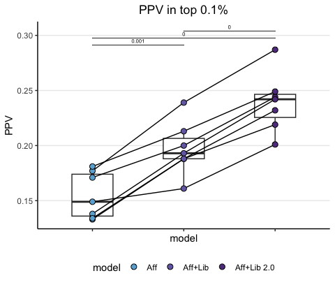
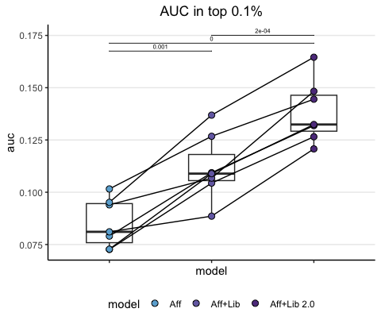
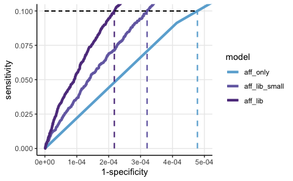
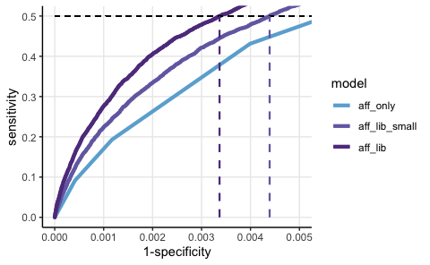
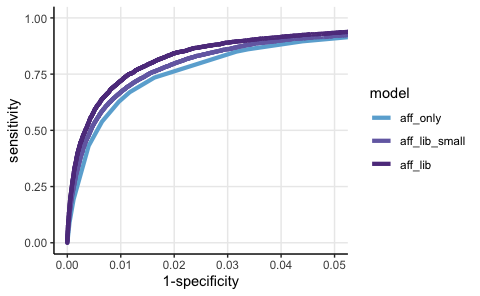

XGB results top 0.1% Broad data
================
Kaspar Bresser
28/03/24

- [Import and tidy data](#import-and-tidy-data)
- [Positive predictive value](#positive-predictive-value)
- [Area under the curve](#area-under-the-curve)
- [Sensitivity ect](#sensitivity-ect)

Used the analysis below to compare the performance of the XGB models.

``` r
library(bayestestR)
library(tidyverse)
library(rstatix)
library(ggpubr)
library(pROC)
```

## Import and tidy data

Import the results table.

``` r
XGB.results <- read_tsv("./Output/all_predictions_T-B.tsv")
```

Convert the ligand column to a binary so it can be used for cumsum
calculation, pivot to longer data by putting the models in a grouped
format.

``` r
XGB.results %>% 
  mutate(rank = -rank) %>% 
  mutate(detected = case_when(ligand == TRUE ~ 1,
                              TRUE ~ 0)) %>% 
  pivot_longer(cols = !c("detected","ligand", "tumor", "sequence", "swissprot.id"), 
               names_to =  "model", 
               values_to =  "score") -> XGB.results

XGB.results
```

    ## # A tibble: 28,027,260 × 7
    ##    ligand sequence    swissprot.id tumor      detected model          score
    ##    <lgl>  <chr>       <chr>        <chr>         <dbl> <chr>          <dbl>
    ##  1 TRUE   GQHPNIITL   Q15418       CD165spike        1 aff_lib        0.988
    ##  2 TRUE   GQHPNIITL   Q15418       CD165spike        1 aff_lib_small  0.981
    ##  3 TRUE   GQHPNIITL   Q15418       CD165spike        1 aff_only       0.964
    ##  4 TRUE   GQHPNIITL   Q15418       CD165spike        1 rank          -0.029
    ##  5 TRUE   KLKEKESAL   O15078       CD165spike        1 aff_lib        0.528
    ##  6 TRUE   KLKEKESAL   O15078       CD165spike        1 aff_lib_small  0.600
    ##  7 TRUE   KLKEKESAL   O15078       CD165spike        1 aff_only       0.812
    ##  8 TRUE   KLKEKESAL   O15078       CD165spike        1 rank          -0.449
    ##  9 TRUE   SEEDRVVVIRF P83876       CD165spike        1 aff_lib        0.705
    ## 10 TRUE   SEEDRVVVIRF P83876       CD165spike        1 aff_lib_small  0.614
    ## # ℹ 28,027,250 more rows

For these analysis we’ll focus on the top 0.1% scoring peptides for each
model. Let’s subset on those. Note that I arrange on both both model
scores and a random number for tie breaking.

Next we’ll calculate the cumulative sums by grouping by allele and
model.

Note that `cumsum()` takes an ordered dataframe.

``` r
XGB.results %>% 
  group_by(tumor, model) %>% 
  mutate(random = sample(1:n())) %>% 
  arrange(desc(score), random, .by_group = T) %>% 
    mutate(peptides = 1:n()/n(), 
         detected_ligands = cumsum(detected)/sum(detected)) %>% 
  slice_head(prop = .001) -> XGB.results
 
XGB.results
```

    ## # A tibble: 28,000 × 10
    ## # Groups:   tumor, model [28]
    ##    ligand sequence  swissprot.id tumor      detected model score random peptides
    ##    <lgl>  <chr>     <chr>        <chr>         <dbl> <chr> <dbl>  <int>    <dbl>
    ##  1 FALSE  SYLDKVRAL P13645       CD165spike        0 aff_… 1.00  972402  9.99e-7
    ##  2 FALSE  KEFTPPVQA P68871       CD165spike        0 aff_… 1.00  998427  2.00e-6
    ##  3 FALSE  AQAEDALRV A8MT69       CD165spike        0 aff_… 1.00  981612  3.00e-6
    ##  4 FALSE  NYIDKVRFL P08670       CD165spike        0 aff_… 1.00  493106  4.00e-6
    ##  5 TRUE   VYGPLPQSF P13073       CD165spike        1 aff_… 1.00  209659  5.00e-6
    ##  6 FALSE  SFIDKVRFL P35908       CD165spike        0 aff_… 1.00  173388  5.99e-6
    ##  7 TRUE   RQYAKDIGF P62273       CD165spike        1 aff_… 1.00  899372  6.99e-6
    ##  8 FALSE  YAYDNFGVL P27797       CD165spike        0 aff_… 1.00  837518  7.99e-6
    ##  9 TRUE   REVSGIKAA P02545       CD165spike        1 aff_… 0.999 868018  8.99e-6
    ## 10 FALSE  REMDQTMAA P30085       CD165spike        0 aff_… 0.999  37511  9.99e-6
    ## # ℹ 27,990 more rows
    ## # ℹ 1 more variable: detected_ligands <dbl>

Lastly, set the ordering in which we’d like the models to appear in
plots, by converting the models variable to a factor

``` r
unique(XGB.results$model)
```

    ## [1] "aff_lib"       "aff_lib_small" "aff_only"      "rank"

``` r
model.order <- c("aff_only", "aff_lib_small","aff_lib")

tumor.order <- as.character(unique(XGB.results$tumor))

colors <- c("#6BAED6", "#756CB1", "#5F3D8C")

XGB.results %>% 
  filter(model %in% model.order) %>% 
  mutate(model = as_factor(model),
         model = fct_relevel(model, model.order),
         tumor = as_factor(tumor),
         tumor = fct_relevel(tumor, tumor.order)) -> XGB.results

XGB.results
```

    ## # A tibble: 21,000 × 10
    ## # Groups:   tumor, model [21]
    ##    ligand sequence  swissprot.id tumor      detected model score random peptides
    ##    <lgl>  <chr>     <chr>        <fct>         <dbl> <fct> <dbl>  <int>    <dbl>
    ##  1 FALSE  SYLDKVRAL P13645       CD165spike        0 aff_… 1.00  972402  9.99e-7
    ##  2 FALSE  KEFTPPVQA P68871       CD165spike        0 aff_… 1.00  998427  2.00e-6
    ##  3 FALSE  AQAEDALRV A8MT69       CD165spike        0 aff_… 1.00  981612  3.00e-6
    ##  4 FALSE  NYIDKVRFL P08670       CD165spike        0 aff_… 1.00  493106  4.00e-6
    ##  5 TRUE   VYGPLPQSF P13073       CD165spike        1 aff_… 1.00  209659  5.00e-6
    ##  6 FALSE  SFIDKVRFL P35908       CD165spike        0 aff_… 1.00  173388  5.99e-6
    ##  7 TRUE   RQYAKDIGF P62273       CD165spike        1 aff_… 1.00  899372  6.99e-6
    ##  8 FALSE  YAYDNFGVL P27797       CD165spike        0 aff_… 1.00  837518  7.99e-6
    ##  9 TRUE   REVSGIKAA P02545       CD165spike        1 aff_… 0.999 868018  8.99e-6
    ## 10 FALSE  REMDQTMAA P30085       CD165spike        0 aff_… 0.999  37511  9.99e-6
    ## # ℹ 20,990 more rows
    ## # ℹ 1 more variable: detected_ligands <dbl>

## Positive predictive value

Lets first plot the positive predictive value (PPV), i.e. the number of
true positives within a certain threshold. Calculate the PPV as the
number of true positives divided by the total number of peptides within
the selected pool.

``` r
XGB.results %>%  
  group_by(tumor, model) %>% 
  mutate(model = fct_drop(model)) %>% 
  summarise(PPV = sum(detected)/n()) %>% 
  ungroup() %>% 
  rstatix::t_test(PPV ~ model, paired = T) %>% 
  add_xy_position(x = "model",  fun = "max",step.increase = .04,) %>% 
  mutate(p.adj = round(p.adj, 3))-> stats
```

``` r
XGB.results %>%  
  group_by(tumor, model) %>% 
  summarise(PPV = sum(detected)/n()) %>% 
   ggplot( aes(x = model, y = PPV, group = tumor)) +
    geom_boxplot(aes(group = model), width = 0.45)+
    geom_line()+
    geom_point(aes(fill = model), shape = 21, size = 2.5 )+
    scale_fill_manual(values = colors, labels = c("Aff", "Aff+Lib", "Aff+Lib 2.0"))+
    stat_pvalue_manual(stats, label = "p.adj", 
                     tip.length = 0.00, hide.ns = F, label.size = 2 )+
    ggtitle("PPV in top 0.1%")+
    theme_classic()+
    theme(plot.title = element_text(hjust = 0.5), 
          panel.grid.major.y = element_line(), axis.text.x=element_blank(), legend.position = "bottom",)
```



``` r
ggsave("Figs/XGB_PPV_strip.pdf", width = 1.7, height = 3.2, scale = 1.2)
```

## Area under the curve

Or calculate the AUC of these curves as a summary metric and plot that.
Used the `area_under_curve()` function from the
[bayestestR](https://easystats.github.io/bayestestR/index.html) package.

``` r
XGB.results %>% 
  group_by(tumor, model) %>% 
  summarise(auc = area_under_curve(peptides, detected_ligands)*1000) %>% 
  mutate(model = fct_drop(model)) %>%
  ungroup() %>% 
  rstatix::t_test( auc ~ model, paired = T) %>% 
  add_xy_position(x = "model", step.increase = 0.04) %>% 
  mutate(p.adj = round(p.adj, 4)) -> stats

stats
```

    ## # A tibble: 3 × 14
    ##   .y.   group1     group2    n1    n2 statistic    df       p p.adj p.adj.signif
    ##   <chr> <chr>      <chr>  <int> <int>     <dbl> <dbl>   <dbl> <dbl> <chr>       
    ## 1 auc   aff_only   aff_l…     7     7     -5.66     6 1   e-3  1e-3 **          
    ## 2 auc   aff_only   aff_l…     7     7    -14.1      6 7.80e-6  0    ****        
    ## 3 auc   aff_lib_s… aff_l…     7     7     -8.90     6 1.12e-4  2e-4 ***         
    ## # ℹ 4 more variables: y.position <dbl>, groups <named list>, xmin <dbl>,
    ## #   xmax <dbl>

``` r
XGB.results %>% 
  group_by(tumor, model) %>% 
  summarise(auc = area_under_curve(peptides, detected_ligands)*1000) %>% 
    ggplot( aes(x = model, y = auc, group = tumor)) +
    geom_boxplot(aes(group = model), width = 0.45)+
    geom_line()+
    geom_point(aes(fill = model), shape = 21, size = 2.5 )+
    scale_fill_manual(values = colors, labels = c("Aff", "Aff+Lib", "Aff+Lib 2.0"))+
    stat_pvalue_manual(stats, label = "p.adj", 
                     tip.length = 0.00, hide.ns = F, label.size = 2 )+
    ggtitle("AUC in top 0.1%")+
    theme_classic()+
    theme(plot.title = element_text(hjust = 0.5), 
          panel.grid.major.y = element_line(), axis.text.x=element_blank(), legend.position = "bottom",)
```



``` r
ggsave("Figs/XGB_AUC_strip.pdf", width = 1.7, height = 3.2, scale = 1.2)
```

## Sensitivity ect

Read in the data to get metrics of model performance

``` r
library(pROC)

XGB.results <- read_tsv("./Output/all_predictions_T-B.tsv")

XGB.results <- mutate(XGB.results, rank = -rank)
```

Define a function to retrieve the performance metrics, and a function to
get the cutoffs at a certain threshold of sensitivity

``` r
get_sens_spec <- function(lig, preds, mods){
 
  map(preds, ~roc(lig, .)) %>% 
     map(~coords(., x = "all", input = "sensitivity", ret = "all") ) -> tmp

    
  tibble(model = mods, dat = tmp) %>% 
    unnest()
    
}

get_cutoffs <- function(lig, preds, mods, thresh){
  map(preds, ~roc(lig, .)) %>%
    map(~coords(., x = thresh, input = "sensitivity", ret = "all") ) %>% 
  map(~select(., !c(threshold))) %>% 
  bind_rows() %>% 
    mutate(model = mods)
}
```

Get the information

``` r
model.results.info <- get_sens_spec(lig = XGB.results$ligand,
                                    preds = map2(list(XGB.results), model.order, ~pull(.x, .y)),
                                    mods =  model.order) %>% mutate(model = factor(model, levels = model.order))
```

    ## Warning: `cols` is now required when using `unnest()`.
    ## ℹ Please use `cols = c(dat)`.

``` r
coordinates <- get_cutoffs(lig = XGB.results$ligand,
                           preds = map2(list(XGB.results), model.order, ~pull(.x, .y)),
                           mods =  model.order,
                           thresh = 0.1)

model.results.info
```

    ## # A tibble: 881,907 × 25
    ##    model    threshold specificity sensitivity accuracy     tn    tp    fn     fp
    ##    <fct>        <dbl>       <dbl>       <dbl>    <dbl>  <dbl> <dbl> <dbl>  <dbl>
    ##  1 aff_on… -Inf             0           1     0.000999 0       7000     0 7.00e6
    ##  2 aff_on…    0.00565       0.147       0.999 0.148    1.03e6  6993     7 5.97e6
    ##  3 aff_on…    0.00693       0.169       0.999 0.170    1.18e6  6993     7 5.81e6
    ##  4 aff_on…    0.00819       0.427       0.996 0.428    2.99e6  6974    26 4.01e6
    ##  5 aff_on…    0.0112        0.449       0.996 0.450    3.15e6  6972    28 3.85e6
    ##  6 aff_on…    0.0158        0.508       0.995 0.509    3.56e6  6965    35 3.44e6
    ##  7 aff_on…    0.0278        0.541       0.994 0.541    3.79e6  6960    40 3.21e6
    ##  8 aff_on…    0.0447        0.593       0.993 0.594    4.15e6  6954    46 2.85e6
    ##  9 aff_on…    0.0647        0.618       0.993 0.618    4.32e6  6950    50 2.68e6
    ## 10 aff_on…    0.0950        0.694       0.990 0.695    4.86e6  6931    69 2.14e6
    ## # ℹ 881,897 more rows
    ## # ℹ 16 more variables: npv <dbl>, ppv <dbl>, fdr <dbl>, fpr <dbl>, tpr <dbl>,
    ## #   tnr <dbl>, fnr <dbl>, `1-specificity` <dbl>, `1-sensitivity` <dbl>,
    ## #   `1-accuracy` <dbl>, `1-npv` <dbl>, `1-ppv` <dbl>, precision <dbl>,
    ## #   recall <dbl>, youden <dbl>, closest.topleft <dbl>

And plot at 0.1 sensitivity

``` r
ggplot(model.results.info, aes(x = `1-specificity`, y = sensitivity, color = model))+
  geom_line( linewidth = 1.5)+
  coord_cartesian(ylim = c(0.0, 0.1), xlim = c(0.0, 0.0005))+
  geom_segment(aes(x = 0.0, xend = max(coordinates$`1-specificity`), y = .1, yend = .1), color = "black", linetype = "dashed")+
  geom_segment(data = coordinates, aes(x = `1-specificity`, xend = `1-specificity`, y = 0.0, yend = .1, color = model), 
               linewidth = 0.8, linetype = "dashed")+
  scale_color_manual(values = colors)+
  theme_classic()+
  theme(panel.grid.major = element_line())
```

    ## Warning in geom_segment(aes(x = 0, xend = max(coordinates$`1-specificity`), : All aesthetics have length 1, but the data has 881907 rows.
    ## ℹ Did you mean to use `annotate()`?



``` r
ggsave(("Figs/XGB_SensSpec_10.pdf"), width = 2.8, height = 2, scale = 2)
```

    ## Warning in geom_segment(aes(x = 0, xend = max(coordinates$`1-specificity`), : All aesthetics have length 1, but the data has 881907 rows.
    ## ℹ Did you mean to use `annotate()`?

And plot at 0.5 sensitivity

``` r
coordinates <- get_cutoffs(lig = XGB.results$ligand,
                           preds = map2(list(XGB.results), model.order, ~pull(.x, .y)),
                           mods =  model.order,
                           thresh = 0.5)

ggplot(model.results.info, aes(x = `1-specificity`, y = sensitivity, color = model))+
  geom_line( linewidth = 1.5)+
  coord_cartesian(ylim = c(0.0, 0.5), xlim = c(0.0, 0.005))+
  geom_segment(aes(x = 0.0, xend = max(coordinates$`1-specificity`), y = .5, yend = .5), color = "black", linetype = "dashed")+
  geom_segment(data = coordinates, aes(x = `1-specificity`, xend = `1-specificity`, y = 0.0, yend = .5, color = model), 
               linewidth = 0.8, linetype = "dashed")+
  scale_color_manual(values = colors)+
  theme_classic()+
  theme(panel.grid.major = element_line())
```

    ## Warning in geom_segment(aes(x = 0, xend = max(coordinates$`1-specificity`), : All aesthetics have length 1, but the data has 881907 rows.
    ## ℹ Did you mean to use `annotate()`?



``` r
ggsave(("Figs/XGB_SensSpec_50.pdf"), width = 2.8, height = 2, scale = 2)
```

    ## Warning in geom_segment(aes(x = 0, xend = max(coordinates$`1-specificity`), : All aesthetics have length 1, but the data has 881907 rows.
    ## ℹ Did you mean to use `annotate()`?

``` r
ggplot(model.results.info, aes(x = `1-specificity`, y = sensitivity, color = model))+
  geom_line( linewidth = 1.5)+
  coord_cartesian(ylim = c(0.0, 1), xlim = c(0.0, 0.05))+
  scale_color_manual(values = colors)+
  theme_classic()+
  theme(panel.grid.major = element_line())
```


