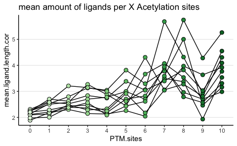

PTM analysis external
================
Kaspar Bresser
15/01/2024

- [Check sheets](#check-sheets)
- [Read ligands](#read-ligands)
- [Compare with PTMs](#compare-with-ptms)
  - [Get swissprot and protein
    abundance](#get-swissprot-and-protein-abundance)
  - [Phospho](#phospho)
  - [Ubiquitin](#ubiquitin)
  - [Acetylation](#acetylation)
  - [Combine figures](#combine-figures)

Below a few analysis that we performed to verify if the peptides
detected by Mass Spec were indeed HLA ligands

Lets load in the packages required for the analysis.

``` r
library(tidyverse)
library(rstatix)
library(readxl)
library(RColorBrewer)
```

## Check sheets

``` r
readxl::excel_sheets("41467_2023_37547_MOESM10_ESM(1).xlsx")
```

    ## [1] "Column_Descriptions"     "Fig4,6_Ubiquitylome"    
    ## [3] "Fig4,6_Proteome"         "Fig4,6_Phosphoproteome" 
    ## [5] "Fig4,6_Acetylome"        "Fig4,6_Somatic_Variants"
    ## [7] "Fig4,6_Ubiquityl_nuORFs" "Fig4,6_Phospho_nuORFs"  
    ## [9] "Fig4,6_Acetyl_nuORFs"

``` r
readxl::excel_sheets("41467_2023_37547_MOESM12_ESM.xlsx")
```

    ##  [1] "Column_Descriptions"          "Fig3,5_Canonical_HLA-I_LUAD" 
    ##  [3] "Fig3,5_Canonical_HLA-II_LUAD" "Fig5_neoantigens"            
    ##  [5] "Fig5_HLA-I,II_CTantigen"      "Fig5_HLAI,II_Lung_CTantigens"
    ##  [7] "Fig5_HLA-I_nuORFs"            "Fig5_HLA-II_nuORFs"          
    ##  [9] "Fig6_HLA-I_phosho_8to11mers"  "Fig6_HLA-II_phospho"         
    ## [11] "Fig6_HLA-I_acetyl_8to11mers"  "Fig6_HLA-II_acetyl"

## Read ligands

read in the HLA class I ligands.

``` r
HLA.ligands <- read_excel("41467_2023_37547_MOESM12_ESM.xlsx", sheet = "Fig3,5_Canonical_HLA-I_LUAD")

HLA.ligands
```

    ## # A tibble: 111,858 × 79
    ##    directory filename      parent_charge score rank2Score deltaForwardReverseS…¹
    ##    <chr>     <chr>                 <dbl> <dbl> <chr>                       <dbl>
    ##  1 C3N-01016 VY20210314_F…             3 11.9  NA                           9.44
    ##  2 C3N-01016 VY20210314_F…             2 10.5  1.1399999…                   6.73
    ##  3 C3N-00547 VY20210312_F…             2  9.14 2.1                          5.94
    ##  4 C3N-00547 VY20210312_F…             2 14.3  4.75                         9.85
    ##  5 C3N-02145 VY20210311_F…             2 11.3  7.09                         7.97
    ##  6 C3N-01016 VY20210314_F…             2 13.3  7.1                          3.15
    ##  7 C3N-01024 VY20210315_F…             2  9.06 5.8                          1.25
    ##  8 C3N-01016 VY20210314_F…             2 14.0  4.57                        11.9 
    ##  9 C3N-01016 VY20210314_F…             2 12.3  7.36                         5.51
    ## 10 C3N-01416 VY20210315_F…             2 12.9  6.92                         5.93
    ## # ℹ 111,848 more rows
    ## # ℹ abbreviated name: ¹​deltaForwardReverseScore
    ## # ℹ 73 more variables: deltaRank1Rank2Score <dbl>,
    ## #   percent_scored_peak_intensity <dbl>, backbone_cleavage_score <dbl>,
    ## #   missedCleavages <dbl>, numKorR <dbl>, maxSequenceTagLength <dbl>,
    ## #   totalIntensity <dbl>, geneSymbol_QUILTS <chr>, VariantScoreMax <chr>,
    ## #   Gnum <chr>, Snum <chr>, ASnumV <chr>, SAAV <chr>, SpliceformType <chr>, …

Keep only what we need

``` r
HLA.ligands %>% 
  filter(plotType == "NA") %>% 
  select(directory, sequence, geneSymbol, allele) -> HLA.ligands

HLA.ligands
```

    ## # A tibble: 69,474 × 4
    ##    directory sequence    geneSymbol allele
    ##    <chr>     <chr>       <chr>      <chr> 
    ##  1 C3N-01016 MAAPKGSLWVR TMEM59     A3303 
    ##  2 C3N-01016 MAESHLLQW   SFTPB      B5801 
    ##  3 C3N-00547 MAGPLRAPL   CST3       C1203 
    ##  4 C3N-01016 MAPARLFAL   SDC4       C0102 
    ##  5 C3N-01416 MAPARLFAL   SDC4       C0102 
    ##  6 C3N-02145 MAPARLFAL   SDC4       C0102 
    ##  7 C3N-02145 MAPLKMLAL   CCL17      C0102 
    ##  8 C3L-01632 MEALPLLAA   PRDX4      B5001 
    ##  9 C3L-01632 MEHSTFLSG   CD3D       B5001 
    ## 10 C3N-01416 MEKIPVSAF   AGR2       B1802 
    ## # ℹ 69,464 more rows

## Compare with PTMs

### Get swissprot and protein abundance

``` r
read_tsv("uniprotkb_Human_AND_reviewed_true_2023_12_14.tsv.gz") %>% 
  transmute(geneSymbol = `Gene Names (primary)`, Entry = `Entry Name`, Length = Length) %>% 
  filter(str_detect(Entry, "HUMAN")) -> sp.human

sp.human
```

    ## # A tibble: 20,428 × 3
    ##    geneSymbol Entry       Length
    ##    <chr>      <chr>        <dbl>
    ##  1 CYP2D7     CP2D7_HUMAN    515
    ##  2 PIGBOS1    PIOS1_HUMAN     54
    ##  3 SIK1B      SIK1B_HUMAN    783
    ##  4 MT-RNR1    MOTSC_HUMAN     16
    ##  5 CD300H     CD3CH_HUMAN    201
    ##  6 NBDY       NBDY_HUMAN      68
    ##  7 CIROP      CIROP_HUMAN    788
    ##  8 SLC12A8    S12A8_HUMAN    714
    ##  9 RBM47      RBM47_HUMAN    593
    ## 10 IFT56      IFT56_HUMAN    554
    ## # ℹ 20,418 more rows

``` r
prot <- read_excel("41467_2023_37547_MOESM10_ESM(1).xlsx", sheet = "Fig4,6_Proteome", skip = 2)

prot %>% 
  filter(geneSymbol != "na") %>% 
  select(geneSymbol, contains("C3")) %>%
  pivot_longer(col = contains("C3"), names_to = "patient", values_to = "abundance") %>% 
  mutate(abundance = as.numeric(abundance)) %>% 
  na.omit() %>% 
  group_by(geneSymbol) %>% 
  summarise(abundance = mean(abundance)) -> prot
```

    ## Warning: There was 1 warning in `mutate()`.
    ## ℹ In argument: `abundance = as.numeric(abundance)`.
    ## Caused by warning:
    ## ! NAs introduced by coercion

``` r
prot
```

    ## # A tibble: 10,223 × 2
    ##    geneSymbol abundance
    ##    <chr>          <dbl>
    ##  1 A1BG         0.0512 
    ##  2 A1CF         1.51   
    ##  3 A2M         -0.0486 
    ##  4 AAAS         0.205  
    ##  5 AACS         0.190  
    ##  6 AADAC        0.939  
    ##  7 AADAT        0.730  
    ##  8 AAGAB       -0.0446 
    ##  9 AAK1        -0.00283
    ## 10 AAMDC       -0.278  
    ## # ℹ 10,213 more rows

``` r
sp.human %>% 
  right_join(prot) -> sp.human.abundance

sp.human.abundance
```

    ## # A tibble: 10,250 × 4
    ##    geneSymbol Entry       Length abundance
    ##    <chr>      <chr>        <dbl>     <dbl>
    ##  1 SIK1B      SIK1B_HUMAN    783   -0.300 
    ##  2 SLC12A8    S12A8_HUMAN    714   -0.0855
    ##  3 RBM47      RBM47_HUMAN    593   -0.0975
    ##  4 TMEM129    TM129_HUMAN    362    0.0174
    ##  5 UBA6       UBA6_HUMAN    1052   -0.122 
    ##  6 ESYT2      ESYT2_HUMAN    921    0.0607
    ##  7 MED19      MED19_HUMAN    244    0.0839
    ##  8 SHTN1      SHOT1_HUMAN    631    0.143 
    ##  9 TMEM120B   T120B_HUMAN    339    0.117 
    ## 10 ARHGAP10   RHG10_HUMAN    786   -0.214 
    ## # ℹ 10,240 more rows

### Phospho

get the data, clean up.

``` r
PTM.dat <- read_excel("41467_2023_37547_MOESM10_ESM(1).xlsx", sheet = "Fig4,6_Phosphoproteome", skip = 2)

PTM.dat %>% 
  filter(geneSymbol != "na") %>% 
  select(geneSymbol, variableSites, contains("C3"))-> PTM.dat

PTM.dat
```

    ## # A tibble: 29,698 × 22
    ##    geneSymbol variableSites C3N.02145    C3N.00199 C3N.00169 C3N.00547 C3N.00579
    ##    <chr>      <chr>         <chr>        <chr>     <chr>     <chr>     <chr>    
    ##  1 SRRM2      T111t         NA           NA        NA        NA        NA       
    ##  2 SRRM2      S231s         -0.49902999… -2.50929  1.17164   5.723000… 3.800559…
    ##  3 SRRM2      S250s         -0.10026     -3.14133  2.18337   2.025520… 4.07158  
    ##  4 SRRM2      T252t         -0.45573999… -3.36538  1.817050… -9.60600… -6.77600…
    ##  5 SRRM2      S295s         NA           NA        NA        NA        NA       
    ##  6 SRRM2      S323s         -0.82260999… -1.48340… 0.76171   2.248E-2  0.280270…
    ##  7 SRRM2      S351s         2.734E-2     -2.19092… 0.97685   0.989249… -0.44041…
    ##  8 SRRM2      S358s         -0.80437999… -1.83715… 1.956599… 0.721500… 0.138589…
    ##  9 SRRM2      T367t         NA           NA        NA        NA        NA       
    ## 10 SRRM2      S377s         -0.45801999… -1.13201  1.200709… 0.737850… -0.44041…
    ## # ℹ 29,688 more rows
    ## # ℹ 15 more variables: C3N.01016 <chr>, C3L.01632 <chr>, C3N.01024 <chr>,
    ## #   C3N.01416 <chr>, C3L.02549 <chr>, C3N.02145.N <chr>, C3N.00199.N <chr>,
    ## #   C3N.00169.N <chr>, C3N.00547.N <chr>, C3N.00579.N <chr>, C3N.01016.N <chr>,
    ## #   C3L.01632.N <chr>, C3N.01024.N <chr>, C3N.01416.N <chr>, C3L.02549.N <chr>

Count PTM sites per protein and combine with ligand data,

``` r
PTM.dat %>% 
  count(geneSymbol, name = "PTM.sites") -> PTM.dat

sp.human %>% 
  filter(!is.na(geneSymbol) ) %>% 
  select(geneSymbol) %>% 
  left_join(PTM.dat, by = c("geneSymbol")) %>% 
  full_join(HLA.ligands, by = c("geneSymbol")) %>% 
  count(geneSymbol, PTM.sites, directory, name = "n.ligands") %>% 
  replace_na(list(n.ligands = 0, PTM.sites = 0)) %>% 
  na.omit() -> to.plot
```

    ## Warning in full_join(., HLA.ligands, by = c("geneSymbol")): Detected an unexpected many-to-many relationship between `x` and `y`.
    ## ℹ Row 3 of `x` matches multiple rows in `y`.
    ## ℹ Row 3193 of `y` matches multiple rows in `x`.
    ## ℹ If a many-to-many relationship is expected, set `relationship =
    ##   "many-to-many"` to silence this warning.

Plot the mean amount of ligands found across all proteins with X PTM
sites, per patient sample.

``` r
p1 <- to.plot %>% 
    inner_join(sp.human, by = "geneSymbol") %>% 
  mutate(PTM.sites = case_when( PTM.sites > 10 ~ 10,
                                     TRUE ~ PTM.sites)) %>% 
  mutate(PTM.sites = factor(PTM.sites, levels = 0:10)) %>% 
  group_by(directory, PTM.sites) %>% 
  summarise(mean.ligands = mean(n.ligands)) %>% 
ggplot(aes(x = PTM.sites, y = mean.ligands, group = directory))+
  geom_line()+
  geom_point(aes(fill = (PTM.sites)), shape = 21, size = 2.5)+
  scale_fill_manual(values = colorRampPalette(brewer.pal(9, name = "Reds"))(15)[3:13])+
  scale_y_continuous(breaks = c(2,3,4,5,6))+
  theme_classic()+
  theme(panel.grid.major.y = element_line(), legend.position = "none")+
  ggtitle("mean amount of ligands per X Phosphorylation sites")
```

    ## Warning in inner_join(., sp.human, by = "geneSymbol"): Detected an unexpected many-to-many relationship between `x` and `y`.
    ## ℹ Row 3434 of `x` matches multiple rows in `y`.
    ## ℹ Row 2037 of `y` matches multiple rows in `x`.
    ## ℹ If a many-to-many relationship is expected, set `relationship =
    ##   "many-to-many"` to silence this warning.

``` r
p1
```


``` r
ggsave("Figs/Phos_lines_per_site.pdf", width = 5, height = 3)
```

Plot the mean amount of ligands found across all proteins with X PTM
sites, per patient sample. Length corrected.

``` r
p4 <- to.plot %>% 
     inner_join(sp.human, by = "geneSymbol") %>% 
  mutate(PTM.sites = case_when( PTM.sites > 10 ~ 10,
                                     TRUE ~ PTM.sites)) %>% 
  mutate(PTM.sites = factor(PTM.sites, levels = 0:10)) %>% 
  group_by(directory, PTM.sites) %>% 
  summarise(mean.ligands = mean(n.ligands), mean.length = mean(Length), mean.ligand.length.cor = (mean.ligands/mean.length)*1000) %>% 
ggplot(aes(x = PTM.sites, y = mean.ligand.length.cor, group = directory))+
  geom_line()+
  geom_point(aes(fill = (PTM.sites)), shape = 21, size = 2.5)+
  scale_fill_manual(values = colorRampPalette(brewer.pal(9, name = "Reds"))(15)[3:13])+
  theme_classic()+
  theme(panel.grid.major.y = element_line(), legend.position = "none")+
  ggtitle("mean amount of ligands per X Phosphorylation sites")
```

    ## Warning in inner_join(., sp.human, by = "geneSymbol"): Detected an unexpected many-to-many relationship between `x` and `y`.
    ## ℹ Row 3434 of `x` matches multiple rows in `y`.
    ## ℹ Row 2037 of `y` matches multiple rows in `x`.
    ## ℹ If a many-to-many relationship is expected, set `relationship =
    ##   "many-to-many"` to silence this warning.

``` r
p4
```


``` r
ggsave("Figs/Phos_lines_per_site_corrected.pdf", width = 5, height = 3)
```

### Ubiquitin

get the data, clean up.

``` r
PTM.dat <- read_excel("41467_2023_37547_MOESM10_ESM(1).xlsx", sheet = "Fig4,6_Ubiquitylome", skip = 2)

PTM.dat %>% 
  filter(geneSymbol != "na") %>% 
  select(geneSymbol, variableSites, contains("C3")) -> PTM.dat

PTM.dat
```

    ## # A tibble: 11,814 × 22
    ##    geneSymbol variableSites C3N.02145    C3N.00199 C3N.00169 C3N.00547 C3N.00579
    ##    <chr>      <chr>         <chr>        <chr>     <chr>     <chr>     <chr>    
    ##  1 PRKDC      K108k         -0.20383000… 0.44966   6.989999… 0.919059… -0.22914…
    ##  2 PRKDC      K148k         -0.10747     1.121150… 0.482279… -0.15445… -1.848E-2
    ##  3 PRKDC      K163k         -7.041E-2    0.332749… 0.898159… 1.112139… -0.54329…
    ##  4 PRKDC      K205k         -0.37801000… 1.02223   0.199199… 2.49973   -0.49154…
    ##  5 PRKDC      K254k         NA           NA        NA        NA        NA       
    ##  6 PRKDC      K263k         0.252010000… 0.16188   0.702450… 0.409330… -2.11771…
    ##  7 PRKDC      K310k         -0.56701999… -0.33274… 1.600610… 0.499429… 3.278210…
    ##  8 PRKDC      K357k         0.196420000… 0.551579… 0.223670… 1.096689… -1.43029…
    ##  9 PRKDC      K374k         0.11859      -0.34173… -0.22716  0.625580… -1.78879…
    ## 10 PRKDC      K471k         -0.88573000… -0.21584  1.01698   0.303779… 0.580250…
    ## # ℹ 11,804 more rows
    ## # ℹ 15 more variables: C3N.01016 <chr>, C3L.01632 <chr>, C3N.01024 <chr>,
    ## #   C3N.01416 <chr>, C3L.02549 <chr>, C3N.02145.N <chr>, C3N.00199.N <chr>,
    ## #   C3N.00169.N <chr>, C3N.00547.N <chr>, C3N.00579.N <chr>, C3N.01016.N <chr>,
    ## #   C3L.01632.N <chr>, C3N.01024.N <chr>, C3N.01416.N <chr>, C3L.02549.N <chr>

Count PTM sites per protein and combine with ligand data,

``` r
PTM.dat %>% 
  count(geneSymbol, name = "PTM.sites") -> PTM.dat

sp.human %>% 
  filter(!is.na(geneSymbol) ) %>% 
  select(geneSymbol) %>% 
  left_join(PTM.dat, by = c("geneSymbol")) %>% 
  full_join(HLA.ligands, by = c("geneSymbol")) %>% 
  count(geneSymbol, PTM.sites, directory, name = "n.ligands") %>% 
  replace_na(list(n.ligands = 0, PTM.sites = 0)) %>% 
  na.omit() -> to.plot
```

    ## Warning in full_join(., HLA.ligands, by = c("geneSymbol")): Detected an unexpected many-to-many relationship between `x` and `y`.
    ## ℹ Row 3 of `x` matches multiple rows in `y`.
    ## ℹ Row 3193 of `y` matches multiple rows in `x`.
    ## ℹ If a many-to-many relationship is expected, set `relationship =
    ##   "many-to-many"` to silence this warning.

Plot the mean amount of ligands found across all proteins with X PTM
sites, per patient sample. Length corrected.

``` r
library(RColorBrewer)

p5 <- to.plot %>% 
     inner_join(sp.human, by = "geneSymbol") %>% 
  mutate(PTM.sites = case_when( PTM.sites > 10 ~ 10,
                                     TRUE ~ PTM.sites)) %>% 
  mutate(PTM.sites = factor(PTM.sites, levels = 0:10)) %>% 
  group_by(directory, PTM.sites) %>% 
  summarise(mean.ligands = mean(n.ligands), mean.length = mean(Length), mean.ligand.length.cor = (mean.ligands/mean.length)*1000) %>% 
ggplot(aes(x = PTM.sites, y = mean.ligand.length.cor, group = directory))+
  geom_line()+
  geom_point(aes(fill = PTM.sites), shape = 21, size = 2.5)+
  scale_fill_manual(values = colorRampPalette(brewer.pal(9, name = "Blues"))(15)[3:13])+
  theme_classic()+
  theme(panel.grid.major.y = element_line(), legend.position = "none")+
  ggtitle("mean amount of ligands per X Ubiquitin sites")
```

    ## Warning in inner_join(., sp.human, by = "geneSymbol"): Detected an unexpected many-to-many relationship between `x` and `y`.
    ## ℹ Row 3434 of `x` matches multiple rows in `y`.
    ## ℹ Row 2037 of `y` matches multiple rows in `x`.
    ## ℹ If a many-to-many relationship is expected, set `relationship =
    ##   "many-to-many"` to silence this warning.

``` r
p5
```


``` r
ggsave("Figs/Phos_lines_per_site_corrected.pdf", width = 5, height = 3)
```

Plot the mean amount of ligands found across all proteins with X PTM
sites, per patient sample.

``` r
p2 <- to.plot %>% 
  mutate(PTM.sites = case_when( PTM.sites > 10 ~ 10,
                                     TRUE ~ PTM.sites)) %>% 
  mutate(PTM.sites = factor(PTM.sites, levels = 0:10)) %>% 
  group_by(directory, PTM.sites) %>% 
  summarise(mean.ligands = mean(n.ligands)) %>% 
ggplot(aes(x = PTM.sites, y = mean.ligands, group = directory))+
  geom_line()+
  geom_point(aes(fill = PTM.sites), shape = 21, size = 2.5)+
  scale_fill_manual(values = colorRampPalette(brewer.pal(9, name = "Blues"))(15)[3:13])+
  theme_classic()+
  theme(panel.grid.major.y = element_line(), legend.position = "none")+
  ggtitle("mean amount of ligands per X Ubiquitin sites")

p2
```


``` r
ggsave("Figs/Ubi_lines_per_site.pdf", width = 5, height = 3)
```

### Acetylation

get the data, clean up.

``` r
PTM.dat <- read_excel("41467_2023_37547_MOESM10_ESM(1).xlsx", sheet = "Fig4,6_Acetylome", skip = 2)

PTM.dat %>% 
  filter(geneSymbol != "na") %>% 
  select(geneSymbol, variableSites, contains("C3"))-> PTM.dat

PTM.dat
```

    ## # A tibble: 6,638 × 22
    ##    geneSymbol variableSites C3N.02145    C3N.00199 C3N.00169 C3N.00547 C3N.00579
    ##    <chr>      <chr>         <chr>        <chr>     <chr>     <chr>     <chr>    
    ##  1 MYH9       K29k          NA           NA        NA        NA        NA       
    ##  2 MYH9       K38k          NA           NA        NA        NA        NA       
    ##  3 MYH9       K63k          0.824550000… 0.388919… -0.26833… -0.57240… 1.328310…
    ##  4 MYH9       K74k          0.966720000… -0.28556… -0.95935… -0.92969… -0.80628…
    ##  5 MYH9       K102k         -1.00147000… 0.968219… 0.38227   -0.82762… 0.66674  
    ##  6 MYH9       K139k         NA           NA        NA        NA        NA       
    ##  7 MYH9       K225k         NA           NA        NA        NA        NA       
    ##  8 MYH9       K228k         0.698180000… 0.13599   -2.09147… -2.29145… -1.57122…
    ##  9 MYH9       K299k         0.67923      0.467789… -1.00713… -0.49220… 4.134999…
    ## 10 MYH9       K355k         NA           NA        NA        NA        NA       
    ## # ℹ 6,628 more rows
    ## # ℹ 15 more variables: C3N.01016 <chr>, C3L.01632 <chr>, C3N.01024 <chr>,
    ## #   C3N.01416 <chr>, C3L.02549 <chr>, C3N.02145.N <chr>, C3N.00199.N <chr>,
    ## #   C3N.00169.N <chr>, C3N.00547.N <chr>, C3N.00579.N <chr>, C3N.01016.N <chr>,
    ## #   C3L.01632.N <chr>, C3N.01024.N <chr>, C3N.01416.N <chr>, C3L.02549.N <chr>

Count PTM sites per protein and combine with ligand data,

``` r
PTM.dat %>% 
  count(geneSymbol, name = "PTM.sites") -> PTM.dat

sp.human %>% 
  filter(!is.na(geneSymbol) ) %>% 
  select(geneSymbol) %>% 
  left_join(PTM.dat, by = c("geneSymbol")) %>% 
  full_join(HLA.ligands, by = c("geneSymbol")) %>% 
  count(geneSymbol, PTM.sites, directory, name = "n.ligands") %>% 
  replace_na(list(n.ligands = 0, PTM.sites = 0)) %>% 
  na.omit() -> to.plot
```

    ## Warning in full_join(., HLA.ligands, by = c("geneSymbol")): Detected an unexpected many-to-many relationship between `x` and `y`.
    ## ℹ Row 3 of `x` matches multiple rows in `y`.
    ## ℹ Row 3193 of `y` matches multiple rows in `x`.
    ## ℹ If a many-to-many relationship is expected, set `relationship =
    ##   "many-to-many"` to silence this warning.

Plot the mean amount of ligands found across all proteins with X PTM
sites, per patient sample.

``` r
p3 <- to.plot %>% 
  mutate(PTM.sites = case_when( PTM.sites > 10 ~ 10,
                                     TRUE ~ PTM.sites)) %>% 
  mutate(PTM.sites = factor(PTM.sites, levels = 0:10)) %>% 
  group_by(directory, PTM.sites) %>% 
  summarise(mean.ligands = mean(n.ligands)) %>% 
ggplot(aes(x = PTM.sites, y = mean.ligands, group = directory))+
  geom_line()+
  geom_point(aes(fill = PTM.sites), shape = 21, size = 2.5)+
  scale_fill_manual(values = colorRampPalette(brewer.pal(9, name = "Blues"))(15)[3:13])+
  theme_classic()+
  theme(panel.grid.major.y = element_line(), legend.position = "none")+
  ggtitle("mean amount of ligands per X Acetylation sites")

p3
```


``` r
ggsave("Figs/Ace_lines_per_site.pdf", width = 5, height = 3)
```

Plot the mean amount of ligands found across all proteins with X PTM
sites, per patient sample. Length corrected.

``` r
p6 <- to.plot %>% 
     inner_join(sp.human, by = "geneSymbol") %>% 
  mutate(PTM.sites = case_when( PTM.sites > 10 ~ 10,
                                     TRUE ~ PTM.sites)) %>% 
  mutate(PTM.sites = factor(PTM.sites, levels = 0:10)) %>% 
  group_by(directory, PTM.sites) %>% 
  summarise(mean.ligands = mean(n.ligands), mean.length = mean(Length), mean.ligand.length.cor = (mean.ligands/mean.length)*1000) %>% 
ggplot(aes(x = PTM.sites, y = mean.ligand.length.cor, group = directory))+
  geom_line()+
  geom_point(aes(fill = PTM.sites), shape = 21, size = 2.5)+
  scale_fill_manual(values = colorRampPalette(brewer.pal(9, name = "Greens"))(15)[3:13])+
  theme_classic()+
  theme(panel.grid.major.y = element_line(), legend.position = "none")+
  ggtitle("mean amount of ligands per X Acetylation sites")
```

    ## Warning in inner_join(., sp.human, by = "geneSymbol"): Detected an unexpected many-to-many relationship between `x` and `y`.
    ## ℹ Row 3434 of `x` matches multiple rows in `y`.
    ## ℹ Row 2037 of `y` matches multiple rows in `x`.
    ## ℹ If a many-to-many relationship is expected, set `relationship =
    ##   "many-to-many"` to silence this warning.

``` r
p6
```



``` r
ggsave("Figs/Ace_lines_per_site_corrected.pdf", width = 5, height = 3)
```

### Combine figures

``` r
library(patchwork)
wrap_plots(list(p3,p2,p1), nrow = 1) & scale_y_continuous(limits = c(1, 6), breaks = 1:6)
```

    ## Warning: Removed 1 row containing missing values or values outside the scale range
    ## (`geom_line()`).

    ## Warning: Removed 1 row containing missing values or values outside the scale range
    ## (`geom_point()`).


``` r
ggsave("./Figs/combined_PTM_plots_length_corrected.pdf", units = "mm", width = 160, height = 45, scale = 1.8)
```

    ## Warning: Removed 1 row containing missing values or values outside the scale range
    ## (`geom_line()`).
    ## Removed 1 row containing missing values or values outside the scale range
    ## (`geom_point()`).

``` r
wrap_plots(list(p6,p5,p4), nrow = 1) & scale_y_continuous(limits = c(1, 6), breaks = 1:6)
```


``` r
ggsave("./Figs/combined_PTM_plots.pdf", units = "mm", width = 160, height = 45, scale = 1.8)
```
